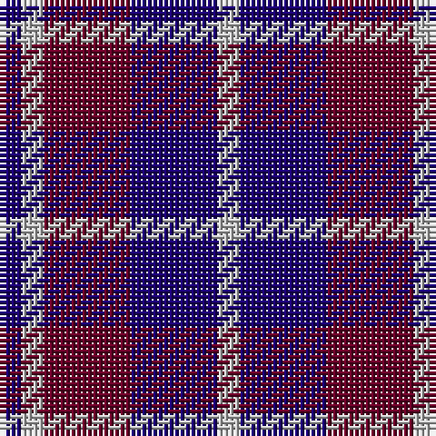

In pattern [BWBBW](/patterns/bwbbw/).

This was sourced from register-of-tartans.  It is a [5 stripes tartan](/stripes/stripes5/).

Original link https://www.tartanregister.gov.uk/tartanDetails.aspx?ref=2064

## Attestations

This cloth appears in 2 source records; the oldest owns this page.

- 01/01/1988 — Laval, Tartan de (register-of-tartans, [record](https://www.tartanregister.gov.uk/tartanDetails.aspx?ref=2064))
- 1988 — Laval, Tartan de (District) (tartans-authority, [record](http://www.tartansauthority.com/tartan-ferret/display/2120/))

## Thread count
DB/4 N4 DR16 DB16 N/4

## Palette
Each colour and its ΔE from the base-6 reference it is a variant of.

| Colour | Shade | Base | ΔE (OKLab) |
|---|---|---|---|
| DB | <code style="background-color:#1C0070;">#1C0070</code> `#1C0070` | B <code style="background-color:#2A418A;">#2A418A</code> | 0.14 |
| DR | <code style="background-color:#680028;">#680028</code> `#680028` | B <code style="background-color:#2A418A;">#2A418A</code> | 0.21 |
| N | <code style="background-color:#C0C0C0;">#C0C0C0</code> `#C0C0C0` | W <code style="background-color:#F7F7F7;">#F7F7F7</code> | 0.17 |

# Sample pattern

## Nearest tartans

The nearest existing variants by ΔTartan distance.

1. [Bryson (2000)](/setts/s5/g5b2ba5b10y2x2~b6c0070-ba1c0070-g006818-ye8c000/) — ΔT 1.19
1. [Laval (Tartan de..) District Tartan Tartan Number: 2120. Earliest known date: 1988 "Purple (Wine red is sample) and blue (Dark blue) are the city's official colours. The symbolize the wealth and the quality of life and the development of a human city. White combines with blue and red to remind us of our French and British origins." (Guy Menard - Communication Services, Laval) See products available Copyright © Blair Urquhart, Comrie, 2015](/setts/s5/b2w2ba8b8w1x2~b202060-ba680028-we0e0e0/) — ΔT 1.20
1. [Laval (Tartan de..)](/setts/s5/b2w2ba8b8w1x2~b000050-ba600030-we0e0e0/) — ΔT 1.27
1. [Baru](/setts/s5/b23g8b23g35w5x2~b780078-g003820-we0e0e0/) — ΔT 1.58
1. [Moorlands (Corporate)](/setts/s5/b27k10b27k35y6~b780078-k101010-ye8c000/) — ΔT 1.59
1. [University of Notre Dame](/setts/s6/r5b35k25b8y10r5x2~b2c2c80-k101010-rc80000-yfccc00/) — ΔT 1.63
1. [Laval Dress, Tartan de](/setts/s8/b2w2b7ba8w10b2w2b2x2~b1c0070-ba680028-wc0c0c0/) — ΔT 1.65
1. [International Highland Games Fed.](/setts/s4/b13r5g5w3x8~b2c2c80-g006818-rc80000-we0e0e0/) — ΔT 1.67
1. [Johore Regiment (Military)](/setts/s5/b20k5b18y26k6x2~b2c2c80-k101010-yd09800/) — ΔT 1.67
1. [Broz Sanz Elementary (Corporate)](/setts/s9/k4b1k1b1k1b4r2b4w2x4~b2c2c80-k101010-rc80000-we0e0e0/) — ΔT 1.69

## Neighbour map

Every grey dot is one of 15726 variants placed by the first two principal components of the ΔTartan feature space (44% of its variance). Red is this tartan; blue dots are its nearest — click one to open its page.

<svg viewBox="0 0 640 380" role="img" style="max-width:100%;height:auto;border:1px solid #e0e0e0;border-radius:4px;display:block" xmlns="http://www.w3.org/2000/svg"><image href="/nn/cloud.v1.png" width="640" height="380"/><a href="/setts/s5/g5b2ba5b10y2x2~b6c0070-ba1c0070-g006818-ye8c000/"><circle cx="216.2" cy="262.5" r="4" fill="#3465a4"><title>Bryson (2000)</title></circle></a><a href="/setts/s5/b2w2ba8b8w1x2~b202060-ba680028-we0e0e0/"><circle cx="264.4" cy="246.3" r="4" fill="#3465a4"><title>Laval (Tartan de..) District Tartan Tartan Number: 2120. Earliest known date: 1988 &quot;Purple (Wine red is sample) and blue (Dark blue) are the city's official colours. The symbolize the wealth and the quality of life and the development of a human city. White combines with blue and red to remind us of our French and British origins.&quot; (Guy Menard - Communication Services, Laval) See products available Copyright © Blair Urquhart, Comrie, 2015</title></circle></a><a href="/setts/s5/b2w2ba8b8w1x2~b000050-ba600030-we0e0e0/"><circle cx="251.8" cy="246.3" r="4" fill="#3465a4"><title>Laval (Tartan de..)</title></circle></a><a href="/setts/s5/b23g8b23g35w5x2~b780078-g003820-we0e0e0/"><circle cx="291.5" cy="279.2" r="4" fill="#3465a4"><title>Baru</title></circle></a><a href="/setts/s5/b27k10b27k35y6~b780078-k101010-ye8c000/"><circle cx="284.8" cy="289.1" r="4" fill="#3465a4"><title>Moorlands (Corporate)</title></circle></a><a href="/setts/s6/r5b35k25b8y10r5x2~b2c2c80-k101010-rc80000-yfccc00/"><circle cx="218.2" cy="223.1" r="4" fill="#3465a4"><title>University of Notre Dame</title></circle></a><a href="/setts/s8/b2w2b7ba8w10b2w2b2x2~b1c0070-ba680028-wc0c0c0/"><circle cx="169.6" cy="230.7" r="4" fill="#3465a4"><title>Laval Dress, Tartan de</title></circle></a><a href="/setts/s4/b13r5g5w3x8~b2c2c80-g006818-rc80000-we0e0e0/"><circle cx="192.0" cy="272.4" r="4" fill="#3465a4"><title>International Highland Games Fed.</title></circle></a><a href="/setts/s5/b20k5b18y26k6x2~b2c2c80-k101010-yd09800/"><circle cx="224.9" cy="278.8" r="4" fill="#3465a4"><title>Johore Regiment (Military)</title></circle></a><a href="/setts/s9/k4b1k1b1k1b4r2b4w2x4~b2c2c80-k101010-rc80000-we0e0e0/"><circle cx="183.7" cy="247.0" r="4" fill="#3465a4"><title>Broz Sanz Elementary (Corporate)</title></circle></a><circle cx="215.5" cy="276.9" r="5" fill="#c00000"/></svg>

ID: /setts/s5/b1w1ba4b4w1x4~b1c0070-ba680028-wc0c0c0/
