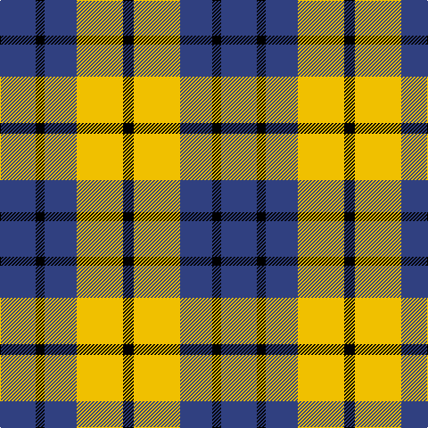

In pattern [BKBYK](/patterns/bkbyk/).

This was sourced from weddslist.  It is a [5 stripes tartan](/stripes/stripes5/).

Original link http://www.weddslist.com/cgi-bin/tartans/pg.pl?source=sts

## Thread count
B/40 K10 B36 Y52 K/12

## Palette
Each colour and its ΔE from the base-6 reference it is a variant of.

| Colour | Shade | Base | ΔE (OKLab) |
|---|---|---|---|
| B | <code style="background-color:#304080;">#304080</code> `#304080` | B <code style="background-color:#2A418A;">#2A418A</code> | 0.02 |
| K | <code style="background-color:#000000;">#000000</code> `#000000` | K <code style="background-color:#000000;">#000000</code> | 0.00 |
| Y | <code style="background-color:#F0C000;">#F0C000</code> `#F0C000` | Y <code style="background-color:#F2BF00;">#F2BF00</code> | 0.00 |

# Sample pattern

## Nearest tartans

The nearest existing variants by ΔTartan distance.

1. [Johore Regiment (Military)](/setts/s5/b20k5b18y26k6~b2c2c80-k101010-yd09800~x2/) — ΔT 0.89
1. [Longford County, Crest Range](/setts/s6/w7k6y15k16k8w3~k101010-we0e0e0-ybc8c00~x2/) — ΔT 0.95
1. [Johore Regiment](/setts/s8/b20k5b18y26k6y26b18k5~b2c2c80-k101010-yd09800~x2/) — ΔT 1.23
1. [MacLeod, of Argentina](/setts/s5/b10w3b12y14r4~b304080-rc00000-we0e0e0-yf0c000~x2/) — ΔT 1.33
1. [Delroeux, John Michael (Personal)](/setts/s4/b3g6y1r3~b0000cd-g125d24-rff0000-yffe600~x10/) — ΔT 1.35
1. [New York State Police Pipe Band](/setts/s5/r5b3r18k16y3~b780078-k101010-r888888-ye8c000~x4/) — ΔT 1.37
1. [Braes High School Falkirk (School)](/setts/s5/w5r5w5k15r2~k101010-rc80000-we0e0e0~x2/) — ΔT 1.37
1. [Grampian Television (Corporate)](/setts/s5/k12b3k12b18w5~b305470-k101010-wfcfcfc~x2/) — ΔT 1.38
1. [Canyon County Idaho Sheriff](/setts/s6/k5y5w1y5k5r1~k101010-rc80000-wf8f8f8-ya08858~x10/) — ΔT 1.40
1. [Braes High School Falkirk](/setts/s5/w5r5w5k15r2~k101010-rc80000-wffffff~x2/) — ΔT 1.40

## Neighbour map

Every grey dot is one of 15726 variants placed by the first two principal components of the ΔTartan feature space (44% of its variance). Red is this tartan; blue dots are its nearest — click one to open its page.

<svg viewBox="0 0 640 380" role="img" style="max-width:100%;height:auto;border:1px solid #e0e0e0;border-radius:4px;display:block" xmlns="http://www.w3.org/2000/svg"><image href="/nn/cloud.v1.png" width="640" height="380"/><a href="/setts/s5/b20k5b18y26k6~b2c2c80-k101010-yd09800~x2/"><circle cx="224.9" cy="278.8" r="4" fill="#3465a4"><title>Johore Regiment (Military)</title></circle></a><a href="/setts/s6/w7k6y15k16k8w3~k101010-we0e0e0-ybc8c00~x2/"><circle cx="215.8" cy="267.3" r="4" fill="#3465a4"><title>Longford County, Crest Range</title></circle></a><a href="/setts/s8/b20k5b18y26k6y26b18k5~b2c2c80-k101010-yd09800~x2/"><circle cx="193.7" cy="255.6" r="4" fill="#3465a4"><title>Johore Regiment</title></circle></a><a href="/setts/s5/b10w3b12y14r4~b304080-rc00000-we0e0e0-yf0c000~x2/"><circle cx="185.2" cy="260.0" r="4" fill="#3465a4"><title>MacLeod, of Argentina</title></circle></a><a href="/setts/s4/b3g6y1r3~b0000cd-g125d24-rff0000-yffe600~x10/"><circle cx="168.5" cy="260.1" r="4" fill="#3465a4"><title>Delroeux, John Michael (Personal)</title></circle></a><a href="/setts/s5/r5b3r18k16y3~b780078-k101010-r888888-ye8c000~x4/"><circle cx="233.3" cy="237.6" r="4" fill="#3465a4"><title>New York State Police Pipe Band</title></circle></a><a href="/setts/s5/w5r5w5k15r2~k101010-rc80000-we0e0e0~x2/"><circle cx="212.2" cy="234.7" r="4" fill="#3465a4"><title>Braes High School Falkirk (School)</title></circle></a><a href="/setts/s5/k12b3k12b18w5~b305470-k101010-wfcfcfc~x2/"><circle cx="226.9" cy="283.4" r="4" fill="#3465a4"><title>Grampian Television (Corporate)</title></circle></a><a href="/setts/s6/k5y5w1y5k5r1~k101010-rc80000-wf8f8f8-ya08858~x10/"><circle cx="185.2" cy="258.2" r="4" fill="#3465a4"><title>Canyon County Idaho Sheriff</title></circle></a><a href="/setts/s5/w5r5w5k15r2~k101010-rc80000-wffffff~x2/"><circle cx="206.8" cy="231.5" r="4" fill="#3465a4"><title>Braes High School Falkirk</title></circle></a><circle cx="203.9" cy="270.8" r="5" fill="#c00000"/></svg>

ID: /setts/s5/b20k5b18y26k6~b304080-k000000-yf0c000~x2/
