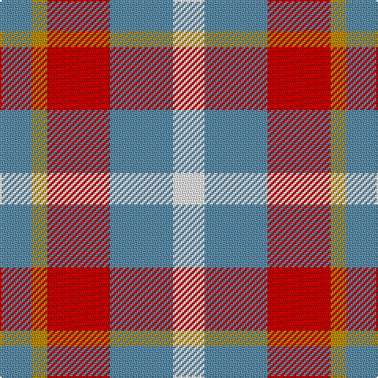

In pattern [BYRBW](/patterns/byrbw/).

This was sourced from tartans-authority.  It is a [5 stripes tartan](/stripes/stripes5/).

Original link http://www.tartansauthority.com/tartan-ferret/display/10759/

## Thread count
B/20 DY10 R40 B40 W/20

## Palette
Each colour and its ΔE from the base-6 reference it is a variant of.

| Colour | Shade | Base | ΔE (OKLab) |
|---|---|---|---|
| B | <code style="background-color:#5C8CA8;">#5C8CA8</code> `#5C8CA8` | B <code style="background-color:#2C4084;">#2C4084</code> | 0.23 |
| DY | <code style="background-color:#BC8C00;">#BC8C00</code> `#BC8C00` | Y <code style="background-color:#E8C000;">#E8C000</code> | 0.16 |
| R | <code style="background-color:#C80000;">#C80000</code> `#C80000` | R <code style="background-color:#C80000;">#C80000</code> | 0.00 |
| W | <code style="background-color:#FCFCFC;">#FCFCFC</code> `#FCFCFC` | W <code style="background-color:#F4F4F0;">#F4F4F0</code> | 0.03 |

# Sample pattern

## Nearest tartans

The nearest existing variants by ΔTartan distance.

1. [Doohan (New South Wales), Andrew](/setts/s5/b20y10r40b40w20-b5f749c-rca2625-wf9f5ef-ye0a126/) — ΔT 0.37
1. [Unidentified Lindley](/setts/s6/b48r48w8r48b48y8-b1474b4-re86000-wfcfcfc-ye8c000/) — ΔT 1.25
1. [Buckeye](/setts/s4/r100k16w32ra64-k101010-r888888-rac80000-wfcfcfc/) — ΔT 1.26
1. [Buckeye](/setts/s4/g100k16w32r64-g75786c-k120a01-rdd1212-wf7f1e8/) — ΔT 1.37
1. [MacLeod, of Argentina](/setts/s5/b20w6b24y28r8-b304080-rc00000-we0e0e0-yf0c000/) — ΔT 1.38
1. [MacLeod of Argentina](/setts/s5/b20w6b24y28r8-b1474b4-rc80000-wfcfcfc-yd8b000/) — ΔT 1.38
1. [Wilson's, No 113](/setts/s4/r4g12b12w4-b800080-g008000-rc00000-we0e0e0/) — ΔT 1.52
1. [Ardalansish Tweed (Fashion)](/setts/s6/b8y8b16w32ba8w8-b441800-ba5c5c5c-wf0d8bc-ya08858/) — ΔT 1.68
1. [Haggis Hostels](/setts/s4/r80b40w40ba32-b5f749c-ba14283c-r960028-we8ccb8/) — ΔT 1.70
1. [Fiddes (Corrected)](/setts/s7/g24r22b24ra6b16g16b16-b780078-g289c18-rc80000-racc4438/) — ΔT 1.71

## Neighbour map

Every grey dot is one of 15726 variants placed by the first two principal components of the ΔTartan feature space (44% of its variance). Red is this tartan; blue dots are its nearest — click one to open its page.

<svg viewBox="0 0 640 380" role="img" style="max-width:100%;height:auto;border:1px solid #e0e0e0;border-radius:4px;display:block" xmlns="http://www.w3.org/2000/svg"><image href="/nn/cloud.v1.png" width="640" height="380"/><a href="/setts/s5/b20y10r40b40w20-b5f749c-rca2625-wf9f5ef-ye0a126/"><circle cx="177.3" cy="273.8" r="4" fill="#3465a4"><title>Doohan (New South Wales), Andrew</title></circle></a><a href="/setts/s6/b48r48w8r48b48y8-b1474b4-re86000-wfcfcfc-ye8c000/"><circle cx="233.3" cy="248.0" r="4" fill="#3465a4"><title>Unidentified Lindley</title></circle></a><a href="/setts/s4/r100k16w32ra64-k101010-r888888-rac80000-wfcfcfc/"><circle cx="206.4" cy="243.4" r="4" fill="#3465a4"><title>Buckeye</title></circle></a><a href="/setts/s4/g100k16w32r64-g75786c-k120a01-rdd1212-wf7f1e8/"><circle cx="210.5" cy="245.4" r="4" fill="#3465a4"><title>Buckeye</title></circle></a><a href="/setts/s5/b20w6b24y28r8-b304080-rc00000-we0e0e0-yf0c000/"><circle cx="187.7" cy="257.7" r="4" fill="#3465a4"><title>MacLeod, of Argentina</title></circle></a><a href="/setts/s5/b20w6b24y28r8-b1474b4-rc80000-wfcfcfc-yd8b000/"><circle cx="201.7" cy="266.3" r="4" fill="#3465a4"><title>MacLeod of Argentina</title></circle></a><a href="/setts/s4/r4g12b12w4-b800080-g008000-rc00000-we0e0e0/"><circle cx="120.1" cy="286.6" r="4" fill="#3465a4"><title>Wilson's, No 113</title></circle></a><a href="/setts/s6/b8y8b16w32ba8w8-b441800-ba5c5c5c-wf0d8bc-ya08858/"><circle cx="177.6" cy="229.6" r="4" fill="#3465a4"><title>Ardalansish Tweed (Fashion)</title></circle></a><a href="/setts/s4/r80b40w40ba32-b5f749c-ba14283c-r960028-we8ccb8/"><circle cx="114.7" cy="306.5" r="4" fill="#3465a4"><title>Haggis Hostels</title></circle></a><a href="/setts/s7/g24r22b24ra6b16g16b16-b780078-g289c18-rc80000-racc4438/"><circle cx="151.3" cy="282.0" r="4" fill="#3465a4"><title>Fiddes (Corrected)</title></circle></a><circle cx="171.0" cy="272.1" r="5" fill="#c00000"/></svg>

ID: /setts/s5/b20y10r40b40w20-b5c8ca8-rc80000-wfcfcfc-ybc8c00/
