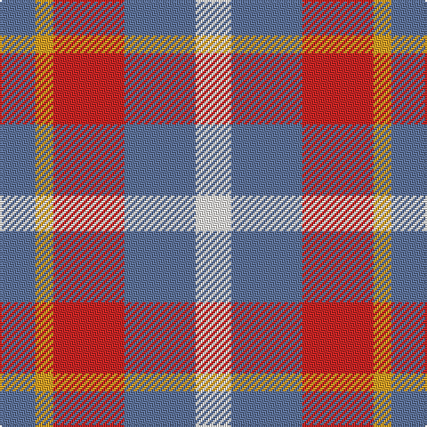

In pattern [BYRBW](/patterns/byrbw/).

This was sourced from register-of-tartans.  It is a [5 stripes tartan](/stripes/stripes5/).

Original link https://www.tartanregister.gov.uk/tartanDetails.aspx?ref=10759

## Thread count
B/20 Y10 R40 B40 W/20

## Palette
Each colour and its ΔE from the base-6 reference it is a variant of.

| Colour | Shade | Base | ΔE (OKLab) |
|---|---|---|---|
| B | <code style="background-color:#5F749C;">#5F749C</code> `#5F749C` | B <code style="background-color:#2A418A;">#2A418A</code> | 0.17 |
| R | <code style="background-color:#CA2625;">#CA2625</code> `#CA2625` | R <code style="background-color:#CC0000;">#CC0000</code> | 0.02 |
| W | <code style="background-color:#F9F5EF;">#F9F5EF</code> `#F9F5EF` | W <code style="background-color:#F7F7F7;">#F7F7F7</code> | 0.01 |
| Y | <code style="background-color:#E0A126;">#E0A126</code> `#E0A126` | Y <code style="background-color:#F2BF00;">#F2BF00</code> | 0.08 |

# Sample pattern

## Nearest tartans

The nearest existing variants by ΔTartan distance.

1. [Doohan (Name)](/setts/s5/b20y10r40b40w20-b5c8ca8-rc80000-wfcfcfc-ybc8c00/) — ΔT 0.37
1. [Unidentified Lindley](/setts/s6/b48r48w8r48b48y8-b1474b4-re86000-wfcfcfc-ye8c000/) — ΔT 1.27
1. [Buckeye](/setts/s4/r100k16w32ra64-k101010-r888888-rac80000-wfcfcfc/) — ΔT 1.29
1. [Buckeye](/setts/s4/g100k16w32r64-g75786c-k120a01-rdd1212-wf7f1e8/) — ΔT 1.40
1. [MacLeod, of Argentina](/setts/s5/b20w6b24y28r8-b304080-rc00000-we0e0e0-yf0c000/) — ΔT 1.53
1. [Wilson's, No 113](/setts/s4/r4g12b12w4-b800080-g008000-rc00000-we0e0e0/) — ΔT 1.54
1. [Haggis Hostels](/setts/s4/r80b40w40ba32-b5f749c-ba14283c-r960028-we8ccb8/) — ΔT 1.56
1. [Fiddes (Corrected)](/setts/s7/g24r22b24ra6b16g16b16-b780078-g289c18-rc80000-racc4438/) — ΔT 1.57
1. [Snowbird (Corporate)](/setts/s5/r16y30b24r58w8-b1474b4-rc80000-we0e0e0-y48a4c0/) — ΔT 1.59
1. [MacLeod of Argentina](/setts/s5/b20w6b24y28r8-b1474b4-rc80000-wfcfcfc-yd8b000/) — ΔT 1.61

## Neighbour map

Every grey dot is one of 15726 variants placed by the first two principal components of the ΔTartan feature space (44% of its variance). Red is this tartan; blue dots are its nearest — click one to open its page.

<svg viewBox="0 0 640 380" role="img" style="max-width:100%;height:auto;border:1px solid #e0e0e0;border-radius:4px;display:block" xmlns="http://www.w3.org/2000/svg"><image href="/nn/cloud.v1.png" width="640" height="380"/><a href="/setts/s5/b20y10r40b40w20-b5c8ca8-rc80000-wfcfcfc-ybc8c00/"><circle cx="171.0" cy="272.1" r="4" fill="#3465a4"><title>Doohan (Name)</title></circle></a><a href="/setts/s6/b48r48w8r48b48y8-b1474b4-re86000-wfcfcfc-ye8c000/"><circle cx="233.3" cy="248.0" r="4" fill="#3465a4"><title>Unidentified Lindley</title></circle></a><a href="/setts/s4/r100k16w32ra64-k101010-r888888-rac80000-wfcfcfc/"><circle cx="206.4" cy="243.4" r="4" fill="#3465a4"><title>Buckeye</title></circle></a><a href="/setts/s4/g100k16w32r64-g75786c-k120a01-rdd1212-wf7f1e8/"><circle cx="210.5" cy="245.4" r="4" fill="#3465a4"><title>Buckeye</title></circle></a><a href="/setts/s5/b20w6b24y28r8-b304080-rc00000-we0e0e0-yf0c000/"><circle cx="187.7" cy="257.7" r="4" fill="#3465a4"><title>MacLeod, of Argentina</title></circle></a><a href="/setts/s4/r4g12b12w4-b800080-g008000-rc00000-we0e0e0/"><circle cx="120.1" cy="286.6" r="4" fill="#3465a4"><title>Wilson's, No 113</title></circle></a><a href="/setts/s4/r80b40w40ba32-b5f749c-ba14283c-r960028-we8ccb8/"><circle cx="114.7" cy="306.5" r="4" fill="#3465a4"><title>Haggis Hostels</title></circle></a><a href="/setts/s7/g24r22b24ra6b16g16b16-b780078-g289c18-rc80000-racc4438/"><circle cx="151.3" cy="282.0" r="4" fill="#3465a4"><title>Fiddes (Corrected)</title></circle></a><a href="/setts/s5/r16y30b24r58w8-b1474b4-rc80000-we0e0e0-y48a4c0/"><circle cx="269.8" cy="236.1" r="4" fill="#3465a4"><title>Snowbird (Corporate)</title></circle></a><a href="/setts/s5/b20w6b24y28r8-b1474b4-rc80000-wfcfcfc-yd8b000/"><circle cx="201.7" cy="266.3" r="4" fill="#3465a4"><title>MacLeod of Argentina</title></circle></a><circle cx="177.3" cy="273.8" r="5" fill="#c00000"/></svg>

ID: /setts/s5/b20y10r40b40w20-b5f749c-rca2625-wf9f5ef-ye0a126/
