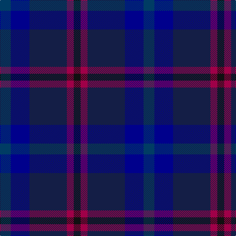

In pattern [BBBRK](/patterns/bbbrk/).

This was sourced from register-of-tartans.  It is a [5 stripes tartan](/stripes/stripes5/).

Original link https://www.tartanregister.gov.uk/tartanDetails.aspx?ref=11219

## Thread count
DBb/22 DB38 DBa76 R14 K/14

## Palette
Each colour and its ΔE from the base-6 reference it is a variant of.

| Colour | Shade | Base | ΔE (OKLab) |
|---|---|---|---|
| DB | <code style="background-color:#00008C;">#00008C</code> `#00008C` | B <code style="background-color:#2C4084;">#2C4084</code> | 0.13 |
| DBa | <code style="background-color:#141E46;">#141E46</code> `#141E46` | B <code style="background-color:#2C4084;">#2C4084</code> | 0.15 |
| DBb | <code style="background-color:#003C64;">#003C64</code> `#003C64` | B <code style="background-color:#2C4084;">#2C4084</code> | 0.07 |
| K | <code style="background-color:#101010;">#101010</code> `#101010` | K <code style="background-color:#000000;">#000000</code> | 0.17 |
| R | <code style="background-color:#A00048;">#A00048</code> `#A00048` | R <code style="background-color:#C80000;">#C80000</code> | 0.11 |

# Sample pattern

ID: /setts/s5/b22ba38bb76r14k14-b003c64-ba00008c-bb141e46-k101010-ra00048/
