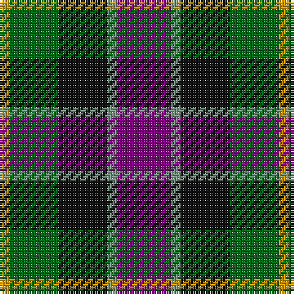

In pattern [BGKGY](/patterns/bgkgy/).

This was sourced from tartans-authority.  It is a [5 stripes tartan](/stripes/stripes5/).

Original link http://www.tartansauthority.com/tartan-ferret/display/3196/

## Thread count
DY/4 G20 K20 LG4 P/22

## Palette
Each colour and its ΔE from the base-6 reference it is a variant of.

| Colour | Shade | Base | ΔE (OKLab) |
|---|---|---|---|
| DY | <code style="background-color:#D09800;">#D09800</code> `#D09800` | Y <code style="background-color:#E8C000;">#E8C000</code> | 0.11 |
| G | <code style="background-color:#006818;">#006818</code> `#006818` | G <code style="background-color:#006400;">#006400</code> | 0.02 |
| K | <code style="background-color:#101010;">#101010</code> `#101010` | K <code style="background-color:#000000;">#000000</code> | 0.17 |
| LG | <code style="background-color:#789484;">#789484</code> `#789484` | G <code style="background-color:#006400;">#006400</code> | 0.23 |
| P | <code style="background-color:#780078;">#780078</code> `#780078` | B <code style="background-color:#2C4084;">#2C4084</code> | 0.16 |

# Sample pattern

## Nearest tartans

The nearest existing variants by ΔTartan distance.

1. [Nobiliary Fraternity](/setts/s5/b22ba4k20g20y6-b780078-ba5c8ca8-g006818-k101010-ye8c000/) — ΔT 0.46
1. [Selkirk (Personal)](/setts/s5/b54ba8k54g54y8-b6c0070-ba1c1c50-g006818-k101010-yd09800/) — ΔT 0.62
1. [Friebe (2014)](/setts/s5/g30ga36b46w8r16-b1c1c50-g649848-ga23321b-rb62531-wf9f5ef/) — ΔT 0.79
1. [MacCaughan or MacEachain Clan Tartan Tartan Number: 169. Earliest known date: 1972 Nothing See products available Copyright © Blair Urquhart, Comrie, 2015](/setts/s6/r8g24k8b24k4ra8-b2c2c80-g006818-k101010-rb468ac-rac80000/) — ΔT 0.80
1. [Birse Family Tartan Tartan Number: 1087. Earliest known date: 1930-50 This sample comes from the MacGregor-Hastie collection which forms the basis of the cloth archive of the Scottish Tartans Society. Some of the samples, including this one, were unmarked. One can assume that the sample dates between 1930 and 1950. See products available Copyright © Blair Urquhart, Comrie, 2015](/setts/s6/k8g32k28y6b32r8-b2c2c80-g006818-k101010-rc80000-ye8c000/) — ΔT 0.80
1. [MacCaughan, or MacEachain](/setts/s6/b8g24k8ba24k4r8-b800070-ba304080-g008000-k000000-rc00000/) — ΔT 0.81
1. [Canine All Dogs (Fashion)](/setts/s6/r10b6g24ba24r6y3-b2c2c80-ba1c1c50-g006818-rc80000-ye8c000/) — ΔT 0.95
1. [Martin Hunting](/setts/s5/b40k10ka38g38y4-b780078-g006818-k000030-ka101010-ye8c000/) — ΔT 0.99
1. [MacEachain (Clan)](/setts/s6/r8k4b24k8g24ra8-b1c0070-g006818-k101010-r880000-ra9c68a4/) — ΔT 0.99
1. [Davidson of Tulloch (Clan)](/setts/s5/r6b42k42g42w6-b2c2c80-g006818-k101010-rc8002c-we0e0e0/) — ΔT 1.00

## Neighbour map

Every grey dot is one of 15726 variants placed by the first two principal components of the ΔTartan feature space (44% of its variance). Red is this tartan; blue dots are its nearest — click one to open its page.

<svg viewBox="0 0 640 380" role="img" style="max-width:100%;height:auto;border:1px solid #e0e0e0;border-radius:4px;display:block" xmlns="http://www.w3.org/2000/svg"><image href="/nn/cloud.v1.png" width="640" height="380"/><a href="/setts/s5/b22ba4k20g20y6-b780078-ba5c8ca8-g006818-k101010-ye8c000/"><circle cx="85.7" cy="245.2" r="4" fill="#3465a4"><title>Nobiliary Fraternity</title></circle></a><a href="/setts/s5/b54ba8k54g54y8-b6c0070-ba1c1c50-g006818-k101010-yd09800/"><circle cx="133.1" cy="240.5" r="4" fill="#3465a4"><title>Selkirk (Personal)</title></circle></a><a href="/setts/s5/g30ga36b46w8r16-b1c1c50-g649848-ga23321b-rb62531-wf9f5ef/"><circle cx="88.9" cy="249.1" r="4" fill="#3465a4"><title>Friebe (2014)</title></circle></a><a href="/setts/s6/r8g24k8b24k4ra8-b2c2c80-g006818-k101010-rb468ac-rac80000/"><circle cx="113.3" cy="233.1" r="4" fill="#3465a4"><title>MacCaughan or MacEachain Clan Tartan Tartan Number: 169. Earliest known date: 1972 Nothing See products available Copyright © Blair Urquhart, Comrie, 2015</title></circle></a><a href="/setts/s6/k8g32k28y6b32r8-b2c2c80-g006818-k101010-rc80000-ye8c000/"><circle cx="104.1" cy="240.1" r="4" fill="#3465a4"><title>Birse Family Tartan Tartan Number: 1087. Earliest known date: 1930-50 This sample comes from the MacGregor-Hastie collection which forms the basis of the cloth archive of the Scottish Tartans Society. Some of the samples, including this one, were unmarked. One can assume that the sample dates between 1930 and 1950. See products available Copyright © Blair Urquhart, Comrie, 2015</title></circle></a><a href="/setts/s6/b8g24k8ba24k4r8-b800070-ba304080-g008000-k000000-rc00000/"><circle cx="90.9" cy="224.5" r="4" fill="#3465a4"><title>MacCaughan, or MacEachain</title></circle></a><a href="/setts/s6/r10b6g24ba24r6y3-b2c2c80-ba1c1c50-g006818-rc80000-ye8c000/"><circle cx="139.1" cy="212.2" r="4" fill="#3465a4"><title>Canine All Dogs (Fashion)</title></circle></a><a href="/setts/s5/b40k10ka38g38y4-b780078-g006818-k000030-ka101010-ye8c000/"><circle cx="134.8" cy="226.3" r="4" fill="#3465a4"><title>Martin Hunting</title></circle></a><a href="/setts/s6/r8k4b24k8g24ra8-b1c0070-g006818-k101010-r880000-ra9c68a4/"><circle cx="114.7" cy="237.1" r="4" fill="#3465a4"><title>MacEachain (Clan)</title></circle></a><a href="/setts/s5/r6b42k42g42w6-b2c2c80-g006818-k101010-rc8002c-we0e0e0/"><circle cx="122.9" cy="238.6" r="4" fill="#3465a4"><title>Davidson of Tulloch (Clan)</title></circle></a><circle cx="109.3" cy="245.2" r="5" fill="#c00000"/></svg>

ID: /setts/s5/b22g4k20ga20y4-b780078-g789484-ga006818-k101010-yd09800/
