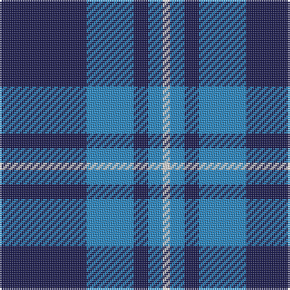

In pattern [BBBBW](/patterns/bbbbw/).

This was sourced from tartans-authority.  It is a [5 stripes tartan](/stripes/stripes5/).

Original link http://www.tartansauthority.com/tartan-ferret/display/7820/

## Attestations

This cloth appears in 2 source records; the oldest owns this page.

- 2008 — Gallaecia (Unofficial) (District) (tartans-authority, [record](http://www.tartansauthority.com/tartan-ferret/display/7820/))
- undated — Gallaecia (Unofficial) (register-of-tartans, [record](https://www.tartanregister.gov.uk/tartanDetails.aspx?ref=5776))

## Register references

External register numbers recorded for this tartan.

- Scottish Register of Tartans: [5776](https://www.tartanregister.gov.uk/tartanDetails.aspx?ref=5776)
- Scottish Tartans Authority (ITI): 7820

## Thread count
DB/48 B26 DB8 B8 LN/4

## Palette
Each colour and its ΔE from the base-6 reference it is a variant of.

| Colour | Shade | Base | ΔE (OKLab) |
|---|---|---|---|
| B | <code style="background-color:#2888C4;">#2888C4</code> `#2888C4` | B <code style="background-color:#2A418A;">#2A418A</code> | 0.21 |
| DB | <code style="background-color:#1C1C50;">#1C1C50</code> `#1C1C50` | B <code style="background-color:#2A418A;">#2A418A</code> | 0.14 |
| LN | <code style="background-color:#E0E0E0;">#E0E0E0</code> `#E0E0E0` | W <code style="background-color:#F7F7F7;">#F7F7F7</code> | 0.07 |

# Sample pattern

## Nearest tartans

The nearest existing variants by ΔTartan distance.

1. [McKerrell of Hillhouse](/setts/s4/w4b28ba49y3~b2888c4-ba202060-we0e0e0-ye8c000~x2/) — ΔT 1.15
1. [Gallaecia - Galicia National](/setts/s5/b24ba13b4ba4w2~b141e46-ba07648c-we0e0e0~x2/) — ΔT 1.25
1. [Slanj (Corporate)](/setts/s6/r4k28b3k3b25k3~b1474b4-k101010-r9c68a4~x2/) — ΔT 1.38
1. [Salem Scottish Dancers (Corporate)](/setts/s8/b5ba5b30w4b4ba18w3b3~b14283c-ba1474b4-wf8f8f8~x2/) — ΔT 1.42
1. [Rea](/setts/s6/b12y2b1k5b4k2~b2888c4-k101010-ye8c000~x4/) — ΔT 1.44
1. [Stakis Hotels (Corporate)](/setts/s3/b9ba14r1~b788cb4-ba000050-rb00000~x4/) — ΔT 1.45
1. [MacKerral Family Tartan Tartan Number: 1757. Earliest known date: 1975 A sample was presented to the Scottish Tartans Society by John Drummond Bowman. This version of the tartan has the unusual feature of exchanging red for yellow in the weft. It is larger than the sett recorded in the Lyon Court Books in 1982. The name, MacKerral or MacKerrell, is recorded in Ayrshire in the 12th century. See products available Copyright © Blair Urquhart, Comrie, 2015](/setts/s4/w4b34ba60y3~b5c8ca8-ba2c2c80-we0e0e0-ye8c000~x2/) — ΔT 1.46
1. [Murray Taylor](/setts/s6/b3ba3b16ba16b16w3~b202060-ba3c82af-wffffff~x2/) — ΔT 1.47
1. [Gilt Edge (Corporate)](/setts/s5/b3ba2bb31b34w2~b202060-ba2c2c80-bb2888c4-we0e0e0~x2/) — ΔT 1.47
1. [Debbie Munro Memorial (Corporate)](/setts/s5/b26w11b3w4k2~b003c9c-k101010-wfc9cd4~x4/) — ΔT 1.47

## Neighbour map

Every grey dot is one of 15726 variants placed by the first two principal components of the ΔTartan feature space (44% of its variance). Red is this tartan; blue dots are its nearest — click one to open its page.

<svg viewBox="0 0 640 380" role="img" style="max-width:100%;height:auto;border:1px solid #e0e0e0;border-radius:4px;display:block" xmlns="http://www.w3.org/2000/svg"><image href="/nn/cloud.v1.png" width="640" height="380"/><a href="/setts/s4/w4b28ba49y3~b2888c4-ba202060-we0e0e0-ye8c000~x2/"><circle cx="342.9" cy="212.3" r="4" fill="#3465a4"><title>McKerrell of Hillhouse</title></circle></a><a href="/setts/s5/b24ba13b4ba4w2~b141e46-ba07648c-we0e0e0~x2/"><circle cx="394.6" cy="252.1" r="4" fill="#3465a4"><title>Gallaecia - Galicia National</title></circle></a><a href="/setts/s6/r4k28b3k3b25k3~b1474b4-k101010-r9c68a4~x2/"><circle cx="320.2" cy="228.1" r="4" fill="#3465a4"><title>Slanj (Corporate)</title></circle></a><a href="/setts/s8/b5ba5b30w4b4ba18w3b3~b14283c-ba1474b4-wf8f8f8~x2/"><circle cx="325.8" cy="205.3" r="4" fill="#3465a4"><title>Salem Scottish Dancers (Corporate)</title></circle></a><a href="/setts/s6/b12y2b1k5b4k2~b2888c4-k101010-ye8c000~x4/"><circle cx="361.1" cy="222.3" r="4" fill="#3465a4"><title>Rea</title></circle></a><a href="/setts/s3/b9ba14r1~b788cb4-ba000050-rb00000~x4/"><circle cx="343.8" cy="267.2" r="4" fill="#3465a4"><title>Stakis Hotels (Corporate)</title></circle></a><a href="/setts/s4/w4b34ba60y3~b5c8ca8-ba2c2c80-we0e0e0-ye8c000~x2/"><circle cx="378.2" cy="207.4" r="4" fill="#3465a4"><title>MacKerral Family Tartan Tartan Number: 1757. Earliest known date: 1975 A sample was presented to the Scottish Tartans Society by John Drummond Bowman. This version of the tartan has the unusual feature of exchanging red for yellow in the weft. It is larger than the sett recorded in the Lyon Court Books in 1982. The name, MacKerral or MacKerrell, is recorded in Ayrshire in the 12th century. See products available Copyright © Blair Urquhart, Comrie, 2015</title></circle></a><a href="/setts/s6/b3ba3b16ba16b16w3~b202060-ba3c82af-wffffff~x2/"><circle cx="320.6" cy="273.6" r="4" fill="#3465a4"><title>Murray Taylor</title></circle></a><a href="/setts/s5/b3ba2bb31b34w2~b202060-ba2c2c80-bb2888c4-we0e0e0~x2/"><circle cx="342.5" cy="200.2" r="4" fill="#3465a4"><title>Gilt Edge (Corporate)</title></circle></a><a href="/setts/s5/b26w11b3w4k2~b003c9c-k101010-wfc9cd4~x4/"><circle cx="375.8" cy="211.2" r="4" fill="#3465a4"><title>Debbie Munro Memorial (Corporate)</title></circle></a><circle cx="362.7" cy="236.4" r="5" fill="#c00000"/></svg>

ID: /setts/s5/b24ba13b4ba4w2~b1c1c50-ba2888c4-we0e0e0~x2/
