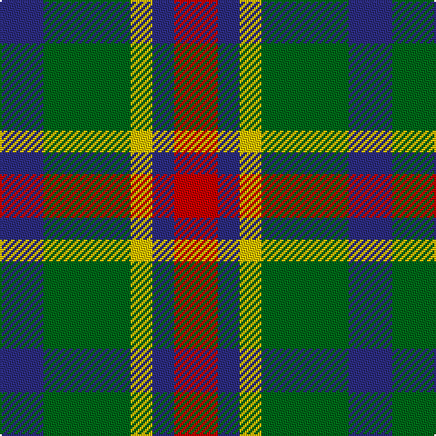

In pattern [BGYBR](/patterns/bgybr/).

This was sourced from register-of-tartans.  It is a [5 stripes tartan](/stripes/stripes5/).

Original link https://www.tartanregister.gov.uk/tartanDetails.aspx?ref=802

## Thread count
DB/24 G48 Y12 DB12 R/24

## Palette
Each colour and its ΔE from the base-6 reference it is a variant of.

| Colour | Shade | Base | ΔE (OKLab) |
|---|---|---|---|
| DB | <code style="background-color:#2C2C80;">#2C2C80</code> `#2C2C80` | B <code style="background-color:#2A418A;">#2A418A</code> | 0.06 |
| G | <code style="background-color:#006818;">#006818</code> `#006818` | G <code style="background-color:#006100;">#006100</code> | 0.02 |
| R | <code style="background-color:#C80000;">#C80000</code> `#C80000` | R <code style="background-color:#CC0000;">#CC0000</code> | 0.01 |
| Y | <code style="background-color:#E8C000;">#E8C000</code> `#E8C000` | Y <code style="background-color:#F2BF00;">#F2BF00</code> | 0.02 |

# Sample pattern

## Nearest tartans

The nearest existing variants by ΔTartan distance.

1. [Wilson's, No 214](/setts/s5/g16r12b4k4b12-b5480b0-g008000-k000000-rc00000/) — ΔT 0.65
1. [Harbison (2015)](/setts/s4/b42g68r28w12-b2c2c80-g006818-rc80000-wfcfcfc/) — ΔT 0.93
1. [Delroeux (Personal)](/setts/s4/b30g60y10r30-b2c2c80-g006818-rc80000-yfccc00/) — ΔT 0.98
1. [Gallowater Old District Tartan Tartan Number: 1025. Earliest known date: 1819 Both 'Old' and 'New' appear in Wilson's 1819 pattern book. See products available Copyright © Blair Urquhart, Comrie, 2015](/setts/s5/k19b10ba19g40y10-b5c8ca8-ba780078-g006818-k101010-ye8c000/) — ΔT 1.04
1. [Stewart, Plaid](/setts/s7/r4g8b16r18g18k4r4-b304080-g008000-k000000-rc00000/) — ΔT 1.05
1. [Waterloo](/setts/s6/g6ga12k12g8r2g2-g789484-ga003820-k101010-rc80000/) — ΔT 1.06
1. [Chivas Regal](/setts/s5/b12k12b12r28y6-b003c64-k101010-rb03000-ye8c000/) — ΔT 1.14
1. [Wilson's No.203](/setts/s4/b8r16g20y4-b2888c4-g006818-rc80000-ye8c000/) — ΔT 1.14
1. [Timespan](/setts/s5/g36r6k36r6ra36-g006818-k101010-rc80000-ra888888/) — ΔT 1.15
1. [Inspiration](/setts/s5/r10b24y22ba42ya10-b5f749c-ba14283c-rc8002c-yc4bc68-yae0a126/) — ΔT 1.16

## Neighbour map

Every grey dot is one of 15726 variants placed by the first two principal components of the ΔTartan feature space (44% of its variance). Red is this tartan; blue dots are its nearest — click one to open its page.

<svg viewBox="0 0 640 380" role="img" style="max-width:100%;height:auto;border:1px solid #e0e0e0;border-radius:4px;display:block" xmlns="http://www.w3.org/2000/svg"><image href="/nn/cloud.v1.png" width="640" height="380"/><a href="/setts/s5/g16r12b4k4b12-b5480b0-g008000-k000000-rc00000/"><circle cx="107.9" cy="276.0" r="4" fill="#3465a4"><title>Wilson's, No 214</title></circle></a><a href="/setts/s4/b42g68r28w12-b2c2c80-g006818-rc80000-wfcfcfc/"><circle cx="177.9" cy="268.2" r="4" fill="#3465a4"><title>Harbison (2015)</title></circle></a><a href="/setts/s4/b30g60y10r30-b2c2c80-g006818-rc80000-yfccc00/"><circle cx="194.5" cy="269.1" r="4" fill="#3465a4"><title>Delroeux (Personal)</title></circle></a><a href="/setts/s5/k19b10ba19g40y10-b5c8ca8-ba780078-g006818-k101010-ye8c000/"><circle cx="107.0" cy="255.2" r="4" fill="#3465a4"><title>Gallowater Old District Tartan Tartan Number: 1025. Earliest known date: 1819 Both 'Old' and 'New' appear in Wilson's 1819 pattern book. See products available Copyright © Blair Urquhart, Comrie, 2015</title></circle></a><a href="/setts/s7/r4g8b16r18g18k4r4-b304080-g008000-k000000-rc00000/"><circle cx="145.0" cy="246.3" r="4" fill="#3465a4"><title>Stewart, Plaid</title></circle></a><a href="/setts/s6/g6ga12k12g8r2g2-g789484-ga003820-k101010-rc80000/"><circle cx="155.3" cy="252.6" r="4" fill="#3465a4"><title>Waterloo</title></circle></a><a href="/setts/s5/b12k12b12r28y6-b003c64-k101010-rb03000-ye8c000/"><circle cx="160.7" cy="268.5" r="4" fill="#3465a4"><title>Chivas Regal</title></circle></a><a href="/setts/s4/b8r16g20y4-b2888c4-g006818-rc80000-ye8c000/"><circle cx="177.8" cy="277.0" r="4" fill="#3465a4"><title>Wilson's No.203</title></circle></a><a href="/setts/s5/g36r6k36r6ra36-g006818-k101010-rc80000-ra888888/"><circle cx="127.4" cy="254.9" r="4" fill="#3465a4"><title>Timespan</title></circle></a><a href="/setts/s5/r10b24y22ba42ya10-b5f749c-ba14283c-rc8002c-yc4bc68-yae0a126/"><circle cx="96.7" cy="246.9" r="4" fill="#3465a4"><title>Inspiration</title></circle></a><circle cx="143.7" cy="273.0" r="5" fill="#c00000"/></svg>

ID: /setts/s5/b24g48y12b12r24-b2c2c80-g006818-rc80000-ye8c000/
