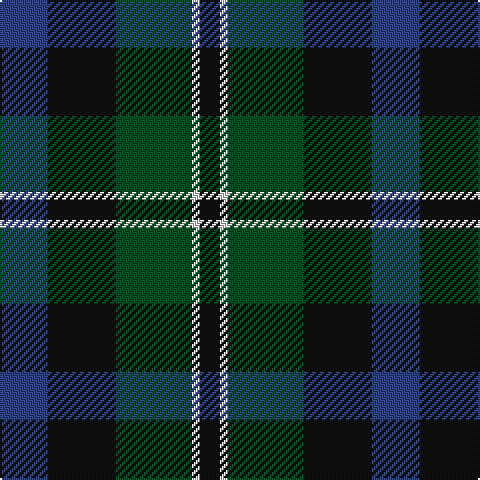

In pattern [BKGWK](/patterns/bkgwk/).

This was sourced from register-of-tartans.  It is a [5 stripes tartan](/stripes/stripes5/).

Original link https://www.tartanregister.gov.uk/tartanDetails.aspx?ref=4637

## Thread count
B/24 K34 G38 LN4 K/10

## Palette
Each colour and its ΔE from the base-6 reference it is a variant of.

| Colour | Shade | Base | ΔE (OKLab) |
|---|---|---|---|
| B | <code style="background-color:#2C4084;">#2C4084</code> `#2C4084` | B <code style="background-color:#2A418A;">#2A418A</code> | 0.01 |
| G | <code style="background-color:#005020;">#005020</code> `#005020` | G <code style="background-color:#006100;">#006100</code> | 0.07 |
| K | <code style="background-color:#101010;">#101010</code> `#101010` | K <code style="background-color:#000000;">#000000</code> | 0.17 |
| LN | <code style="background-color:#E0E0E0;">#E0E0E0</code> `#E0E0E0` | W <code style="background-color:#F7F7F7;">#F7F7F7</code> | 0.07 |

# Sample pattern

## Nearest tartans

The nearest existing variants by ΔTartan distance.

1. [Graham of Montrose](/setts/s6/g8b30w4k32g38k8-b2c4084-g005020-k101010-we0e0e0/) — ΔT 0.57
1. [Graham of Menteith Clan Tartan Tartan Number: 698. Earliest known date: 1831 Logan describes the broad blue stripe as 'smalt', in his book, 'The Scottish Gael' published in 1831. Smibert also records this sett in 1850. However, in the text for McIan's Costume of the Clans (1845-47), Logan admits that this sett's antiquity is questionable. Menteith is the name given to the western branch of the Graham family. The Menteith District tartan is similar but the azure stripe is white. (See also Montrose, Menteith.) See products available Copyright © Blair Urquhart, Comrie, 2015](/setts/s6/g36b4g8k28ba24k6-b5c8ca8-ba2c2c80-g006818-k101010/) — ΔT 0.73
1. [Gallamore](/setts/s6/k6b28r4k28g28k6-b2c2c80-g006818-k101010-rc80000/) — ΔT 0.77
1. [Coburg](/setts/s6/g36b4g8k28ba24k6-b5c8ca8-ba440044-g006818-k101010/) — ΔT 0.80
1. [MacKirdy Family Tartan Tartan Number: 1092. Earliest known date: 1930-50 This sample comes from the MacGregor-Hastie collection which forms the basis of the cloth archive of the Scottish Tartans Society. MacGregor-Hastie noted, "A pattern seen at Andersons, Edinburgh, was labelled 'MacKirdy'. It is a simple green tartan. The family are usually given as a sept of the Stuarts of Bute. The tartan is modern". One can assume that the sample dates between 1930 and 1950. At a very early period the larger part of the Island of Bute belonged to the Mackuerdys, which was leased to them by King James IV in 1489. Later Bute became the stronghold of the Stuarts of Bute. See products available Copyright © Blair Urquhart, Comrie, 2015](/setts/s5/k4g24k22b24w2-b2c2c80-g006818-k101010-we0e0e0/) — ΔT 0.81
1. [Ferguson of Balquhidder #2](/setts/s6/g8b48r6k48g50k8-b2c2c80-g006818-k101010-rc80000/) — ΔT 0.88
1. [Graham of Menteith (Clan)](/setts/s6/g32b4g4k24ba24k4-b5c8ca8-ba2c2c80-g006818-k101010/) — ΔT 0.89
1. [Morrison Clan Tartan Tartan Number: 1083. Earliest known date: 1908 The Clan Morrison have strong links with the MacKays and this is evident in the similarity of the tartans. Morrison has an added red stripe. Lord Lyon recorded a new sett in 1968 based on a fragment of Morrison tartan dated 1747. See products available Copyright © Blair Urquhart, Comrie, 2015](/setts/s6/k6g28k28g4b28r6-b2c2c80-g006818-k101010-rc80000/) — ΔT 0.94
1. [Blaylock Annandale (Name)](/setts/s7/g48b12ba6k12b24k30g8-b2c2c80-ba5c8ca8-g006818-k101010/) — ΔT 0.95
1. [Graham of Menteith](/setts/s6/g32b4g4k24ba24k4-b2474e8-ba28287c-g006c3c-k101010/) — ΔT 0.95

## Neighbour map

Every grey dot is one of 15726 variants placed by the first two principal components of the ΔTartan feature space (44% of its variance). Red is this tartan; blue dots are its nearest — click one to open its page.

<svg viewBox="0 0 640 380" role="img" style="max-width:100%;height:auto;border:1px solid #e0e0e0;border-radius:4px;display:block" xmlns="http://www.w3.org/2000/svg"><image href="/nn/cloud.v1.png" width="640" height="380"/><a href="/setts/s6/g8b30w4k32g38k8-b2c4084-g005020-k101010-we0e0e0/"><circle cx="219.3" cy="248.7" r="4" fill="#3465a4"><title>Graham of Montrose</title></circle></a><a href="/setts/s6/g36b4g8k28ba24k6-b5c8ca8-ba2c2c80-g006818-k101010/"><circle cx="224.7" cy="246.7" r="4" fill="#3465a4"><title>Graham of Menteith Clan Tartan Tartan Number: 698. Earliest known date: 1831 Logan describes the broad blue stripe as 'smalt', in his book, 'The Scottish Gael' published in 1831. Smibert also records this sett in 1850. However, in the text for McIan's Costume of the Clans (1845-47), Logan admits that this sett's antiquity is questionable. Menteith is the name given to the western branch of the Graham family. The Menteith District tartan is similar but the azure stripe is white. (See also Montrose, Menteith.) See products available Copyright © Blair Urquhart, Comrie, 2015</title></circle></a><a href="/setts/s6/k6b28r4k28g28k6-b2c2c80-g006818-k101010-rc80000/"><circle cx="211.1" cy="256.0" r="4" fill="#3465a4"><title>Gallamore</title></circle></a><a href="/setts/s6/g36b4g8k28ba24k6-b5c8ca8-ba440044-g006818-k101010/"><circle cx="226.6" cy="244.2" r="4" fill="#3465a4"><title>Coburg</title></circle></a><a href="/setts/s5/k4g24k22b24w2-b2c2c80-g006818-k101010-we0e0e0/"><circle cx="199.3" cy="242.3" r="4" fill="#3465a4"><title>MacKirdy Family Tartan Tartan Number: 1092. Earliest known date: 1930-50 This sample comes from the MacGregor-Hastie collection which forms the basis of the cloth archive of the Scottish Tartans Society. MacGregor-Hastie noted, &quot;A pattern seen at Andersons, Edinburgh, was labelled 'MacKirdy'. It is a simple green tartan. The family are usually given as a sept of the Stuarts of Bute. The tartan is modern&quot;. One can assume that the sample dates between 1930 and 1950. At a very early period the larger part of the Island of Bute belonged to the Mackuerdys, which was leased to them by King James IV in 1489. Later Bute became the stronghold of the Stuarts of Bute. See products available Copyright © Blair Urquhart, Comrie, 2015</title></circle></a><a href="/setts/s6/g8b48r6k48g50k8-b2c2c80-g006818-k101010-rc80000/"><circle cx="200.7" cy="243.5" r="4" fill="#3465a4"><title>Ferguson of Balquhidder #2</title></circle></a><a href="/setts/s6/g32b4g4k24ba24k4-b5c8ca8-ba2c2c80-g006818-k101010/"><circle cx="214.3" cy="243.9" r="4" fill="#3465a4"><title>Graham of Menteith (Clan)</title></circle></a><a href="/setts/s6/k6g28k28g4b28r6-b2c2c80-g006818-k101010-rc80000/"><circle cx="179.8" cy="252.3" r="4" fill="#3465a4"><title>Morrison Clan Tartan Tartan Number: 1083. Earliest known date: 1908 The Clan Morrison have strong links with the MacKays and this is evident in the similarity of the tartans. Morrison has an added red stripe. Lord Lyon recorded a new sett in 1968 based on a fragment of Morrison tartan dated 1747. See products available Copyright © Blair Urquhart, Comrie, 2015</title></circle></a><a href="/setts/s7/g48b12ba6k12b24k30g8-b2c2c80-ba5c8ca8-g006818-k101010/"><circle cx="209.2" cy="243.2" r="4" fill="#3465a4"><title>Blaylock Annandale (Name)</title></circle></a><a href="/setts/s6/g32b4g4k24ba24k4-b2474e8-ba28287c-g006c3c-k101010/"><circle cx="216.5" cy="245.0" r="4" fill="#3465a4"><title>Graham of Menteith</title></circle></a><circle cx="219.6" cy="263.3" r="5" fill="#c00000"/></svg>

ID: /setts/s5/b24k34g38w4k10-b2c4084-g005020-k101010-we0e0e0/
