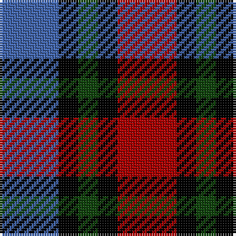

In pattern [BKGKR](/patterns/bkgkr/).

This was sourced from weddslist.  It is a [5 stripes tartan](/stripes/stripes5/).

Original link http://www.weddslist.com/cgi-bin/tartans/pg.pl?source=tinsel

## Thread count
B/24 K8 DG8 K8 DR/24

## Palette
Each colour and its ΔE from the base-6 reference it is a variant of.

| Colour | Shade | Base | ΔE (OKLab) |
|---|---|---|---|
| B | <code style="background-color:#4367AE;">#4367AE</code> `#4367AE` | B <code style="background-color:#2C4084;">#2C4084</code> | 0.13 |
| DG | <code style="background-color:#11450D;">#11450D</code> `#11450D` | G <code style="background-color:#006400;">#006400</code> | 0.10 |
| DR | <code style="background-color:#AA0000;">#AA0000</code> `#AA0000` | R <code style="background-color:#C80000;">#C80000</code> | 0.06 |
| K | <code style="background-color:#000000;">#000000</code> `#000000` | K <code style="background-color:#000000;">#000000</code> | 0.00 |

# Sample pattern

## Nearest tartans

The nearest existing variants by ΔTartan distance.

1. [Clark](/setts/s5/b12k4g4k4r12-b4367ae-g11450d-k000000-raa0000/) — ΔT 0.00
1. [Austin / Wilson's No 137](/setts/s5/b6k6b6g12r4-b800080-g008000-k000000-rc00000/) — ΔT 0.93
1. [Austin (Wilson's No 173)](/setts/s5/b6k6b6g12y4-b5a008c-g005020-k101010-ye8c000/) — ΔT 1.17
1. [Clark, Red](/setts/s8/r52k16g16k16b52k16g16k16-b1c0070-g808080-k101010-rc80000/) — ΔT 1.20
1. [Chivas Regal](/setts/s5/b12k12b12r28y6-b003c64-k101010-rb03000-ye8c000/) — ΔT 1.27
1. [Wilson's No.220](/setts/s4/b20k20g20w4-b740074-g006818-k101010-we0e0e0/) — ΔT 1.29
1. [Unnamed, No 60](/setts/s4/b12k10g10r2-b800080-g008000-k000000-rc00000/) — ΔT 1.36
1. [MacNeil 2](/setts/s6/w4b20k20g18k6w4-b800080-g008000-k000000-we0e0e0/) — ΔT 1.37
1. [Austin / Wilson's No 173](/setts/s5/b6k6b6g12y4-b800080-g008000-k000000-yf0c000/) — ΔT 1.37
1. [Thomas Newcomen's Combustion Engine](/setts/s4/k28r20w12b8-b202060-k101010-rc80000-wfcfcfc/) — ΔT 1.39

## Neighbour map

Every grey dot is one of 15726 variants placed by the first two principal components of the ΔTartan feature space (44% of its variance). Red is this tartan; blue dots are its nearest — click one to open its page.

<svg viewBox="0 0 640 380" role="img" style="max-width:100%;height:auto;border:1px solid #e0e0e0;border-radius:4px;display:block" xmlns="http://www.w3.org/2000/svg"><image href="/nn/cloud.v1.png" width="640" height="380"/><a href="/setts/s5/b12k4g4k4r12-b4367ae-g11450d-k000000-raa0000/"><circle cx="99.7" cy="278.1" r="4" fill="#3465a4"><title>Clark</title></circle></a><a href="/setts/s5/b6k6b6g12r4-b800080-g008000-k000000-rc00000/"><circle cx="85.1" cy="294.8" r="4" fill="#3465a4"><title>Austin / Wilson's No 137</title></circle></a><a href="/setts/s5/b6k6b6g12y4-b5a008c-g005020-k101010-ye8c000/"><circle cx="92.6" cy="303.7" r="4" fill="#3465a4"><title>Austin (Wilson's No 173)</title></circle></a><a href="/setts/s8/r52k16g16k16b52k16g16k16-b1c0070-g808080-k101010-rc80000/"><circle cx="103.0" cy="250.9" r="4" fill="#3465a4"><title>Clark, Red</title></circle></a><a href="/setts/s5/b12k12b12r28y6-b003c64-k101010-rb03000-ye8c000/"><circle cx="160.7" cy="268.5" r="4" fill="#3465a4"><title>Chivas Regal</title></circle></a><a href="/setts/s4/b20k20g20w4-b740074-g006818-k101010-we0e0e0/"><circle cx="111.4" cy="290.8" r="4" fill="#3465a4"><title>Wilson's No.220</title></circle></a><a href="/setts/s4/b12k10g10r2-b800080-g008000-k000000-rc00000/"><circle cx="120.8" cy="274.5" r="4" fill="#3465a4"><title>Unnamed, No 60</title></circle></a><a href="/setts/s6/w4b20k20g18k6w4-b800080-g008000-k000000-we0e0e0/"><circle cx="104.8" cy="239.3" r="4" fill="#3465a4"><title>MacNeil 2</title></circle></a><a href="/setts/s5/b6k6b6g12y4-b800080-g008000-k000000-yf0c000/"><circle cx="71.2" cy="290.7" r="4" fill="#3465a4"><title>Austin / Wilson's No 173</title></circle></a><a href="/setts/s4/k28r20w12b8-b202060-k101010-rc80000-wfcfcfc/"><circle cx="111.5" cy="280.1" r="4" fill="#3465a4"><title>Thomas Newcomen's Combustion Engine</title></circle></a><circle cx="99.7" cy="278.1" r="5" fill="#c00000"/></svg>

ID: /setts/s5/b24k8g8k8r24-b4367ae-g11450d-k000000-raa0000/
