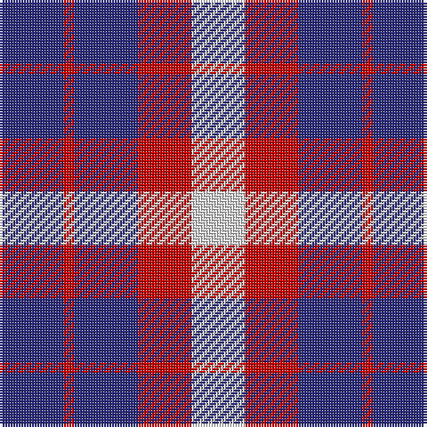

In pattern [BRBRW](/patterns/brbrw/).

This was sourced from tartans-authority.  It is a [5 stripes tartan](/stripes/stripes5/).

Original link http://www.tartansauthority.com/tartan-ferret/display/4068/

## Thread count
DB/24 R4 DB24 R20 LN/20

## Palette
Each colour and its ΔE from the base-6 reference it is a variant of.

| Colour | Shade | Base | ΔE (OKLab) |
|---|---|---|---|
| DB | <code style="background-color:#2C2C80;">#2C2C80</code> `#2C2C80` | B <code style="background-color:#2A418A;">#2A418A</code> | 0.06 |
| LN | <code style="background-color:#E0E0E0;">#E0E0E0</code> `#E0E0E0` | W <code style="background-color:#F7F7F7;">#F7F7F7</code> | 0.07 |
| R | <code style="background-color:#C80000;">#C80000</code> `#C80000` | R <code style="background-color:#CC0000;">#CC0000</code> | 0.01 |

# Sample pattern

## Nearest tartans

The nearest existing variants by ΔTartan distance.

1. [U.S. Coast Guard](/setts/s8/r20b24r4b24r4b24r20w20-b2c2c80-rc80000-we0e0e0/) — ΔT 1.13
1. [Coronation](/setts/s7/b14w2r14b8r4b8w4-b2c4084-rdc0000-we0e0e0/) — ΔT 1.40
1. [Johore Regiment (Military)](/setts/s5/b40k10b36y52k12-b2c2c80-k101010-yd09800/) — ΔT 1.44
1. [Coronation Commemorative Tartan Tartan Number: 661. Earliest known date: 1936 Designed to commemorate the coronation of King George VI and Queen Elizabeth in 1936. There is another count estimated from a drawing by Coulson Bonner which is now in the possession of the Scottish Tartan Society. B22 W2 R24 B12 R2 B12 W2 See products available Copyright © Blair Urquhart, Comrie, 2015](/setts/s7/b14w2r14b8r4b8w4-b202060-rc80000-we0e0e0/) — ΔT 1.51
1. [Coronation](/setts/s7/b14w2r14b8r4b8w4-b000050-rc00000-we0e0e0/) — ΔT 1.73
1. [Creek Indian Nation (District)](/setts/s7/b24b48y12b12y24b48y24-b2c2c80-ye8c000/) — ΔT 1.80
1. [International Highland Games Fed.](/setts/s4/b104r40g40w24-b2c2c80-g006818-rc80000-we0e0e0/) — ΔT 1.82
1. [Unidentified, Sample](/setts/s6/b22r8y18b8y4b22-b304080-rc00000-yf0c000/) — ΔT 1.83
1. [Unidentified Sample](/setts/s6/b22r8y18b8y4b22-b2c4084-rdc0000-ye8c000/) — ΔT 1.83
1. [Jahore](/setts/s5/b40k10b36y52k12-b304080-k000000-yf0c000/) — ΔT 1.84

## Neighbour map

Every grey dot is one of 15726 variants placed by the first two principal components of the ΔTartan feature space (44% of its variance). Red is this tartan; blue dots are its nearest — click one to open its page.

<svg viewBox="0 0 640 380" role="img" style="max-width:100%;height:auto;border:1px solid #e0e0e0;border-radius:4px;display:block" xmlns="http://www.w3.org/2000/svg"><image href="/nn/cloud.v1.png" width="640" height="380"/><a href="/setts/s8/r20b24r4b24r4b24r20w20-b2c2c80-rc80000-we0e0e0/"><circle cx="224.3" cy="255.5" r="4" fill="#3465a4"><title>U.S. Coast Guard</title></circle></a><a href="/setts/s7/b14w2r14b8r4b8w4-b2c4084-rdc0000-we0e0e0/"><circle cx="277.5" cy="244.3" r="4" fill="#3465a4"><title>Coronation</title></circle></a><a href="/setts/s5/b40k10b36y52k12-b2c2c80-k101010-yd09800/"><circle cx="227.4" cy="275.8" r="4" fill="#3465a4"><title>Johore Regiment (Military)</title></circle></a><a href="/setts/s7/b14w2r14b8r4b8w4-b202060-rc80000-we0e0e0/"><circle cx="272.3" cy="244.2" r="4" fill="#3465a4"><title>Coronation Commemorative Tartan Tartan Number: 661. Earliest known date: 1936 Designed to commemorate the coronation of King George VI and Queen Elizabeth in 1936. There is another count estimated from a drawing by Coulson Bonner which is now in the possession of the Scottish Tartan Society. B22 W2 R24 B12 R2 B12 W2 See products available Copyright © Blair Urquhart, Comrie, 2015</title></circle></a><a href="/setts/s7/b14w2r14b8r4b8w4-b000050-rc00000-we0e0e0/"><circle cx="259.7" cy="244.9" r="4" fill="#3465a4"><title>Coronation</title></circle></a><a href="/setts/s7/b24b48y12b12y24b48y24-b2c2c80-ye8c000/"><circle cx="162.1" cy="256.8" r="4" fill="#3465a4"><title>Creek Indian Nation (District)</title></circle></a><a href="/setts/s4/b104r40g40w24-b2c2c80-g006818-rc80000-we0e0e0/"><circle cx="194.0" cy="270.5" r="4" fill="#3465a4"><title>International Highland Games Fed.</title></circle></a><a href="/setts/s6/b22r8y18b8y4b22-b304080-rc00000-yf0c000/"><circle cx="296.2" cy="267.2" r="4" fill="#3465a4"><title>Unidentified, Sample</title></circle></a><a href="/setts/s6/b22r8y18b8y4b22-b2c4084-rdc0000-ye8c000/"><circle cx="294.8" cy="267.2" r="4" fill="#3465a4"><title>Unidentified Sample</title></circle></a><a href="/setts/s5/b40k10b36y52k12-b304080-k000000-yf0c000/"><circle cx="206.7" cy="267.4" r="4" fill="#3465a4"><title>Jahore</title></circle></a><circle cx="213.3" cy="279.4" r="5" fill="#c00000"/></svg>

ID: /setts/s5/b24r4b24r20w20-b2c2c80-rc80000-we0e0e0/
