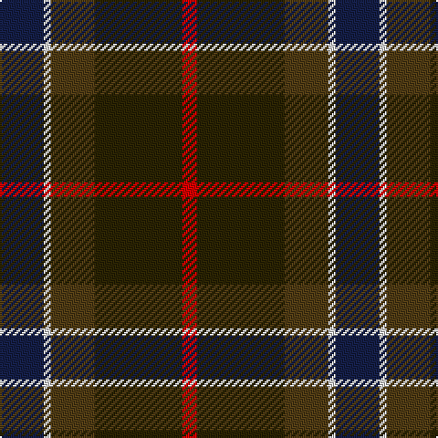

In pattern [BWGBR](/patterns/bwgbr/).

This was sourced from register-of-tartans.  It is a [5 stripes tartan](/stripes/stripes5/).

Original link https://www.tartanregister.gov.uk/tartanDetails.aspx?ref=4444

## Thread count
DB/24 LN4 T24 K48 R/8

## Palette
Each colour and its ΔE from the base-6 reference it is a variant of.

| Colour | Shade | Base | ΔE (OKLab) |
|---|---|---|---|
| DB | <code style="background-color:#141E46;">#141E46</code> `#141E46` | B <code style="background-color:#2C4084;">#2C4084</code> | 0.15 |
| K | <code style="background-color:#2A2303;">#2A2303</code> `#2A2303` | B <code style="background-color:#2C4084;">#2C4084</code> | 0.21 |
| LN | <code style="background-color:#E0E0E0;">#E0E0E0</code> `#E0E0E0` | W <code style="background-color:#F4F4F0;">#F4F4F0</code> | 0.06 |
| R | <code style="background-color:#DC0000;">#DC0000</code> `#DC0000` | R <code style="background-color:#C80000;">#C80000</code> | 0.04 |
| T | <code style="background-color:#503C14;">#503C14</code> `#503C14` | G <code style="background-color:#006400;">#006400</code> | 0.15 |

# Sample pattern

## Nearest tartans

The nearest existing variants by ΔTartan distance.

1. [Andover (Fashion)](/setts/s6/r4b48k24y4ba40r4-b5c5c5c-ba4c3428-k101010-rc80000-yfccc00/) — ΔT 1.03
1. [Andover](/setts/s6/r4b48k24ka4ba40r4-b5c5c5c-ba4c3428-k101010-ka000000-rc80000/) — ΔT 1.04
1. [Loch Long One Design](/setts/s6/y8k56r4b44ba16b6-b3d3134-ba5f749c-k1c1714-rca2625-ye0a126/) — ΔT 1.07
1. [Ballantrae (Macnaughtons)](/setts/s7/g12r6g68k32y6b44r8-b1c1c1c-g604000-k101010-rc80000-ye8c000/) — ΔT 1.10
1. [Lisbon](/setts/s6/g4b24ba6ga44ba44r4-b1c0070-ba441800-g8c7038-ga006818-r880000/) — ΔT 1.15
1. [Cultoquhey Hotel Corporate Tartan Tartan Number: 3393. Earliest known date: circa1990 Designed by Peter MacDonald as a Cook tartan for the former owners (David & Anna) of the Cultoquhey Hotel near Crieff. When they left, if became the house tartan of the hotel See products available Copyright © Blair Urquhart, Comrie, 2015](/setts/s5/r6b44k22g64y6-b202060-g003820-k101010-rc80000-yd8b000/) — ΔT 1.18
1. [Douglas, (Brown)](/setts/s5/k14b6g60ba60w6-b3c82af-ba141e46-g503c14-k101010-we0e0e0/) — ΔT 1.18
1. [Lyle and Scott](/setts/s6/g10b4g18ba38r18y4-b1474b4-ba003c64-g003820-ra00000-yfccc00/) — ΔT 1.21
1. [Unidentified #66](/setts/s6/y4b4r32k32b40ya4-b2a2303-k101010-r960000-y96963c-yae8c000/) — ΔT 1.21
1. [McCarthy, Old](/setts/s5/b14r52b14g48y4-b202060-g003820-r880000-ye8c000/) — ΔT 1.22

## Neighbour map

Every grey dot is one of 15726 variants placed by the first two principal components of the ΔTartan feature space (44% of its variance). Red is this tartan; blue dots are its nearest — click one to open its page.

<svg viewBox="0 0 640 380" role="img" style="max-width:100%;height:auto;border:1px solid #e0e0e0;border-radius:4px;display:block" xmlns="http://www.w3.org/2000/svg"><image href="/nn/cloud.v1.png" width="640" height="380"/><a href="/setts/s6/r4b48k24y4ba40r4-b5c5c5c-ba4c3428-k101010-rc80000-yfccc00/"><circle cx="238.3" cy="202.6" r="4" fill="#3465a4"><title>Andover (Fashion)</title></circle></a><a href="/setts/s6/r4b48k24ka4ba40r4-b5c5c5c-ba4c3428-k101010-ka000000-rc80000/"><circle cx="251.9" cy="210.1" r="4" fill="#3465a4"><title>Andover</title></circle></a><a href="/setts/s6/y8k56r4b44ba16b6-b3d3134-ba5f749c-k1c1714-rca2625-ye0a126/"><circle cx="261.8" cy="196.3" r="4" fill="#3465a4"><title>Loch Long One Design</title></circle></a><a href="/setts/s7/g12r6g68k32y6b44r8-b1c1c1c-g604000-k101010-rc80000-ye8c000/"><circle cx="261.5" cy="199.2" r="4" fill="#3465a4"><title>Ballantrae (Macnaughtons)</title></circle></a><a href="/setts/s6/g4b24ba6ga44ba44r4-b1c0070-ba441800-g8c7038-ga006818-r880000/"><circle cx="237.3" cy="212.4" r="4" fill="#3465a4"><title>Lisbon</title></circle></a><a href="/setts/s5/r6b44k22g64y6-b202060-g003820-k101010-rc80000-yd8b000/"><circle cx="267.5" cy="236.0" r="4" fill="#3465a4"><title>Cultoquhey Hotel Corporate Tartan Tartan Number: 3393. Earliest known date: circa1990 Designed by Peter MacDonald as a Cook tartan for the former owners (David &amp; Anna) of the Cultoquhey Hotel near Crieff. When they left, if became the house tartan of the hotel See products available Copyright © Blair Urquhart, Comrie, 2015</title></circle></a><a href="/setts/s5/k14b6g60ba60w6-b3c82af-ba141e46-g503c14-k101010-we0e0e0/"><circle cx="256.0" cy="223.4" r="4" fill="#3465a4"><title>Douglas, (Brown)</title></circle></a><a href="/setts/s6/g10b4g18ba38r18y4-b1474b4-ba003c64-g003820-ra00000-yfccc00/"><circle cx="216.8" cy="220.4" r="4" fill="#3465a4"><title>Lyle and Scott</title></circle></a><a href="/setts/s6/y4b4r32k32b40ya4-b2a2303-k101010-r960000-y96963c-yae8c000/"><circle cx="216.9" cy="210.5" r="4" fill="#3465a4"><title>Unidentified #66</title></circle></a><a href="/setts/s5/b14r52b14g48y4-b202060-g003820-r880000-ye8c000/"><circle cx="272.1" cy="236.0" r="4" fill="#3465a4"><title>McCarthy, Old</title></circle></a><circle cx="250.1" cy="229.0" r="5" fill="#c00000"/></svg>

ID: /setts/s5/b24w4g24ba48r8-b141e46-ba2a2303-g503c14-rdc0000-we0e0e0/
