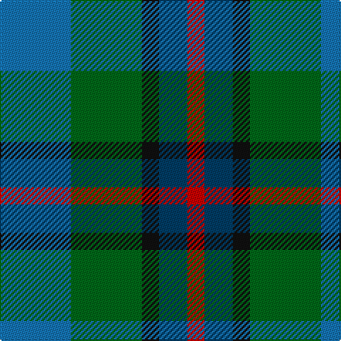

In pattern [BGKBR](/patterns/bgkbr/).

This was sourced from tartans-authority.  It is a [5 stripes tartan](/stripes/stripes5/).

Original link http://www.tartansauthority.com/tartan-ferret/display/10488/

## Thread count
B/50 G50 K12 DB20 R/12

## Palette
Each colour and its ΔE from the base-6 reference it is a variant of.

| Colour | Shade | Base | ΔE (OKLab) |
|---|---|---|---|
| B | <code style="background-color:#1474B4;">#1474B4</code> `#1474B4` | B <code style="background-color:#2A418A;">#2A418A</code> | 0.15 |
| DB | <code style="background-color:#003C64;">#003C64</code> `#003C64` | B <code style="background-color:#2A418A;">#2A418A</code> | 0.08 |
| G | <code style="background-color:#006818;">#006818</code> `#006818` | G <code style="background-color:#006100;">#006100</code> | 0.02 |
| K | <code style="background-color:#101010;">#101010</code> `#101010` | K <code style="background-color:#000000;">#000000</code> | 0.17 |
| R | <code style="background-color:#C80000;">#C80000</code> `#C80000` | R <code style="background-color:#CC0000;">#CC0000</code> | 0.01 |

# Sample pattern

## Nearest tartans

The nearest existing variants by ΔTartan distance.

1. [Birse](/setts/s6/k4g16k14y3b16r4~b105880-g00643c-k101010-rc80000-ybc8c00~x2/) — ΔT 1.11
1. [Davidson of Tulloch #2](/setts/s5/r1b6k3g6w1~b2c4084-g005020-k101010-rdc0000-we0e0e0~x4/) — ΔT 1.25
1. [Friebe (2014)](/setts/s5/g15ga18b23w4r8~b003c64-g408060-ga003820-rc80000-wfcfcfc~x2/) — ΔT 1.27
1. [Unnamed, No 29](/setts/s6/b3g11ba2b11bb6g3~b304080-ba5480b0-bb8080d0-g008000~x2/) — ΔT 1.28
1. [Forbo Nairn](/setts/s5/b2g8k7ba12r2~b5c8ca8-ba2c2c80-g006818-k101010-rc80000~x4/) — ΔT 1.33
1. [Casely](/setts/s6/r4g11k11g2b11ga3~b506878-g30644c-ga446428-k101010-rc80000~x4/) — ΔT 1.35
1. [Breon (Jersey Shore, Pennsylvania) (Personal)](/setts/s5/b25g25k6ba10r6~b5f749c-ba433a5a-g23321b-k1c1714-rb62531~x2/) — ΔT 1.37
1. [Bath](/setts/s5/k4b2g13ba13w2~b1474b4-ba2c2c80-g006818-k101010-we0e0e0~x4/) — ΔT 1.43
1. [Norwich No.040](/setts/s4/b6ba6g6r1~b5c8ca8-ba2c2c80-g006818-rc80000~x2/) — ΔT 1.47
1. [Fox-Eves Wedding (Personal)](/setts/s6/r9b6ba13b21ra18w4~b1870a4-ba003c64-ra00000-ra888888-wfcfcfc~x2/) — ΔT 1.47

## Neighbour map

Every grey dot is one of 15726 variants placed by the first two principal components of the ΔTartan feature space (44% of its variance). Red is this tartan; blue dots are its nearest — click one to open its page.

<svg viewBox="0 0 640 380" role="img" style="max-width:100%;height:auto;border:1px solid #e0e0e0;border-radius:4px;display:block" xmlns="http://www.w3.org/2000/svg"><image href="/nn/cloud.v1.png" width="640" height="380"/><a href="/setts/s6/k4g16k14y3b16r4~b105880-g00643c-k101010-rc80000-ybc8c00~x2/"><circle cx="124.0" cy="248.6" r="4" fill="#3465a4"><title>Birse</title></circle></a><a href="/setts/s5/r1b6k3g6w1~b2c4084-g005020-k101010-rdc0000-we0e0e0~x4/"><circle cx="143.4" cy="243.2" r="4" fill="#3465a4"><title>Davidson of Tulloch #2</title></circle></a><a href="/setts/s5/g15ga18b23w4r8~b003c64-g408060-ga003820-rc80000-wfcfcfc~x2/"><circle cx="101.2" cy="257.2" r="4" fill="#3465a4"><title>Friebe (2014)</title></circle></a><a href="/setts/s6/b3g11ba2b11bb6g3~b304080-ba5480b0-bb8080d0-g008000~x2/"><circle cx="195.4" cy="267.4" r="4" fill="#3465a4"><title>Unnamed, No 29</title></circle></a><a href="/setts/s5/b2g8k7ba12r2~b5c8ca8-ba2c2c80-g006818-k101010-rc80000~x4/"><circle cx="156.6" cy="252.1" r="4" fill="#3465a4"><title>Forbo Nairn</title></circle></a><a href="/setts/s6/r4g11k11g2b11ga3~b506878-g30644c-ga446428-k101010-rc80000~x4/"><circle cx="130.4" cy="255.6" r="4" fill="#3465a4"><title>Casely</title></circle></a><a href="/setts/s5/b25g25k6ba10r6~b5f749c-ba433a5a-g23321b-k1c1714-rb62531~x2/"><circle cx="161.5" cy="273.6" r="4" fill="#3465a4"><title>Breon (Jersey Shore, Pennsylvania) (Personal)</title></circle></a><a href="/setts/s5/k4b2g13ba13w2~b1474b4-ba2c2c80-g006818-k101010-we0e0e0~x4/"><circle cx="166.6" cy="232.2" r="4" fill="#3465a4"><title>Bath</title></circle></a><a href="/setts/s4/b6ba6g6r1~b5c8ca8-ba2c2c80-g006818-rc80000~x2/"><circle cx="151.4" cy="297.8" r="4" fill="#3465a4"><title>Norwich No.040</title></circle></a><a href="/setts/s6/r9b6ba13b21ra18w4~b1870a4-ba003c64-ra00000-ra888888-wfcfcfc~x2/"><circle cx="129.0" cy="251.9" r="4" fill="#3465a4"><title>Fox-Eves Wedding (Personal)</title></circle></a><circle cx="133.9" cy="268.7" r="5" fill="#c00000"/></svg>

ID: /setts/s5/b25g25k6ba10r6~b1474b4-ba003c64-g006818-k101010-rc80000~x2/
