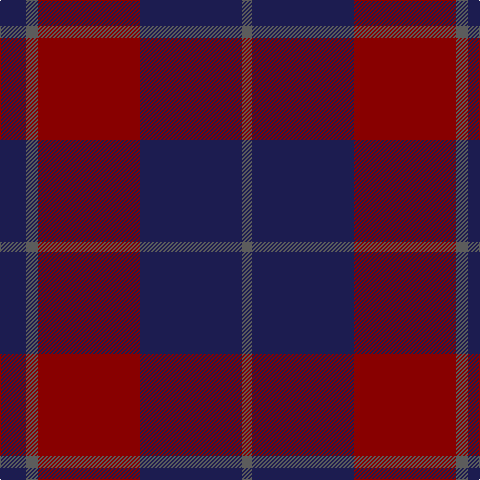

In pattern [BBRBB](/patterns/bbrbb/).

This was sourced from tartans-authority.  It is a [5 stripes tartan](/stripes/stripes5/).

Original link http://www.tartansauthority.com/tartan-ferret/display/8030/

## Thread count
DB/26 N12 DR102 DB102 N/10

## Palette
Each colour and its ΔE from the base-6 reference it is a variant of.

| Colour | Shade | Base | ΔE (OKLab) |
|---|---|---|---|
| DB | <code style="background-color:#1C1C50;">#1C1C50</code> `#1C1C50` | B <code style="background-color:#2A418A;">#2A418A</code> | 0.14 |
| DR | <code style="background-color:#880000;">#880000</code> `#880000` | R <code style="background-color:#CC0000;">#CC0000</code> | 0.15 |
| N | <code style="background-color:#5C5C5C;">#5C5C5C</code> `#5C5C5C` | B <code style="background-color:#2A418A;">#2A418A</code> | 0.15 |

# Sample pattern

## Nearest tartans

The nearest existing variants by ΔTartan distance.

1. [Perthshire Tourist Board (Corporate)](/setts/s6/b52r12g32b16g6r4-b500048-g006818-r880000/) — ΔT 1.16
1. [Feniston (Personal)](/setts/s5/b60ba20b6ba60r6-b680028-ba202060-rec34c4/) — ΔT 1.20
1. [MacArthur-Fox, dress](/setts/s6/b8r64ba12r12ba52ra8-b5480b0-ba304080-r800000-rac00000/) — ΔT 1.21
1. [Laurel Cadre, The](/setts/s5/b12r8k64b75r8-b43146f-k101010-rdc0000/) — ΔT 1.22
1. [Robbins](/setts/s6/b4r12b4r12b24g4-b304080-g008000-r900030/) — ΔT 1.29
1. [MacArthur-Fox Dress Personal Tartan Tartan Number: 459. Earliest known date: 1986 This is the older of the two MacArthur setts, which links the clan with the Campbells. See products available Copyright © Blair Urquhart, Comrie, 2015](/setts/s6/b8r64ba12r12ba52ra8-b5c8ca8-ba2c2c80-r880000-rac80000/) — ΔT 1.33
1. [Perthshire Tourist Board](/setts/s6/k52r12g32k16g6r4-g003c00-k20001c-r880000/) — ΔT 1.36
1. [Unidentified Tartan Tartan Number: 598. Earliest known date: 0 Seen by Alex Lumsden in a Toronto subway 1984. See products available Copyright © Blair Urquhart, Comrie, 2015](/setts/s5/b48g6b48g57r12-b2c2c80-g604000-rc80000/) — ΔT 1.41
1. [Keeper of the Quaich Corporate Tartan Tartan Number: 1731. Earliest known date: 1988 Restricted. Sample in STS collection. See products available Copyright © Blair Urquhart, Comrie, 2015](/setts/s6/b3ba3b3ba27b40y3-b4c2424-ba2c2c80-ye8c000/) — ΔT 1.49
1. [Dege of Saville Row](/setts/s6/g44b4g12ba4b36r4-b202060-ba2c2c80-g604000-rc80000/) — ΔT 1.49

## Neighbour map

Every grey dot is one of 15726 variants placed by the first two principal components of the ΔTartan feature space (44% of its variance). Red is this tartan; blue dots are its nearest — click one to open its page.

<svg viewBox="0 0 640 380" role="img" style="max-width:100%;height:auto;border:1px solid #e0e0e0;border-radius:4px;display:block" xmlns="http://www.w3.org/2000/svg"><image href="/nn/cloud.v1.png" width="640" height="380"/><a href="/setts/s6/b52r12g32b16g6r4-b500048-g006818-r880000/"><circle cx="378.2" cy="235.8" r="4" fill="#3465a4"><title>Perthshire Tourist Board (Corporate)</title></circle></a><a href="/setts/s5/b60ba20b6ba60r6-b680028-ba202060-rec34c4/"><circle cx="424.1" cy="277.2" r="4" fill="#3465a4"><title>Feniston (Personal)</title></circle></a><a href="/setts/s6/b8r64ba12r12ba52ra8-b5480b0-ba304080-r800000-rac00000/"><circle cx="346.9" cy="239.5" r="4" fill="#3465a4"><title>MacArthur-Fox, dress</title></circle></a><a href="/setts/s5/b12r8k64b75r8-b43146f-k101010-rdc0000/"><circle cx="366.0" cy="254.5" r="4" fill="#3465a4"><title>Laurel Cadre, The</title></circle></a><a href="/setts/s6/b4r12b4r12b24g4-b304080-g008000-r900030/"><circle cx="364.6" cy="281.8" r="4" fill="#3465a4"><title>Robbins</title></circle></a><a href="/setts/s6/b8r64ba12r12ba52ra8-b5c8ca8-ba2c2c80-r880000-rac80000/"><circle cx="329.9" cy="230.6" r="4" fill="#3465a4"><title>MacArthur-Fox Dress Personal Tartan Tartan Number: 459. Earliest known date: 1986 This is the older of the two MacArthur setts, which links the clan with the Campbells. See products available Copyright © Blair Urquhart, Comrie, 2015</title></circle></a><a href="/setts/s6/k52r12g32k16g6r4-g003c00-k20001c-r880000/"><circle cx="403.7" cy="254.9" r="4" fill="#3465a4"><title>Perthshire Tourist Board</title></circle></a><a href="/setts/s5/b48g6b48g57r12-b2c2c80-g604000-rc80000/"><circle cx="383.4" cy="289.5" r="4" fill="#3465a4"><title>Unidentified Tartan Tartan Number: 598. Earliest known date: 0 Seen by Alex Lumsden in a Toronto subway 1984. See products available Copyright © Blair Urquhart, Comrie, 2015</title></circle></a><a href="/setts/s6/b3ba3b3ba27b40y3-b4c2424-ba2c2c80-ye8c000/"><circle cx="455.9" cy="231.8" r="4" fill="#3465a4"><title>Keeper of the Quaich Corporate Tartan Tartan Number: 1731. Earliest known date: 1988 Restricted. Sample in STS collection. See products available Copyright © Blair Urquhart, Comrie, 2015</title></circle></a><a href="/setts/s6/g44b4g12ba4b36r4-b202060-ba2c2c80-g604000-rc80000/"><circle cx="397.6" cy="237.5" r="4" fill="#3465a4"><title>Dege of Saville Row</title></circle></a><circle cx="386.1" cy="261.7" r="5" fill="#c00000"/></svg>

ID: /setts/s5/b26ba12r102b102ba10-b1c1c50-ba5c5c5c-r880000/
