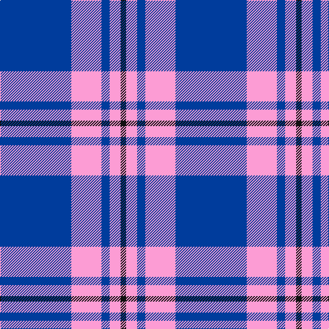

In pattern [BWBWK](/patterns/bwbwk/).

This was sourced from tartans-authority.  It is a [5 stripes tartan](/stripes/stripes5/).

Original link http://www.tartansauthority.com/tartan-ferret/display/7638/

## Attestations

This cloth appears in 2 source records; the oldest owns this page.

- May 2008 — Debbie Munro Memorial (Corporate) (tartans-authority, [record](http://www.tartansauthority.com/tartan-ferret/display/7638/))
- undated — Debbie Munro Memorial (register-of-tartans, [record](https://www.tartanregister.gov.uk/tartanDetails.aspx?ref=5653))

## Thread count
B/104 LP44 B12 LP16 K/8

## Palette
Each colour and its ΔE from the base-6 reference it is a variant of.

| Colour | Shade | Base | ΔE (OKLab) |
|---|---|---|---|
| B | <code style="background-color:#003C9C;">#003C9C</code> `#003C9C` | B <code style="background-color:#2A418A;">#2A418A</code> | 0.05 |
| K | <code style="background-color:#101010;">#101010</code> `#101010` | K <code style="background-color:#000000;">#000000</code> | 0.17 |
| LP | <code style="background-color:#FC9CD4;">#FC9CD4</code> `#FC9CD4` | W <code style="background-color:#F7F7F7;">#F7F7F7</code> | 0.22 |

# Sample pattern

## Nearest tartans

The nearest existing variants by ΔTartan distance.

1. [Glen Moy](/setts/s5/b13w3b1r3w1x6~b1c0070-rc80000-wc0c0c0/) — ΔT 1.20
1. [Whitley (Personal)](/setts/s6/b1w5b1w5b15y1x4~b3850c8-we0e0e0-ye8c000/) — ΔT 1.36
1. [Loch Lomond #2](/setts/s5/b13w3b1k3w1x6~b2474e8-k101010-wfcfcfc/) — ΔT 1.38
1. [Nike ACG Lunarstorm (Fashion)](/setts/s7/b8r2b18r1b2w10b4x2~b2c2c80-rc80000-wf8f8f8/) — ΔT 1.40
1. [UEFA (Glasgow)](/setts/s6/r12b4y5b30y5b4x4~b3850c8-rc80000-ye8c000/) — ΔT 1.41
1. [UEFA (Corporate)](/setts/s4/b30y5b4r12x4~b3850c8-rc80000-ye8c000/) — ΔT 1.44
1. [Carlisle Ancient](/setts/s5/b11y2r1y2r1x4~b2474e8-r880000-yd09800/) — ΔT 1.46
1. [Glen Moy Trade Tartan Tartan Number: 635. Earliest known date: pre 1992 Its mainly Sheep farming in Glen Moy. Off the beaten track, its a very quiet area of the Angus glens close to Cortachy castle and great for walking if you like it to yourself! Its also close to Glen Clova which is the busiest glen around here with some fantastic mountains for walking and taking photos. See products available Copyright © Blair Urquhart, Comrie, 2015](/setts/s5/b37w9b3r9w3x2~b202060-rc80000-we0e0e0/) — ΔT 1.46
1. [Gallaecia (Unofficial) (District)](/setts/s5/b24ba13b4ba4w2x2~b1c1c50-ba2888c4-we0e0e0/) — ΔT 1.47
1. [Loch Lomond](/setts/s5/b37w9b3ba9w3x2~b5480b0-ba000050-we0e0e0/) — ΔT 1.48

## Neighbour map

Every grey dot is one of 15726 variants placed by the first two principal components of the ΔTartan feature space (44% of its variance). Red is this tartan; blue dots are its nearest — click one to open its page.

<svg viewBox="0 0 640 380" role="img" style="max-width:100%;height:auto;border:1px solid #e0e0e0;border-radius:4px;display:block" xmlns="http://www.w3.org/2000/svg"><image href="/nn/cloud.v1.png" width="640" height="380"/><a href="/setts/s5/b13w3b1r3w1x6~b1c0070-rc80000-wc0c0c0/"><circle cx="393.0" cy="206.9" r="4" fill="#3465a4"><title>Glen Moy</title></circle></a><a href="/setts/s6/b1w5b1w5b15y1x4~b3850c8-we0e0e0-ye8c000/"><circle cx="364.0" cy="186.7" r="4" fill="#3465a4"><title>Whitley (Personal)</title></circle></a><a href="/setts/s5/b13w3b1k3w1x6~b2474e8-k101010-wfcfcfc/"><circle cx="372.2" cy="202.0" r="4" fill="#3465a4"><title>Loch Lomond #2</title></circle></a><a href="/setts/s7/b8r2b18r1b2w10b4x2~b2c2c80-rc80000-wf8f8f8/"><circle cx="407.1" cy="190.7" r="4" fill="#3465a4"><title>Nike ACG Lunarstorm (Fashion)</title></circle></a><a href="/setts/s6/r12b4y5b30y5b4x4~b3850c8-rc80000-ye8c000/"><circle cx="345.0" cy="222.5" r="4" fill="#3465a4"><title>UEFA (Glasgow)</title></circle></a><a href="/setts/s4/b30y5b4r12x4~b3850c8-rc80000-ye8c000/"><circle cx="380.2" cy="255.7" r="4" fill="#3465a4"><title>UEFA (Corporate)</title></circle></a><a href="/setts/s5/b11y2r1y2r1x4~b2474e8-r880000-yd09800/"><circle cx="394.3" cy="212.3" r="4" fill="#3465a4"><title>Carlisle Ancient</title></circle></a><a href="/setts/s5/b37w9b3r9w3x2~b202060-rc80000-we0e0e0/"><circle cx="375.8" cy="205.4" r="4" fill="#3465a4"><title>Glen Moy Trade Tartan Tartan Number: 635. Earliest known date: pre 1992 Its mainly Sheep farming in Glen Moy. Off the beaten track, its a very quiet area of the Angus glens close to Cortachy castle and great for walking if you like it to yourself! Its also close to Glen Clova which is the busiest glen around here with some fantastic mountains for walking and taking photos. See products available Copyright © Blair Urquhart, Comrie, 2015</title></circle></a><a href="/setts/s5/b24ba13b4ba4w2x2~b1c1c50-ba2888c4-we0e0e0/"><circle cx="362.7" cy="236.4" r="4" fill="#3465a4"><title>Gallaecia (Unofficial) (District)</title></circle></a><a href="/setts/s5/b37w9b3ba9w3x2~b5480b0-ba000050-we0e0e0/"><circle cx="380.0" cy="210.1" r="4" fill="#3465a4"><title>Loch Lomond</title></circle></a><circle cx="375.8" cy="211.2" r="5" fill="#c00000"/></svg>

ID: /setts/s5/b26w11b3w4k2x4~b003c9c-k101010-wfc9cd4/
