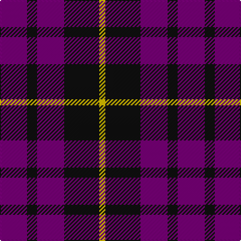

In pattern [BKBKY](/patterns/bkbky/).

This was sourced from tartans-authority.  It is a [5 stripes tartan](/stripes/stripes5/).

Original link http://www.tartansauthority.com/tartan-ferret/display/8076/

## Thread count
P/27 K10 P27 K35 Y/6

## Palette
Each colour and its ΔE from the base-6 reference it is a variant of.

| Colour | Shade | Base | ΔE (OKLab) |
|---|---|---|---|
| K | <code style="background-color:#101010;">#101010</code> `#101010` | K <code style="background-color:#000000;">#000000</code> | 0.17 |
| P | <code style="background-color:#780078;">#780078</code> `#780078` | B <code style="background-color:#2C4084;">#2C4084</code> | 0.16 |
| Y | <code style="background-color:#E8C000;">#E8C000</code> `#E8C000` | Y <code style="background-color:#E8C000;">#E8C000</code> | 0.00 |

# Sample pattern

## Nearest tartans

The nearest existing variants by ΔTartan distance.

1. [Baru](/setts/s5/b46g16b46g70w10-b780078-g003820-we0e0e0/) — ΔT 0.99
1. [Hamilton](/setts/s5/b12r2b12r18y2-b000052-raa0000-yaaaaaa/) — ΔT 1.09
1. [Hamilton](/setts/s5/b12r2b12r18w2-b00004c-rc80000-wd0d0d0/) — ΔT 1.36
1. [Robbins](/setts/s6/b8r24b8r24b48g8-b1c0070-g006818-r880000/) — ΔT 1.38
1. [Hamilton Red Clan Tartan Tartan Number: 477. Earliest known date: 1842 First recorded in the Vestiarium Scoticum which was supposedly based on an ancient manuscript now known to have been forged. The original illustration shows the four main stripes in a very dark shade of blue. There is no evidence of a Hamilton tartan prior to the publication of this spectacular work. The authors, the Sobieski Stuart brothers, enjoyed a popular following amongst the Scottish gentry of the period and it is probable that the design can be attributed to Charles Edward Stuart (Allan Hay) who prepared the illustrations for the book. See products available Copyright © Blair Urquhart, Comrie, 2015](/setts/s5/b24r4b24r36w4-b2c2c80-rc80000-we0e0e0/) — ΔT 1.45
1. [Coronation Commemorative Tartan Tartan Number: 661. Earliest known date: 1936 Designed to commemorate the coronation of King George VI and Queen Elizabeth in 1936. There is another count estimated from a drawing by Coulson Bonner which is now in the possession of the Scottish Tartan Society. B22 W2 R24 B12 R2 B12 W2 See products available Copyright © Blair Urquhart, Comrie, 2015](/setts/s7/b14w2r14b8r4b8w4-b202060-rc80000-we0e0e0/) — ΔT 1.47
1. [Laval (Tartan de..) District Tartan Tartan Number: 2120. Earliest known date: 1988 "Purple (Wine red is sample) and blue (Dark blue) are the city's official colours. The symbolize the wealth and the quality of life and the development of a human city. White combines with blue and red to remind us of our French and British origins." (Guy Menard - Communication Services, Laval) See products available Copyright © Blair Urquhart, Comrie, 2015](/setts/s5/b4w4ba16b16w2-b202060-ba680028-we0e0e0/) — ΔT 1.51
1. [Highland Spirit (Fashion)](/setts/s5/b30ba10b30ba42w4-b780078-ba000c3c-we0e0e0/) — ΔT 1.52
1. [Coronation](/setts/s7/b14w2r14b8r4b8w4-b000050-rc00000-we0e0e0/) — ΔT 1.56
1. [Laval, Tartan de](/setts/s5/b4w4ba16b16w4-b1c0070-ba680028-wc0c0c0/) — ΔT 1.58

## Neighbour map

Every grey dot is one of 15726 variants placed by the first two principal components of the ΔTartan feature space (44% of its variance). Red is this tartan; blue dots are its nearest — click one to open its page.

<svg viewBox="0 0 640 380" role="img" style="max-width:100%;height:auto;border:1px solid #e0e0e0;border-radius:4px;display:block" xmlns="http://www.w3.org/2000/svg"><image href="/nn/cloud.v1.png" width="640" height="380"/><a href="/setts/s5/b46g16b46g70w10-b780078-g003820-we0e0e0/"><circle cx="293.3" cy="276.7" r="4" fill="#3465a4"><title>Baru</title></circle></a><a href="/setts/s5/b12r2b12r18y2-b000052-raa0000-yaaaaaa/"><circle cx="313.1" cy="250.2" r="4" fill="#3465a4"><title>Hamilton</title></circle></a><a href="/setts/s5/b12r2b12r18w2-b00004c-rc80000-wd0d0d0/"><circle cx="299.8" cy="241.7" r="4" fill="#3465a4"><title>Hamilton</title></circle></a><a href="/setts/s6/b8r24b8r24b48g8-b1c0070-g006818-r880000/"><circle cx="331.8" cy="270.0" r="4" fill="#3465a4"><title>Robbins</title></circle></a><a href="/setts/s5/b24r4b24r36w4-b2c2c80-rc80000-we0e0e0/"><circle cx="321.7" cy="244.8" r="4" fill="#3465a4"><title>Hamilton Red Clan Tartan Tartan Number: 477. Earliest known date: 1842 First recorded in the Vestiarium Scoticum which was supposedly based on an ancient manuscript now known to have been forged. The original illustration shows the four main stripes in a very dark shade of blue. There is no evidence of a Hamilton tartan prior to the publication of this spectacular work. The authors, the Sobieski Stuart brothers, enjoyed a popular following amongst the Scottish gentry of the period and it is probable that the design can be attributed to Charles Edward Stuart (Allan Hay) who prepared the illustrations for the book. See products available Copyright © Blair Urquhart, Comrie, 2015</title></circle></a><a href="/setts/s7/b14w2r14b8r4b8w4-b202060-rc80000-we0e0e0/"><circle cx="272.3" cy="244.2" r="4" fill="#3465a4"><title>Coronation Commemorative Tartan Tartan Number: 661. Earliest known date: 1936 Designed to commemorate the coronation of King George VI and Queen Elizabeth in 1936. There is another count estimated from a drawing by Coulson Bonner which is now in the possession of the Scottish Tartan Society. B22 W2 R24 B12 R2 B12 W2 See products available Copyright © Blair Urquhart, Comrie, 2015</title></circle></a><a href="/setts/s5/b4w4ba16b16w2-b202060-ba680028-we0e0e0/"><circle cx="265.7" cy="243.3" r="4" fill="#3465a4"><title>Laval (Tartan de..) District Tartan Tartan Number: 2120. Earliest known date: 1988 &quot;Purple (Wine red is sample) and blue (Dark blue) are the city's official colours. The symbolize the wealth and the quality of life and the development of a human city. White combines with blue and red to remind us of our French and British origins.&quot; (Guy Menard - Communication Services, Laval) See products available Copyright © Blair Urquhart, Comrie, 2015</title></circle></a><a href="/setts/s5/b30ba10b30ba42w4-b780078-ba000c3c-we0e0e0/"><circle cx="336.2" cy="265.0" r="4" fill="#3465a4"><title>Highland Spirit (Fashion)</title></circle></a><a href="/setts/s7/b14w2r14b8r4b8w4-b000050-rc00000-we0e0e0/"><circle cx="259.7" cy="244.9" r="4" fill="#3465a4"><title>Coronation</title></circle></a><a href="/setts/s5/b4w4ba16b16w4-b1c0070-ba680028-wc0c0c0/"><circle cx="217.3" cy="274.4" r="4" fill="#3465a4"><title>Laval, Tartan de</title></circle></a><circle cx="287.1" cy="286.0" r="5" fill="#c00000"/></svg>

ID: /setts/s5/b27k10b27k35y6-b780078-k101010-ye8c000/
