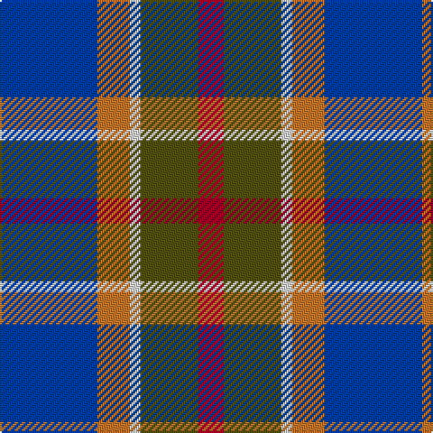

In pattern [BRWGR](/patterns/brwgr/).

This was sourced from register-of-tartans.  It is a [5 stripes tartan](/stripes/stripes5/).

Original link https://www.tartanregister.gov.uk/tartanDetails.aspx?ref=4273

## Register references

External register numbers recorded for this tartan.

- Scottish Register of Tartans: [4273](https://www.tartanregister.gov.uk/tartanDetails.aspx?ref=4273)
- Scottish Tartans World Register: 2792

## Thread count
B/54 DO18 LN6 T32 DR/14

## Palette
Each colour and its ΔE from the base-6 reference it is a variant of.

| Colour | Shade | Base | ΔE (OKLab) |
|---|---|---|---|
| B | <code style="background-color:#003C96;">#003C96</code> `#003C96` | B <code style="background-color:#2A418A;">#2A418A</code> | 0.04 |
| DO | <code style="background-color:#BE7832;">#BE7832</code> `#BE7832` | R <code style="background-color:#CC0000;">#CC0000</code> | 0.17 |
| DR | <code style="background-color:#960028;">#960028</code> `#960028` | R <code style="background-color:#CC0000;">#CC0000</code> | 0.12 |
| LN | <code style="background-color:#E0E0E0;">#E0E0E0</code> `#E0E0E0` | W <code style="background-color:#F7F7F7;">#F7F7F7</code> | 0.07 |
| T | <code style="background-color:#525014;">#525014</code> `#525014` | G <code style="background-color:#006100;">#006100</code> | 0.09 |

# Sample pattern

## Nearest tartans

The nearest existing variants by ΔTartan distance.

1. [Wellington No 229](/setts/s5/k4b3ba11g14w2~b3c82af-ba5a008c-g005020-k101010-we0e0e0~x2/) — ΔT 0.86
1. [Balfour Family Tartan Tartan Number: 683. Earliest known date: 1984 Presented by William Balfour. See products available Copyright © Blair Urquhart, Comrie, 2015](/setts/s6/b30y3g11y3r33ra6~b2c2c80-g604000-r888888-rac80000-ye8c000~x2/) — ΔT 1.06
1. [Edelstein (Personal)](/setts/s5/b10ba10g10w1y1~b780078-ba2c2c80-g006818-we0e0e0-ye8c000~x6/) — ΔT 1.08
1. [MacPhail Hunting #2](/setts/s6/r4b24k12g14k4w3~b2c2c80-g006818-k101010-rc80000-wc0c0c0~x2/) — ΔT 1.10
1. [Newmill Corporate Tartan Tartan Number: 2053. Earliest known date: March 1992 Designed to be used in the refurbishing of Johnstons of Elgin new mill shop and based on the colours of the mill shop house style. The lighter square is represented here as green from the 'Antique' colour range, a speciality of Johnstons of Elgin. See products available Copyright © Blair Urquhart, Comrie, 2015](/setts/s7/r5ra20b13ba42b13ra20y5~b003c64-ba2c2c80-rc8002c-raa07c58-ydc943c/) — ΔT 1.11
1. [Stovell (2015)](/setts/s6/b15r6g8k2w2k2~b202060-g005020-k101010-rb03000-wf8f4d0~x6/) — ΔT 1.12
1. [Paterson Blue (Personal)](/setts/s6/b22w2k10g11r3g4~b2c2c80-g006818-k101010-rc80000-we0e0e0~x2/) — ΔT 1.13
1. [Commonwealth Games Council (Corp.)](/setts/s6/r3k17b11r2ra20w2~b484848-k101010-rb468ac-ra888888-we0e0e0~x2/) — ΔT 1.16
1. [Turnbull Hunting](/setts/s5/r7y3g28b28w3~b2c4084-g005020-r960000-we0e0e0-ye8c000~x2/) — ΔT 1.16
1. [Soroptimist International (Corporate](/setts/s6/w2k1r10k6b12y2~b1870a4-k101010-r9c68a4-we0e0e0-ybc8c00~x2/) — ΔT 1.17

## Neighbour map

Every grey dot is one of 15726 variants placed by the first two principal components of the ΔTartan feature space (44% of its variance). Red is this tartan; blue dots are its nearest — click one to open its page.

<svg viewBox="0 0 640 380" role="img" style="max-width:100%;height:auto;border:1px solid #e0e0e0;border-radius:4px;display:block" xmlns="http://www.w3.org/2000/svg"><image href="/nn/cloud.v1.png" width="640" height="380"/><a href="/setts/s5/k4b3ba11g14w2~b3c82af-ba5a008c-g005020-k101010-we0e0e0~x2/"><circle cx="169.9" cy="228.9" r="4" fill="#3465a4"><title>Wellington No 229</title></circle></a><a href="/setts/s6/b30y3g11y3r33ra6~b2c2c80-g604000-r888888-rac80000-ye8c000~x2/"><circle cx="196.8" cy="185.0" r="4" fill="#3465a4"><title>Balfour Family Tartan Tartan Number: 683. Earliest known date: 1984 Presented by William Balfour. See products available Copyright © Blair Urquhart, Comrie, 2015</title></circle></a><a href="/setts/s5/b10ba10g10w1y1~b780078-ba2c2c80-g006818-we0e0e0-ye8c000~x6/"><circle cx="159.3" cy="217.3" r="4" fill="#3465a4"><title>Edelstein (Personal)</title></circle></a><a href="/setts/s6/r4b24k12g14k4w3~b2c2c80-g006818-k101010-rc80000-wc0c0c0~x2/"><circle cx="169.3" cy="217.2" r="4" fill="#3465a4"><title>MacPhail Hunting #2</title></circle></a><a href="/setts/s7/r5ra20b13ba42b13ra20y5~b003c64-ba2c2c80-rc8002c-raa07c58-ydc943c/"><circle cx="174.8" cy="213.1" r="4" fill="#3465a4"><title>Newmill Corporate Tartan Tartan Number: 2053. Earliest known date: March 1992 Designed to be used in the refurbishing of Johnstons of Elgin new mill shop and based on the colours of the mill shop house style. The lighter square is represented here as green from the 'Antique' colour range, a speciality of Johnstons of Elgin. See products available Copyright © Blair Urquhart, Comrie, 2015</title></circle></a><a href="/setts/s6/b15r6g8k2w2k2~b202060-g005020-k101010-rb03000-wf8f4d0~x6/"><circle cx="179.4" cy="208.4" r="4" fill="#3465a4"><title>Stovell (2015)</title></circle></a><a href="/setts/s6/b22w2k10g11r3g4~b2c2c80-g006818-k101010-rc80000-we0e0e0~x2/"><circle cx="200.8" cy="201.7" r="4" fill="#3465a4"><title>Paterson Blue (Personal)</title></circle></a><a href="/setts/s6/r3k17b11r2ra20w2~b484848-k101010-rb468ac-ra888888-we0e0e0~x2/"><circle cx="157.4" cy="190.0" r="4" fill="#3465a4"><title>Commonwealth Games Council (Corp.)</title></circle></a><a href="/setts/s5/r7y3g28b28w3~b2c4084-g005020-r960000-we0e0e0-ye8c000~x2/"><circle cx="221.9" cy="214.6" r="4" fill="#3465a4"><title>Turnbull Hunting</title></circle></a><a href="/setts/s6/w2k1r10k6b12y2~b1870a4-k101010-r9c68a4-we0e0e0-ybc8c00~x2/"><circle cx="161.2" cy="186.5" r="4" fill="#3465a4"><title>Soroptimist International (Corporate</title></circle></a><circle cx="193.0" cy="221.7" r="5" fill="#c00000"/></svg>

ID: /setts/s5/b27r9w3g16ra7~b003c96-g525014-rbe7832-ra960028-we0e0e0~x2/
