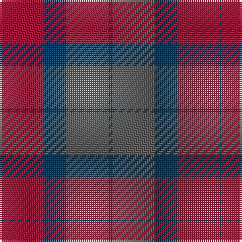

In pattern [BBBRB](/patterns/bbbrb/).

This was sourced from tartans-authority.  It is a [5 stripes tartan](/stripes/stripes5/).

Original link http://www.tartansauthority.com/tartan-ferret/display/8145/

## Thread count
DB/1 DR21 DB11 N21 DB/2

## Palette
Each colour and its ΔE from the base-6 reference it is a variant of.

| Colour | Shade | Base | ΔE (OKLab) |
|---|---|---|---|
| DB | <code style="background-color:#003C64;">#003C64</code> `#003C64` | B <code style="background-color:#2A418A;">#2A418A</code> | 0.08 |
| DR | <code style="background-color:#901C38;">#901C38</code> `#901C38` | R <code style="background-color:#CC0000;">#CC0000</code> | 0.13 |
| N | <code style="background-color:#5C5C5C;">#5C5C5C</code> `#5C5C5C` | B <code style="background-color:#2A418A;">#2A418A</code> | 0.15 |

# Sample pattern

## Nearest tartans

The nearest existing variants by ΔTartan distance.

1. [Aisteach](/setts/s7/b32g16r14k4r6b7k2~b3d2e60-g005020-k1c1714-r97342f~x2/) — ΔT 1.83
1. [Harmony 6](/setts/s5/b2g10ga15b10g2~b840068-g005020-ga503c14~x4/) — ΔT 1.95
1. [Dempster Family Tartan Tartan Number: 2219. Earliest known date: 2001 Designed by Claire Donaldson of the House of Edgar. See products available Copyright © Blair Urquhart, Comrie, 2015](/setts/s7/b4g2ba16ba10g10b32bb3~b14283c-ba4c0000-bb5c5c5c-g285800~x2/) — ΔT 1.98
1. [Madder](/setts/s7/g28r4b27r27g28r5b2~b280034-g044028-r780014~x2/) — ΔT 2.02
1. [Granite City (Silver Granite) Fashion Tartan Tartan Number: 7459. Earliest known date: pre 2007 Produced for Mike King of Philip King Tailoring Ltd, Aberdeen. Previously recorded by the STA as 'Granite City'. Thought to have been produced for Mike King of Aberdeen. . It is believed that Lochcarron of Scotland have now (Jan 2008) trademarked the word ‘Granite’ when used in connection with tartans. See products available Copyright © Blair Urquhart, Comrie, 2015](/setts/s7/k3g3k3g21ga21k3g1~g716d61-ga413c2e-k1e1a10~x2/) — ΔT 2.03
1. [Brave for Men (Fashion)](/setts/s8/k5g5k5g34b33k6b5r2~b5c5c5c-g604000-k101010-r888888/) — ΔT 2.10
1. [Unamed, Riding cloak 1745](/setts/s5/b1ba8r2ra8r1~b5480b0-ba304080-rc00000-ra806050~x2/) — ΔT 2.13
1. [Dunans Rising](/setts/s5/g35ga25r15b2b21~b5e82a3-g006752-ga5e6639-raf23a5~x2/) — ΔT 2.20
1. [Klymson (Personal)](/setts/s4/b70y16ba3r45~b5c5c5c-ba2474e8-rb84c00-yd87c00/) — ΔT 2.21
1. [Granite City (Fashion)](/setts/s8/k3b3k3b21ba21k3ba3y1~b5c5c5c-ba505050-k101010-ya0a0a0~x2/) — ΔT 2.24

## Neighbour map

Every grey dot is one of 15726 variants placed by the first two principal components of the ΔTartan feature space (44% of its variance). Red is this tartan; blue dots are its nearest — click one to open its page.

<svg viewBox="0 0 640 380" role="img" style="max-width:100%;height:auto;border:1px solid #e0e0e0;border-radius:4px;display:block" xmlns="http://www.w3.org/2000/svg"><image href="/nn/cloud.v1.png" width="640" height="380"/><a href="/setts/s7/b32g16r14k4r6b7k2~b3d2e60-g005020-k1c1714-r97342f~x2/"><circle cx="350.7" cy="225.0" r="4" fill="#3465a4"><title>Aisteach</title></circle></a><a href="/setts/s5/b2g10ga15b10g2~b840068-g005020-ga503c14~x4/"><circle cx="303.9" cy="299.0" r="4" fill="#3465a4"><title>Harmony 6</title></circle></a><a href="/setts/s7/b4g2ba16ba10g10b32bb3~b14283c-ba4c0000-bb5c5c5c-g285800~x2/"><circle cx="382.8" cy="237.2" r="4" fill="#3465a4"><title>Dempster Family Tartan Tartan Number: 2219. Earliest known date: 2001 Designed by Claire Donaldson of the House of Edgar. See products available Copyright © Blair Urquhart, Comrie, 2015</title></circle></a><a href="/setts/s7/g28r4b27r27g28r5b2~b280034-g044028-r780014~x2/"><circle cx="352.3" cy="261.6" r="4" fill="#3465a4"><title>Madder</title></circle></a><a href="/setts/s7/k3g3k3g21ga21k3g1~g716d61-ga413c2e-k1e1a10~x2/"><circle cx="395.0" cy="214.7" r="4" fill="#3465a4"><title>Granite City (Silver Granite) Fashion Tartan Tartan Number: 7459. Earliest known date: pre 2007 Produced for Mike King of Philip King Tailoring Ltd, Aberdeen. Previously recorded by the STA as 'Granite City'. Thought to have been produced for Mike King of Aberdeen. . It is believed that Lochcarron of Scotland have now (Jan 2008) trademarked the word ‘Granite’ when used in connection with tartans. See products available Copyright © Blair Urquhart, Comrie, 2015</title></circle></a><a href="/setts/s8/k5g5k5g34b33k6b5r2~b5c5c5c-g604000-k101010-r888888/"><circle cx="355.4" cy="203.8" r="4" fill="#3465a4"><title>Brave for Men (Fashion)</title></circle></a><a href="/setts/s5/b1ba8r2ra8r1~b5480b0-ba304080-rc00000-ra806050~x2/"><circle cx="298.5" cy="254.8" r="4" fill="#3465a4"><title>Unamed, Riding cloak 1745</title></circle></a><a href="/setts/s5/g35ga25r15b2b21~b5e82a3-g006752-ga5e6639-raf23a5~x2/"><circle cx="261.7" cy="258.8" r="4" fill="#3465a4"><title>Dunans Rising</title></circle></a><a href="/setts/s4/b70y16ba3r45~b5c5c5c-ba2474e8-rb84c00-yd87c00/"><circle cx="421.2" cy="237.3" r="4" fill="#3465a4"><title>Klymson (Personal)</title></circle></a><a href="/setts/s8/k3b3k3b21ba21k3ba3y1~b5c5c5c-ba505050-k101010-ya0a0a0~x2/"><circle cx="394.3" cy="208.3" r="4" fill="#3465a4"><title>Granite City (Fashion)</title></circle></a><circle cx="374.0" cy="255.7" r="5" fill="#c00000"/></svg>

ID: /setts/s5/b2ba21b11r21b1~b003c64-ba5c5c5c-r901c38/
