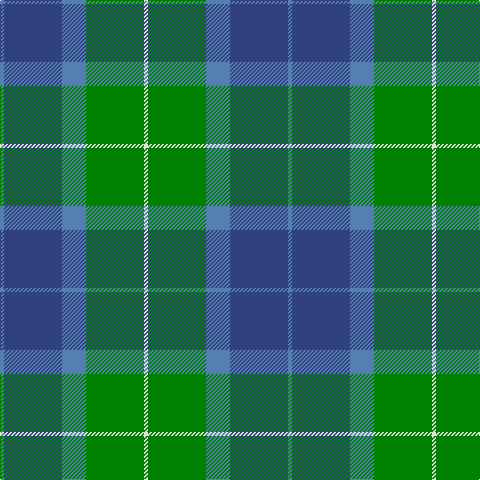

In pattern [BBBGW](/patterns/bbbgw/).

This was sourced from weddslist.  It is a [5 stripes tartan](/stripes/stripes5/).

Original link http://www.weddslist.com/cgi-bin/tartans/pg.pl?source=sts

## Thread count
Ba/4 B58 Ba24 G58 LN/4

## Palette
Each colour and its ΔE from the base-6 reference it is a variant of.

| Colour | Shade | Base | ΔE (OKLab) |
|---|---|---|---|
| B | <code style="background-color:#304080;">#304080</code> `#304080` | B <code style="background-color:#2A418A;">#2A418A</code> | 0.02 |
| Ba | <code style="background-color:#5480B0;">#5480B0</code> `#5480B0` | B <code style="background-color:#2A418A;">#2A418A</code> | 0.19 |
| G | <code style="background-color:#008000;">#008000</code> `#008000` | G <code style="background-color:#006100;">#006100</code> | 0.10 |
| LN | <code style="background-color:#E0E0E0;">#E0E0E0</code> `#E0E0E0` | W <code style="background-color:#F7F7F7;">#F7F7F7</code> | 0.07 |

# Sample pattern

## Nearest tartans

The nearest existing variants by ΔTartan distance.

1. [Wallace Blue Clan Tartan Tartan Number: 46. Earliest known date: pre 2003 The design is based on the sett from the Vestiarium Scoticum (1842). See products available Copyright © Blair Urquhart, Comrie, 2015](/setts/s5/b2ba29b12g29w2~b5c8ca8-ba2c2c80-g006818-we0e0e0~x2/) — ΔT 0.62
1. [Wallace Blue (Fashion)](/setts/s5/b2ba29b12g29w2~b5c8ca8-ba2c2c80-g006818-wf8f8f8~x2/) — ΔT 0.69
1. [Wellington (Lochcarron)](/setts/s5/k9y6b22g28ya2~b0c585c-g408060-k101010-y9ca8b0-yae8c000~x2/) — ΔT 1.15
1. [Skibo](/setts/s5/r2g23b11ba22r2~b000050-ba304080-g008000-rc00000~x2/) — ΔT 1.19
1. [Bethlehem, City of (District)](/setts/s5/b3r10g9ra1g3~b1c0070-g006c3c-r888888-ra880000~x4/) — ΔT 1.20
1. [Alvis of Lee (Personal)](/setts/s5/b9w4g36ba36r4~b1c0070-ba5c8ca8-g00643c-rc80000-we0e0e0~x2/) — ΔT 1.22
1. [Alvis of Lee Personal Tartan Tartan Number: 643. Earliest known date: 1985 Designed for the Baron of Lee See products available Copyright © Blair Urquhart, Comrie, 2015](/setts/s5/b9w4g36ba36r4~b202060-ba5c8ca8-g006818-rc80000-we0e0e0/) — ΔT 1.27
1. [Flower of Scotland](/setts/s6/b3g25b3k16b25r3~b1474b4-g009468-k101010-rc80000~x2/) — ΔT 1.31
1. [Corey (Name)](/setts/s5/b32g16ga3y4gb28~b1474b4-g604000-ga006818-gb003820-yd87c00~x2/) — ΔT 1.34
1. [Universal Ancient](/setts/s8/b12g2b2g2b2ga8gb8ga1~b3c82af-g005020-ga503c14-gb309c18~x2/) — ΔT 1.36

## Neighbour map

Every grey dot is one of 15726 variants placed by the first two principal components of the ΔTartan feature space (44% of its variance). Red is this tartan; blue dots are its nearest — click one to open its page.

<svg viewBox="0 0 640 380" role="img" style="max-width:100%;height:auto;border:1px solid #e0e0e0;border-radius:4px;display:block" xmlns="http://www.w3.org/2000/svg"><image href="/nn/cloud.v1.png" width="640" height="380"/><a href="/setts/s5/b2ba29b12g29w2~b5c8ca8-ba2c2c80-g006818-we0e0e0~x2/"><circle cx="250.1" cy="220.9" r="4" fill="#3465a4"><title>Wallace Blue Clan Tartan Tartan Number: 46. Earliest known date: pre 2003 The design is based on the sett from the Vestiarium Scoticum (1842). See products available Copyright © Blair Urquhart, Comrie, 2015</title></circle></a><a href="/setts/s5/b2ba29b12g29w2~b5c8ca8-ba2c2c80-g006818-wf8f8f8~x2/"><circle cx="245.7" cy="219.1" r="4" fill="#3465a4"><title>Wallace Blue (Fashion)</title></circle></a><a href="/setts/s5/k9y6b22g28ya2~b0c585c-g408060-k101010-y9ca8b0-yae8c000~x2/"><circle cx="227.8" cy="214.7" r="4" fill="#3465a4"><title>Wellington (Lochcarron)</title></circle></a><a href="/setts/s5/r2g23b11ba22r2~b000050-ba304080-g008000-rc00000~x2/"><circle cx="213.0" cy="228.7" r="4" fill="#3465a4"><title>Skibo</title></circle></a><a href="/setts/s5/b3r10g9ra1g3~b1c0070-g006c3c-r888888-ra880000~x4/"><circle cx="277.4" cy="250.3" r="4" fill="#3465a4"><title>Bethlehem, City of (District)</title></circle></a><a href="/setts/s5/b9w4g36ba36r4~b1c0070-ba5c8ca8-g00643c-rc80000-we0e0e0~x2/"><circle cx="218.4" cy="215.6" r="4" fill="#3465a4"><title>Alvis of Lee (Personal)</title></circle></a><a href="/setts/s5/b9w4g36ba36r4~b202060-ba5c8ca8-g006818-rc80000-we0e0e0/"><circle cx="216.7" cy="215.0" r="4" fill="#3465a4"><title>Alvis of Lee Personal Tartan Tartan Number: 643. Earliest known date: 1985 Designed for the Baron of Lee See products available Copyright © Blair Urquhart, Comrie, 2015</title></circle></a><a href="/setts/s6/b3g25b3k16b25r3~b1474b4-g009468-k101010-rc80000~x2/"><circle cx="206.9" cy="227.1" r="4" fill="#3465a4"><title>Flower of Scotland</title></circle></a><a href="/setts/s5/b32g16ga3y4gb28~b1474b4-g604000-ga006818-gb003820-yd87c00~x2/"><circle cx="215.1" cy="230.5" r="4" fill="#3465a4"><title>Corey (Name)</title></circle></a><a href="/setts/s8/b12g2b2g2b2ga8gb8ga1~b3c82af-g005020-ga503c14-gb309c18~x2/"><circle cx="252.0" cy="211.3" r="4" fill="#3465a4"><title>Universal Ancient</title></circle></a><circle cx="255.2" cy="222.9" r="5" fill="#c00000"/></svg>

ID: /setts/s5/b2ba29b12g29w2~b5480b0-ba304080-g008000-we0e0e0~x2/
