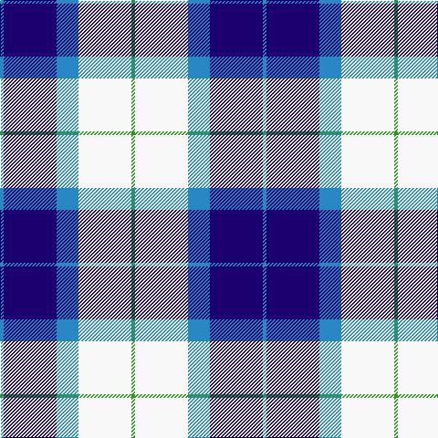

In pattern [BBBWG](/patterns/bbbwg/).

This was sourced from register-of-tartans.  It is a [5 stripes tartan](/stripes/stripes5/).

Original link https://www.tartanregister.gov.uk/tartanDetails.aspx?ref=4484

## Register references

External register numbers recorded for this tartan.

- Scottish Register of Tartans: [4484](https://www.tartanregister.gov.uk/tartanDetails.aspx?ref=4484)
- Scottish Tartans Authority (ITI): 6569

## Thread count
B/4 DB58 B24 W58 G/4

## Palette
Each colour and its ΔE from the base-6 reference it is a variant of.

| Colour | Shade | Base | ΔE (OKLab) |
|---|---|---|---|
| B | <code style="background-color:#2888C4;">#2888C4</code> `#2888C4` | B <code style="background-color:#2A418A;">#2A418A</code> | 0.21 |
| DB | <code style="background-color:#1C0070;">#1C0070</code> `#1C0070` | B <code style="background-color:#2A418A;">#2A418A</code> | 0.14 |
| G | <code style="background-color:#289C18;">#289C18</code> `#289C18` | G <code style="background-color:#006100;">#006100</code> | 0.19 |
| W | <code style="background-color:#F8F8F8;">#F8F8F8</code> `#F8F8F8` | W <code style="background-color:#F7F7F7;">#F7F7F7</code> | 0.00 |

# Sample pattern

## Nearest tartans

The nearest existing variants by ΔTartan distance.

1. [Bonnie Royal](/setts/s6/w5b32g12b2w30k4~b2c2c80-g289c18-k101010-wfcfcfc~x2/) — ΔT 1.03
1. [Ferguson, dress](/setts/s7/b34ba24w18r3w18g2w3~b5480b0-ba000050-g008000-rc00000-we0e0e0~x2/) — ΔT 1.31
1. [St. Andrews Dress, Earl of (Danc](/setts/s7/w28b19ba19w4bb2bc2ba7~b5c8ca8-ba2c2c80-bb202060-bc9058d8-we0e0e0~x2/) — ΔT 1.35
1. [St Andrews Dress, Earl of.. District Tartan Tartan Number: 45. Earliest known date: pre 2003 See products available Copyright © Blair Urquhart, Comrie, 2015](/setts/s7/w28b19ba19w4bb2wa2ba7~b5c8ca8-ba2c2c80-bb202060-we0e0e0-wac49cd8~x2/) — ΔT 1.37
1. [Strathclyde 1975 (District)](/setts/s7/k2w16wa2b16wa15k2wa2~b1c0070-k101010-wa8ace8-waf8f8f8~x2/) — ΔT 1.38
1. [(1) Abercrombie](/setts/s9/b27w2b14k14y4k4y4k4y27~b868aff-k000000-wffffff-y86ae9a/) — ΔT 1.39
1. [Ailsa, Royal Blue (Dance)](/setts/s6/b8ba3b28w32bb3w4~b2c2c80-ba5c8ca8-bb003c64-wf0e0c8~x2/) — ΔT 1.39
1. [Earl of St. Andrews Dress](/setts/s7/w20b14ba14w4bb2bc2ba7~b003478-ba3c3c64-bb000064-bc6478b0-wf8f8f8~x2/) — ΔT 1.42
1. [Conquergood](/setts/s8/b2k1w2k5b5w11b2k2~b8080d0-k000030-we0e0e0~x2/) — ΔT 1.47
1. [Bannockbane Blue #2](/setts/s8/b3ba2b14ba1w10wa16ba2wa3~b1c0070-ba2c2c80-wc0c0c0-waa8ace8~x2/) — ΔT 1.47

## Neighbour map

Every grey dot is one of 15726 variants placed by the first two principal components of the ΔTartan feature space (44% of its variance). Red is this tartan; blue dots are its nearest — click one to open its page.

<svg viewBox="0 0 640 380" role="img" style="max-width:100%;height:auto;border:1px solid #e0e0e0;border-radius:4px;display:block" xmlns="http://www.w3.org/2000/svg"><image href="/nn/cloud.v1.png" width="640" height="380"/><a href="/setts/s6/w5b32g12b2w30k4~b2c2c80-g289c18-k101010-wfcfcfc~x2/"><circle cx="194.8" cy="166.1" r="4" fill="#3465a4"><title>Bonnie Royal</title></circle></a><a href="/setts/s7/b34ba24w18r3w18g2w3~b5480b0-ba000050-g008000-rc00000-we0e0e0~x2/"><circle cx="155.8" cy="151.5" r="4" fill="#3465a4"><title>Ferguson, dress</title></circle></a><a href="/setts/s7/w28b19ba19w4bb2bc2ba7~b5c8ca8-ba2c2c80-bb202060-bc9058d8-we0e0e0~x2/"><circle cx="166.8" cy="156.6" r="4" fill="#3465a4"><title>St. Andrews Dress, Earl of (Danc</title></circle></a><a href="/setts/s7/w28b19ba19w4bb2wa2ba7~b5c8ca8-ba2c2c80-bb202060-we0e0e0-wac49cd8~x2/"><circle cx="166.8" cy="156.4" r="4" fill="#3465a4"><title>St Andrews Dress, Earl of.. District Tartan Tartan Number: 45. Earliest known date: pre 2003 See products available Copyright © Blair Urquhart, Comrie, 2015</title></circle></a><a href="/setts/s7/k2w16wa2b16wa15k2wa2~b1c0070-k101010-wa8ace8-waf8f8f8~x2/"><circle cx="125.2" cy="179.4" r="4" fill="#3465a4"><title>Strathclyde 1975 (District)</title></circle></a><a href="/setts/s9/b27w2b14k14y4k4y4k4y27~b868aff-k000000-wffffff-y86ae9a/"><circle cx="181.2" cy="162.0" r="4" fill="#3465a4"><title>(1) Abercrombie</title></circle></a><a href="/setts/s6/b8ba3b28w32bb3w4~b2c2c80-ba5c8ca8-bb003c64-wf0e0c8~x2/"><circle cx="240.6" cy="180.5" r="4" fill="#3465a4"><title>Ailsa, Royal Blue (Dance)</title></circle></a><a href="/setts/s7/w20b14ba14w4bb2bc2ba7~b003478-ba3c3c64-bb000064-bc6478b0-wf8f8f8~x2/"><circle cx="125.8" cy="173.9" r="4" fill="#3465a4"><title>Earl of St. Andrews Dress</title></circle></a><a href="/setts/s8/b2k1w2k5b5w11b2k2~b8080d0-k000030-we0e0e0~x2/"><circle cx="198.5" cy="187.3" r="4" fill="#3465a4"><title>Conquergood</title></circle></a><a href="/setts/s8/b3ba2b14ba1w10wa16ba2wa3~b1c0070-ba2c2c80-wc0c0c0-waa8ace8~x2/"><circle cx="180.5" cy="160.3" r="4" fill="#3465a4"><title>Bannockbane Blue #2</title></circle></a><circle cx="181.8" cy="182.6" r="5" fill="#c00000"/></svg>

ID: /setts/s5/b2ba29b12w29g2~b2888c4-ba1c0070-g289c18-wf8f8f8~x2/
