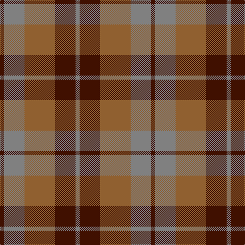

In pattern [BGRBG](/patterns/bgrbg/).

This was sourced from weddslist.  It is a [5 stripes tartan](/stripes/stripes5/).

Original link http://www.weddslist.com/cgi-bin/tartans/pg.pl?source=sts

## Thread count
DR/8 N40 LT60 DR40 N/8

## Palette
Each colour and its ΔE from the base-6 reference it is a variant of.

| Colour | Shade | Base | ΔE (OKLab) |
|---|---|---|---|
| DR | <code style="background-color:#401000;">#401000</code> `#401000` | B <code style="background-color:#2A418A;">#2A418A</code> | 0.24 |
| LT | <code style="background-color:#906030;">#906030</code> `#906030` | R <code style="background-color:#CC0000;">#CC0000</code> | 0.15 |
| N | <code style="background-color:#808080;">#808080</code> `#808080` | G <code style="background-color:#006100;">#006100</code> | 0.23 |

# Sample pattern

## Nearest tartans

The nearest existing variants by ΔTartan distance.

1. [Harmony, 6](/setts/s5/b2g10r15b10g2x4~b800070-g008000-r806050/) — ΔT 0.59
1. [Harmony 8](/setts/s5/g2ga10r15g10ga2x4~g2a2303-ga808080-rbe7832/) — ΔT 1.04
1. [Glen Esk (1993)](/setts/s7/g2r1g8r5ga5r1ga2x4~g005020-ga5c6428-rdc0000/) — ΔT 1.12
1. [MacNab #2](/setts/s6/g1r1g7r4ra7r1x4~g006818-ra00048-rac80000/) — ΔT 1.13
1. [MacNab, Variant](/setts/s6/g1r1g7r4ra7r1x4~g008000-r900030-rac00000/) — ΔT 1.21
1. [Callum (Buchan) (Name)](/setts/s5/b7r1ba6r8y1x8~b5c5c5c-ba344054-rc80000-ya0a0a0/) — ΔT 1.39
1. [Glen Esk (Fashion)](/setts/s7/g2r1g8r5ga5r1ga2x4~g004c00-ga6c6c00-rc80000/) — ΔT 1.41
1. [Chindecella Gorse (Kemete Heil)](/setts/s8/r9b4r4b4r24g19b19g4x2~b241b1e-g4f4232-r8c6627/) — ΔT 1.44
1. [MacCormick (Dress)](/setts/s6/k3g13k10r13k2r3x2~g006818-k101010-r880000/) — ΔT 1.45
1. [Glasgow #2](/setts/s7/g25r4b24r21g25r3b4x2~b2c4084-g005020-rc82828/) — ΔT 1.46

## Neighbour map

Every grey dot is one of 15726 variants placed by the first two principal components of the ΔTartan feature space (44% of its variance). Red is this tartan; blue dots are its nearest — click one to open its page.

<svg viewBox="0 0 640 380" role="img" style="max-width:100%;height:auto;border:1px solid #e0e0e0;border-radius:4px;display:block" xmlns="http://www.w3.org/2000/svg"><image href="/nn/cloud.v1.png" width="640" height="380"/><a href="/setts/s5/b2g10r15b10g2x4~b800070-g008000-r806050/"><circle cx="252.5" cy="273.6" r="4" fill="#3465a4"><title>Harmony, 6</title></circle></a><a href="/setts/s5/g2ga10r15g10ga2x4~g2a2303-ga808080-rbe7832/"><circle cx="227.8" cy="261.3" r="4" fill="#3465a4"><title>Harmony 8</title></circle></a><a href="/setts/s7/g2r1g8r5ga5r1ga2x4~g005020-ga5c6428-rdc0000/"><circle cx="270.1" cy="253.4" r="4" fill="#3465a4"><title>Glen Esk (1993)</title></circle></a><a href="/setts/s6/g1r1g7r4ra7r1x4~g006818-ra00048-rac80000/"><circle cx="261.3" cy="249.2" r="4" fill="#3465a4"><title>MacNab #2</title></circle></a><a href="/setts/s6/g1r1g7r4ra7r1x4~g008000-r900030-rac00000/"><circle cx="251.4" cy="246.8" r="4" fill="#3465a4"><title>MacNab, Variant</title></circle></a><a href="/setts/s5/b7r1ba6r8y1x8~b5c5c5c-ba344054-rc80000-ya0a0a0/"><circle cx="258.3" cy="257.1" r="4" fill="#3465a4"><title>Callum (Buchan) (Name)</title></circle></a><a href="/setts/s7/g2r1g8r5ga5r1ga2x4~g004c00-ga6c6c00-rc80000/"><circle cx="272.5" cy="255.0" r="4" fill="#3465a4"><title>Glen Esk (Fashion)</title></circle></a><a href="/setts/s8/r9b4r4b4r24g19b19g4x2~b241b1e-g4f4232-r8c6627/"><circle cx="280.2" cy="267.0" r="4" fill="#3465a4"><title>Chindecella Gorse (Kemete Heil)</title></circle></a><a href="/setts/s6/k3g13k10r13k2r3x2~g006818-k101010-r880000/"><circle cx="226.4" cy="271.6" r="4" fill="#3465a4"><title>MacCormick (Dress)</title></circle></a><a href="/setts/s7/g25r4b24r21g25r3b4x2~b2c4084-g005020-rc82828/"><circle cx="280.0" cy="258.0" r="4" fill="#3465a4"><title>Glasgow #2</title></circle></a><circle cx="256.1" cy="273.1" r="5" fill="#c00000"/></svg>

ID: /setts/s5/b2g10r15b10g2x4~b401000-g808080-r906030/
