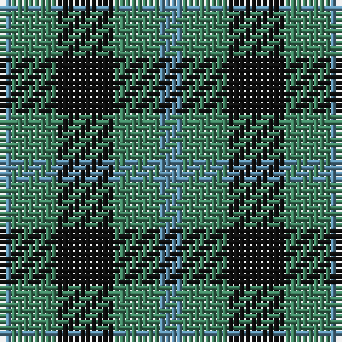

In pattern [BGKGB](/patterns/bgkgb/).

This was sourced from register-of-tartans.  It is a [5 stripes tartan](/stripes/stripes5/).

Original link https://www.tartanregister.gov.uk/tartanDetails.aspx?ref=4657

## Thread count
B/2 Gb8 K10 Gb8 B/4

## Palette
Each colour and its ΔE from the base-6 reference it is a variant of.

| Colour | Shade | Base | ΔE (OKLab) |
|---|---|---|---|
| B | <code style="background-color:#5C8CA8;">#5C8CA8</code> `#5C8CA8` | B <code style="background-color:#2A418A;">#2A418A</code> | 0.23 |
| DG | <code style="background-color:#003820;">#003820</code> `#003820` | G <code style="background-color:#006100;">#006100</code> | 0.15 |
| G | <code style="background-color:#006818;">#006818</code> `#006818` | G <code style="background-color:#006100;">#006100</code> | 0.02 |
| Ga | <code style="background-color:#285800;">#285800</code> `#285800` | G <code style="background-color:#006100;">#006100</code> | 0.03 |
| Gb | <code style="background-color:#408060;">#408060</code> `#408060` | G <code style="background-color:#006100;">#006100</code> | 0.14 |
| K | <code style="background-color:#101010;">#101010</code> `#101010` | K <code style="background-color:#000000;">#000000</code> | 0.17 |
| LG | <code style="background-color:#789484;">#789484</code> `#789484` | G <code style="background-color:#006100;">#006100</code> | 0.24 |

# Sample pattern

## Nearest tartans

The nearest existing variants by ΔTartan distance.

1. [Glen Lyon #2](/setts/s5/b2g4k5g4b1x2~b2888c4-g006818-k101010/) — ΔT 0.76
1. [Agnew](/setts/s3/b53g42r14~b304080-g008000-rc00000/) — ΔT 1.35
1. [Hamilton, hunting](/setts/s5/b5g2b5g8w1x8~b304080-g008000-we0e0e0/) — ΔT 1.36
1. [Campbell of Glenlyon](/setts/s5/g7k6b7k1b2x2~b1474b4-g006818-k101010/) — ΔT 1.37
1. [Campbell of Glenlyon Check (Clan)](/setts/s5/g7k6b7k1b2x4~b1474b4-g006818-k101010/) — ΔT 1.37
1. [Campbell, The 42nd](/setts/s6/b6k6b18k18g22k5x2~b1474b4-g006818-k101010/) — ΔT 1.38
1. [Hamilton Hunting Clan Tartan Tartan Number: 139. Earliest known date: pre 2003 Sample presented to the Scottish Tartans Society by Wiebe Stodel. See products available Copyright © Blair Urquhart, Comrie, 2015](/setts/s5/b5g2b5g8w1x8~b2c2c80-g006818-we0e0e0/) — ΔT 1.40
1. [MacCurdie (Clan?)](/setts/s4/k5g14b12g4x4~b2c2c80-g006818-k101010/) — ΔT 1.41
1. [Keith Clan](/setts/s8/g9b4k4b3k4b4g9k2x4~b2474e8-g408060-k101010/) — ΔT 1.42
1. [Falconer](/setts/s5/b3k4b4g9k2x4~b2474e8-g408060-k101010/) — ΔT 1.46

## Neighbour map

Every grey dot is one of 15726 variants placed by the first two principal components of the ΔTartan feature space (44% of its variance). Red is this tartan; blue dots are its nearest — click one to open its page.

<svg viewBox="0 0 640 380" role="img" style="max-width:100%;height:auto;border:1px solid #e0e0e0;border-radius:4px;display:block" xmlns="http://www.w3.org/2000/svg"><image href="/nn/cloud.v1.png" width="640" height="380"/><a href="/setts/s5/b2g4k5g4b1x2~b2888c4-g006818-k101010/"><circle cx="227.4" cy="313.6" r="4" fill="#3465a4"><title>Glen Lyon #2</title></circle></a><a href="/setts/s3/b53g42r14~b304080-g008000-rc00000/"><circle cx="245.7" cy="345.2" r="4" fill="#3465a4"><title>Agnew</title></circle></a><a href="/setts/s5/b5g2b5g8w1x8~b304080-g008000-we0e0e0/"><circle cx="282.5" cy="281.7" r="4" fill="#3465a4"><title>Hamilton, hunting</title></circle></a><a href="/setts/s5/g7k6b7k1b2x2~b1474b4-g006818-k101010/"><circle cx="200.8" cy="286.4" r="4" fill="#3465a4"><title>Campbell of Glenlyon</title></circle></a><a href="/setts/s5/g7k6b7k1b2x4~b1474b4-g006818-k101010/"><circle cx="200.8" cy="286.4" r="4" fill="#3465a4"><title>Campbell of Glenlyon Check (Clan)</title></circle></a><a href="/setts/s6/b6k6b18k18g22k5x2~b1474b4-g006818-k101010/"><circle cx="177.3" cy="294.8" r="4" fill="#3465a4"><title>Campbell, The 42nd</title></circle></a><a href="/setts/s5/b5g2b5g8w1x8~b2c2c80-g006818-we0e0e0/"><circle cx="286.2" cy="283.7" r="4" fill="#3465a4"><title>Hamilton Hunting Clan Tartan Tartan Number: 139. Earliest known date: pre 2003 Sample presented to the Scottish Tartans Society by Wiebe Stodel. See products available Copyright © Blair Urquhart, Comrie, 2015</title></circle></a><a href="/setts/s4/k5g14b12g4x4~b2c2c80-g006818-k101010/"><circle cx="262.5" cy="342.4" r="4" fill="#3465a4"><title>MacCurdie (Clan?)</title></circle></a><a href="/setts/s8/g9b4k4b3k4b4g9k2x4~b2474e8-g408060-k101010/"><circle cx="187.2" cy="281.3" r="4" fill="#3465a4"><title>Keith Clan</title></circle></a><a href="/setts/s5/b3k4b4g9k2x4~b2474e8-g408060-k101010/"><circle cx="176.9" cy="294.7" r="4" fill="#3465a4"><title>Falconer</title></circle></a><circle cx="223.7" cy="307.3" r="5" fill="#c00000"/></svg>

ID: /setts/s5/b2g4k5g4b1x2~b5c8ca8-g408060-k101010/
