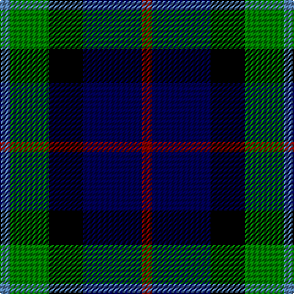

In pattern [BGKBR](/patterns/bgkbr/).

This was sourced from weddslist.  It is a [5 stripes tartan](/stripes/stripes5/).

Original link http://www.weddslist.com/cgi-bin/tartans/pg.pl?source=sts

## Thread count
B/8 G32 K28 DB48 DR/8

## Palette
Each colour and its ΔE from the base-6 reference it is a variant of.

| Colour | Shade | Base | ΔE (OKLab) |
|---|---|---|---|
| B | <code style="background-color:#5480B0;">#5480B0</code> `#5480B0` | B <code style="background-color:#2A418A;">#2A418A</code> | 0.19 |
| DB | <code style="background-color:#000050;">#000050</code> `#000050` | B <code style="background-color:#2A418A;">#2A418A</code> | 0.21 |
| DR | <code style="background-color:#800000;">#800000</code> `#800000` | R <code style="background-color:#CC0000;">#CC0000</code> | 0.17 |
| G | <code style="background-color:#008000;">#008000</code> `#008000` | G <code style="background-color:#006100;">#006100</code> | 0.10 |
| K | <code style="background-color:#000000;">#000000</code> `#000000` | K <code style="background-color:#000000;">#000000</code> | 0.00 |

# Sample pattern

## Nearest tartans

The nearest existing variants by ΔTartan distance.

1. [Davidson of Tulloch](/setts/s5/r1b6k3g6w1~b00004c-g004c00-k000000-rc80000-wd0d0d0/) — ΔT 0.45
1. [Davidson of Tulloch](/setts/s5/r1b6k3g6y1x2~b000052-g11450d-k000000-raa0000-yaaaaaa/) — ΔT 0.71
1. [Gaines Center for the Humanities](/setts/s6/r1k1g6k6b6w1x4~b00008c-g007800-k000000-r8c0000-wc8c8c8/) — ΔT 0.80
1. [MacNiel of Barra](/setts/s6/y3k2g12k12b14ya3x2~b000052-g11450d-k000000-yaaaa00-yaaaaaaa/) — ΔT 0.88
1. [MacNiel of Barra](/setts/s6/y3k2g12k12b14ya3~b000052-g11450d-k000000-yaaaa00-yaaaaaaa/) — ΔT 0.88
1. [Dougles Green](/setts/s5/k4b2g8ba8y1x2~b4367ae-ba000052-g11450d-k000000-yaaaaaa/) — ΔT 0.92
1. [Dougles Green](/setts/s5/k4b2g8ba8y1~b4367ae-ba000052-g11450d-k000000-yaaaaaa/) — ΔT 0.92
1. [MacNeil of Barra](/setts/s6/w3b14k12g12k2y3~b000064-g004c00-k000000-wd0d0d0-yc8c800/) — ΔT 0.92
1. [Lanark](/setts/s6/g31y4g6k19b18ba9x2~b304080-ba5480b0-g004010-k000000-yf0c000/) — ΔT 0.94
1. [Dyce Family Tartan Tartan Number: 1266. Earliest known date: 1880 From Ross-Craven research. Black guards on the white. See products available Copyright © Blair Urquhart, Comrie, 2015](/setts/s6/k2y1g6k6b6w1x4~b2c2c80-g006818-k101010-we0e0e0-ye8c000/) — ΔT 1.00

## Neighbour map

Every grey dot is one of 15726 variants placed by the first two principal components of the ΔTartan feature space (44% of its variance). Red is this tartan; blue dots are its nearest — click one to open its page.

<svg viewBox="0 0 640 380" role="img" style="max-width:100%;height:auto;border:1px solid #e0e0e0;border-radius:4px;display:block" xmlns="http://www.w3.org/2000/svg"><image href="/nn/cloud.v1.png" width="640" height="380"/><a href="/setts/s5/r1b6k3g6w1~b00004c-g004c00-k000000-rc80000-wd0d0d0/"><circle cx="122.0" cy="240.3" r="4" fill="#3465a4"><title>Davidson of Tulloch</title></circle></a><a href="/setts/s5/r1b6k3g6y1x2~b000052-g11450d-k000000-raa0000-yaaaaaa/"><circle cx="136.3" cy="246.1" r="4" fill="#3465a4"><title>Davidson of Tulloch</title></circle></a><a href="/setts/s6/r1k1g6k6b6w1x4~b00008c-g007800-k000000-r8c0000-wc8c8c8/"><circle cx="98.5" cy="221.8" r="4" fill="#3465a4"><title>Gaines Center for the Humanities</title></circle></a><a href="/setts/s6/y3k2g12k12b14ya3x2~b000052-g11450d-k000000-yaaaa00-yaaaaaaa/"><circle cx="96.0" cy="226.2" r="4" fill="#3465a4"><title>MacNiel of Barra</title></circle></a><a href="/setts/s6/y3k2g12k12b14ya3~b000052-g11450d-k000000-yaaaa00-yaaaaaaa/"><circle cx="96.0" cy="226.2" r="4" fill="#3465a4"><title>MacNiel of Barra</title></circle></a><a href="/setts/s5/k4b2g8ba8y1x2~b4367ae-ba000052-g11450d-k000000-yaaaaaa/"><circle cx="142.9" cy="240.9" r="4" fill="#3465a4"><title>Dougles Green</title></circle></a><a href="/setts/s5/k4b2g8ba8y1~b4367ae-ba000052-g11450d-k000000-yaaaaaa/"><circle cx="142.9" cy="240.9" r="4" fill="#3465a4"><title>Dougles Green</title></circle></a><a href="/setts/s6/w3b14k12g12k2y3~b000064-g004c00-k000000-wd0d0d0-yc8c800/"><circle cx="83.3" cy="221.0" r="4" fill="#3465a4"><title>MacNeil of Barra</title></circle></a><a href="/setts/s6/g31y4g6k19b18ba9x2~b304080-ba5480b0-g004010-k000000-yf0c000/"><circle cx="150.4" cy="226.0" r="4" fill="#3465a4"><title>Lanark</title></circle></a><a href="/setts/s6/k2y1g6k6b6w1x4~b2c2c80-g006818-k101010-we0e0e0-ye8c000/"><circle cx="122.6" cy="231.7" r="4" fill="#3465a4"><title>Dyce Family Tartan Tartan Number: 1266. Earliest known date: 1880 From Ross-Craven research. Black guards on the white. See products available Copyright © Blair Urquhart, Comrie, 2015</title></circle></a><circle cx="120.1" cy="244.6" r="5" fill="#c00000"/></svg>

ID: /setts/s5/b2g8k7ba12r2x4~b5480b0-ba000050-g008000-k000000-r800000/
