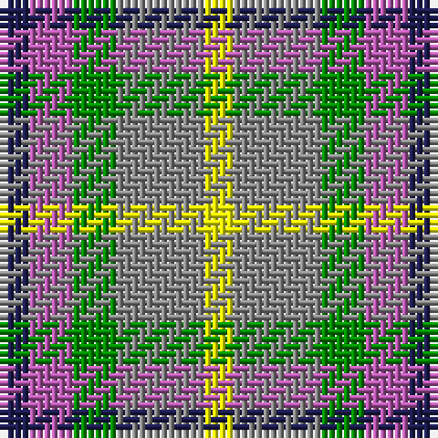

In pattern [BRGRY](/patterns/brgry/).

This was sourced from register-of-tartans.  It is a [5 stripes tartan](/stripes/stripes5/).

Original link https://www.tartanregister.gov.uk/tartanDetails.aspx?ref=11629

## Thread count
DB/4 P6 G6 N12 Y/4

## Palette
Each colour and its ΔE from the base-6 reference it is a variant of.

| Colour | Shade | Base | ΔE (OKLab) |
|---|---|---|---|
| DB | <code style="background-color:#1C1C50;">#1C1C50</code> `#1C1C50` | B <code style="background-color:#2A418A;">#2A418A</code> | 0.14 |
| G | <code style="background-color:#008B00;">#008B00</code> `#008B00` | G <code style="background-color:#006100;">#006100</code> | 0.13 |
| N | <code style="background-color:#888888;">#888888</code> `#888888` | R <code style="background-color:#CC0000;">#CC0000</code> | 0.24 |
| P | <code style="background-color:#B458AC;">#B458AC</code> `#B458AC` | R <code style="background-color:#CC0000;">#CC0000</code> | 0.20 |
| Y | <code style="background-color:#FFFF00;">#FFFF00</code> `#FFFF00` | Y <code style="background-color:#F2BF00;">#F2BF00</code> | 0.16 |

# Sample pattern

## Nearest tartans

The nearest existing variants by ΔTartan distance.

1. [Inspiration](/setts/s5/r5b12y11ba21ya5x2~b202060-ba5c5c5c-rc80000-yfccc00-yae8c000/) — ΔT 1.13
1. [Inspiration](/setts/s5/r5b12y11ba21ya5x2~b5f749c-ba14283c-rc8002c-yc4bc68-yae0a126/) — ΔT 1.18
1. [Clan Haggis World (Corporate)](/setts/s5/r13y13g13b22w4x2~b1044ad-g649848-rca2625-wf9f5ef-yf8f85d/) — ΔT 1.21
1. [Unidentified Silk Plaid](/setts/s5/b7r8g15y6ya3x10~b2c4084-g005020-rec7440-yfadc00-yac89600/) — ΔT 1.30
1. [Mitchell, Martin (Personal)](/setts/s6/y12ya8r5k6y7g5x4~g00643c-k101010-r880000-ya0a0a0-yad87c00/) — ΔT 1.36
1. [MacTeddy](/setts/s5/b3w10ba10g10r2x4~b5c8ca8-ba2c2c80-g207810-rc80000-we0e0e0/) — ΔT 1.40
1. [Wilson's, No 214](/setts/s5/g4r3b1k1b3x4~b5480b0-g008000-k000000-rc00000/) — ΔT 1.48
1. [Clan Haggis World (Corporate)](/setts/s5/r13y13g13b22w4x2~b2c2c80-g006818-rc8002c-wfcfcfc-ydc943c/) — ΔT 1.53
1. [Gallowater Old District Tartan Tartan Number: 1025. Earliest known date: 1819 Both 'Old' and 'New' appear in Wilson's 1819 pattern book. See products available Copyright © Blair Urquhart, Comrie, 2015](/setts/s5/k19b10ba19g40y10~b5c8ca8-ba780078-g006818-k101010-ye8c000/) — ΔT 1.60
1. [Unidentified, Silk Plaid](/setts/s5/b7r8g15y6ga3x10~b304080-g008000-ga908000-rf07040-yffe000/) — ΔT 1.61

## Neighbour map

Every grey dot is one of 15726 variants placed by the first two principal components of the ΔTartan feature space (44% of its variance). Red is this tartan; blue dots are its nearest — click one to open its page.

<svg viewBox="0 0 640 380" role="img" style="max-width:100%;height:auto;border:1px solid #e0e0e0;border-radius:4px;display:block" xmlns="http://www.w3.org/2000/svg"><image href="/nn/cloud.v1.png" width="640" height="380"/><a href="/setts/s5/r5b12y11ba21ya5x2~b202060-ba5c5c5c-rc80000-yfccc00-yae8c000/"><circle cx="93.2" cy="241.4" r="4" fill="#3465a4"><title>Inspiration</title></circle></a><a href="/setts/s5/r5b12y11ba21ya5x2~b5f749c-ba14283c-rc8002c-yc4bc68-yae0a126/"><circle cx="95.6" cy="246.9" r="4" fill="#3465a4"><title>Inspiration</title></circle></a><a href="/setts/s5/r13y13g13b22w4x2~b1044ad-g649848-rca2625-wf9f5ef-yf8f85d/"><circle cx="49.2" cy="238.4" r="4" fill="#3465a4"><title>Clan Haggis World (Corporate)</title></circle></a><a href="/setts/s5/b7r8g15y6ya3x10~b2c4084-g005020-rec7440-yfadc00-yac89600/"><circle cx="89.8" cy="242.9" r="4" fill="#3465a4"><title>Unidentified Silk Plaid</title></circle></a><a href="/setts/s6/y12ya8r5k6y7g5x4~g00643c-k101010-r880000-ya0a0a0-yad87c00/"><circle cx="78.5" cy="287.6" r="4" fill="#3465a4"><title>Mitchell, Martin (Personal)</title></circle></a><a href="/setts/s5/b3w10ba10g10r2x4~b5c8ca8-ba2c2c80-g207810-rc80000-we0e0e0/"><circle cx="49.4" cy="238.0" r="4" fill="#3465a4"><title>MacTeddy</title></circle></a><a href="/setts/s5/g4r3b1k1b3x4~b5480b0-g008000-k000000-rc00000/"><circle cx="106.3" cy="276.0" r="4" fill="#3465a4"><title>Wilson's, No 214</title></circle></a><a href="/setts/s5/r13y13g13b22w4x2~b2c2c80-g006818-rc8002c-wfcfcfc-ydc943c/"><circle cx="70.4" cy="246.2" r="4" fill="#3465a4"><title>Clan Haggis World (Corporate)</title></circle></a><a href="/setts/s5/k19b10ba19g40y10~b5c8ca8-ba780078-g006818-k101010-ye8c000/"><circle cx="105.9" cy="255.1" r="4" fill="#3465a4"><title>Gallowater Old District Tartan Tartan Number: 1025. Earliest known date: 1819 Both 'Old' and 'New' appear in Wilson's 1819 pattern book. See products available Copyright © Blair Urquhart, Comrie, 2015</title></circle></a><a href="/setts/s5/b7r8g15y6ga3x10~b304080-g008000-ga908000-rf07040-yffe000/"><circle cx="96.0" cy="245.4" r="4" fill="#3465a4"><title>Unidentified, Silk Plaid</title></circle></a><circle cx="61.3" cy="266.5" r="5" fill="#c00000"/></svg>

ID: /setts/s5/b2r3g3ra6y2x2~b1c1c50-g008b00-rb458ac-ra888888-yffff00/
