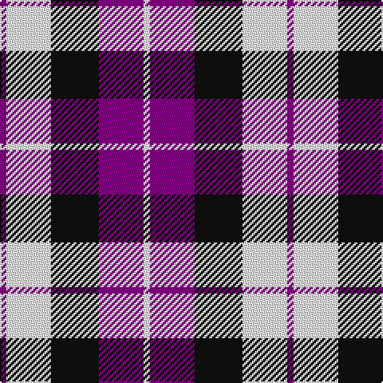

In pattern [BWKBW](/patterns/bwkbw/).

This was sourced from register-of-tartans.  It is a [5 stripes tartan](/stripes/stripes5/).

Original link https://www.tartanregister.gov.uk/tartanDetails.aspx?ref=1291

## Attestations

This cloth appears in 2 source records; the oldest owns this page.

- 01/01/2004 — Furman University (register-of-tartans, [record](https://www.tartanregister.gov.uk/tartanDetails.aspx?ref=1291))
- pre 2004 — Furman University (Corporate) (tartans-authority, [record](http://www.tartansauthority.com/tartan-ferret/display/6150/))

## Register references

External register numbers recorded for this tartan.

- Scottish Register of Tartans: [1291](https://www.tartanregister.gov.uk/tartanDetails.aspx?ref=1291)
- Scottish Tartans Authority (ITI): 6150

## Thread count
P/4 W28 K30 P28 W/4

## Palette
Each colour and its ΔE from the base-6 reference it is a variant of.

| Colour | Shade | Base | ΔE (OKLab) |
|---|---|---|---|
| K | <code style="background-color:#101010;">#101010</code> `#101010` | K <code style="background-color:#000000;">#000000</code> | 0.17 |
| P | <code style="background-color:#880088;">#880088</code> `#880088` | B <code style="background-color:#2A418A;">#2A418A</code> | 0.18 |
| W | <code style="background-color:#FCFCFC;">#FCFCFC</code> `#FCFCFC` | W <code style="background-color:#F7F7F7;">#F7F7F7</code> | 0.01 |

# Sample pattern

## Nearest tartans

The nearest existing variants by ΔTartan distance.

1. [Common Ground (Dress)](/setts/s5/w3r27w16b27y3~b001f5c-r930601-wffffff-yf0e200~x2/) — ΔT 1.21
1. [Common Ground Dress (Fashion)](/setts/s5/w3r27w16b27y3~b2c2c80-r880000-we0e0e0-ybc8c00~x2/) — ΔT 1.23
1. [Sunderland](/setts/s7/b12w4b1w4r8w2r1~b141e46-r960028-we0e0e0~x4/) — ΔT 1.47
1. [Laval Dress, Tartan de](/setts/s8/b2w2b7ba8w10b2w2b2~b1c0070-ba680028-wc0c0c0~x2/) — ΔT 1.54
1. [Laval (Tartan de..), dress](/setts/s8/b2w2b8ba8w10b2w1b1~b000050-ba600030-we0e0e0~x2/) — ΔT 1.57
1. [Battle of Prestonpans (1745) Heritage Trust, The](/setts/s5/b9r12g9b5w2~b0000cd-g008b00-re3170d-wffffff~x4/) — ΔT 1.63
1. [Thompson Navy Trade Tartan Tartan Number: 1443. Earliest known date: Oregon Possibly designed by Councillor John Hannay himself. No other information is available. See products available Copyright © Blair Urquhart, Comrie, 2015](/setts/s7/r3b15w13g6b2g2r2~b202060-g604000-ra00048-we0e0e0~x2/) — ΔT 1.65
1. [Meg Merrilees Fancy Tartan Tartan Number: 1602. Earliest known date: 1831 Miss McDougall, Inverness library, says in her notes:The first mention I had of this tartan was in an advertisment by D MacDougall, Draper, 27 High St., Inverness in 1831 . . . Meg Merrilees and other winter shawls. From Dalgety Archives. STS notes that it was sold by Forsyth's in Glasgow in 1840. Meg Merrilees was a character in one of Scotts novels, Guy Mannering. BU See products available Copyright © Blair Urquhart, Comrie, 2015](/setts/s6/w23b6w6r5k35r10~b2c2c80-k101010-rc80000-we0e0e0~x2/) — ΔT 1.67
1. [Because You Care](/setts/s7/g16b4g8b13k3w26b10~b440044-g005020-k101010-wffffff~x2/) — ΔT 1.67
1. [Braes High School Falkirk](/setts/s5/w5r5w5k15r2~k101010-rc80000-wffffff~x2/) — ΔT 1.69

## Neighbour map

Every grey dot is one of 15726 variants placed by the first two principal components of the ΔTartan feature space (44% of its variance). Red is this tartan; blue dots are its nearest — click one to open its page.

<svg viewBox="0 0 640 380" role="img" style="max-width:100%;height:auto;border:1px solid #e0e0e0;border-radius:4px;display:block" xmlns="http://www.w3.org/2000/svg"><image href="/nn/cloud.v1.png" width="640" height="380"/><a href="/setts/s5/w3r27w16b27y3~b001f5c-r930601-wffffff-yf0e200~x2/"><circle cx="147.3" cy="206.7" r="4" fill="#3465a4"><title>Common Ground (Dress)</title></circle></a><a href="/setts/s5/w3r27w16b27y3~b2c2c80-r880000-we0e0e0-ybc8c00~x2/"><circle cx="163.2" cy="211.8" r="4" fill="#3465a4"><title>Common Ground Dress (Fashion)</title></circle></a><a href="/setts/s7/b12w4b1w4r8w2r1~b141e46-r960028-we0e0e0~x4/"><circle cx="210.0" cy="192.1" r="4" fill="#3465a4"><title>Sunderland</title></circle></a><a href="/setts/s8/b2w2b7ba8w10b2w2b2~b1c0070-ba680028-wc0c0c0~x2/"><circle cx="169.6" cy="230.7" r="4" fill="#3465a4"><title>Laval Dress, Tartan de</title></circle></a><a href="/setts/s8/b2w2b8ba8w10b2w1b1~b000050-ba600030-we0e0e0~x2/"><circle cx="183.7" cy="194.1" r="4" fill="#3465a4"><title>Laval (Tartan de..), dress</title></circle></a><a href="/setts/s5/b9r12g9b5w2~b0000cd-g008b00-re3170d-wffffff~x4/"><circle cx="118.0" cy="254.8" r="4" fill="#3465a4"><title>Battle of Prestonpans (1745) Heritage Trust, The</title></circle></a><a href="/setts/s7/r3b15w13g6b2g2r2~b202060-g604000-ra00048-we0e0e0~x2/"><circle cx="156.9" cy="192.0" r="4" fill="#3465a4"><title>Thompson Navy Trade Tartan Tartan Number: 1443. Earliest known date: Oregon Possibly designed by Councillor John Hannay himself. No other information is available. See products available Copyright © Blair Urquhart, Comrie, 2015</title></circle></a><a href="/setts/s6/w23b6w6r5k35r10~b2c2c80-k101010-rc80000-we0e0e0~x2/"><circle cx="160.4" cy="202.6" r="4" fill="#3465a4"><title>Meg Merrilees Fancy Tartan Tartan Number: 1602. Earliest known date: 1831 Miss McDougall, Inverness library, says in her notes:The first mention I had of this tartan was in an advertisment by D MacDougall, Draper, 27 High St., Inverness in 1831 . . . Meg Merrilees and other winter shawls. From Dalgety Archives. STS notes that it was sold by Forsyth's in Glasgow in 1840. Meg Merrilees was a character in one of Scotts novels, Guy Mannering. BU See products available Copyright © Blair Urquhart, Comrie, 2015</title></circle></a><a href="/setts/s7/g16b4g8b13k3w26b10~b440044-g005020-k101010-wffffff~x2/"><circle cx="117.0" cy="202.2" r="4" fill="#3465a4"><title>Because You Care</title></circle></a><a href="/setts/s5/w5r5w5k15r2~k101010-rc80000-wffffff~x2/"><circle cx="206.8" cy="231.5" r="4" fill="#3465a4"><title>Braes High School Falkirk</title></circle></a><circle cx="149.5" cy="233.0" r="5" fill="#c00000"/></svg>

ID: /setts/s5/b2w14k15b14w2~b880088-k101010-wfcfcfc~x2/
