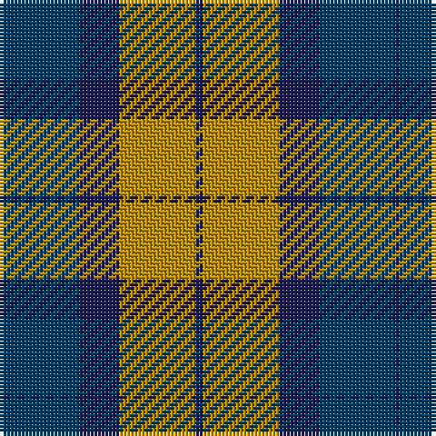

In pattern [BBBYB](/patterns/bbbyb/).

This was sourced from tartans-authority.  It is a [5 stripes tartan](/stripes/stripes5/).

Original link http://www.tartansauthority.com/tartan-ferret/display/8147/

## Thread count
DBa/1 DB21 DBa11 DY21 DBa/2

## Palette
Each colour and its ΔE from the base-6 reference it is a variant of.

| Colour | Shade | Base | ΔE (OKLab) |
|---|---|---|---|
| DB | <code style="background-color:#003C64;">#003C64</code> `#003C64` | B <code style="background-color:#2A418A;">#2A418A</code> | 0.08 |
| DBa | <code style="background-color:#1C1C50;">#1C1C50</code> `#1C1C50` | B <code style="background-color:#2A418A;">#2A418A</code> | 0.14 |
| DY | <code style="background-color:#BC8C00;">#BC8C00</code> `#BC8C00` | Y <code style="background-color:#F2BF00;">#F2BF00</code> | 0.16 |

# Sample pattern

## Nearest tartans

The nearest existing variants by ΔTartan distance.

1. [Mar, Red](/setts/s6/b2r24g24r1b24r2~b2c2c80-g006818-rd05054~x2/) — ΔT 0.98
1. [MacTavish / Thom(p)son, hunting](/setts/s6/b3r26g4b13k13b2~b5480b0-g008000-k000000-r806050~x2/) — ΔT 1.35
1. [Nibley](/setts/s6/w3g15b18r15g1r2~b304080-g008000-rc00000-we0e0e0~x2/) — ΔT 1.39
1. [Highland Spring Dress (2004) (Corp)](/setts/s5/w4b30g10r25w2~b2c2c80-g289c18-r880000-wfcfcfc~x2/) — ΔT 1.47
1. [Chindecella Gorse (Personal)](/setts/s8/y7b4y2b4y23ba19b19ba4~b1c1c50-ba5c5c5c-ybc8c00~x2/) — ΔT 1.49
1. [Logan](/setts/s7/b8r3b1r3g14r3b1~b2c4084-g005020-rdc0000~x4/) — ΔT 1.51
1. [Harvey](/setts/s6/b4r11g11b22y1g4~b2c2c80-g006818-rc80000-ye8c000~x2/) — ΔT 1.51
1. [Scottish Ballet](/setts/s6/y5g22b15ba11b5g2~b440044-ba780078-g288028-ye8c000~x2/) — ΔT 1.53
1. [Confederate (Military)](/setts/s7/r12b18k1r4k1g6k2~b1474b4-g006800-k000000-rc80000~x2/) — ΔT 1.54
1. [British Hills](/setts/s5/y2b8r8g17r1~b2c2c80-g006818-rc80000-yfccc00~x4/) — ΔT 1.54

## Neighbour map

Every grey dot is one of 15726 variants placed by the first two principal components of the ΔTartan feature space (44% of its variance). Red is this tartan; blue dots are its nearest — click one to open its page.

<svg viewBox="0 0 640 380" role="img" style="max-width:100%;height:auto;border:1px solid #e0e0e0;border-radius:4px;display:block" xmlns="http://www.w3.org/2000/svg"><image href="/nn/cloud.v1.png" width="640" height="380"/><a href="/setts/s6/b2r24g24r1b24r2~b2c2c80-g006818-rd05054~x2/"><circle cx="267.6" cy="192.7" r="4" fill="#3465a4"><title>Mar, Red</title></circle></a><a href="/setts/s6/b3r26g4b13k13b2~b5480b0-g008000-k000000-r806050~x2/"><circle cx="212.4" cy="196.2" r="4" fill="#3465a4"><title>MacTavish / Thom(p)son, hunting</title></circle></a><a href="/setts/s6/w3g15b18r15g1r2~b304080-g008000-rc00000-we0e0e0~x2/"><circle cx="203.6" cy="186.5" r="4" fill="#3465a4"><title>Nibley</title></circle></a><a href="/setts/s5/w4b30g10r25w2~b2c2c80-g289c18-r880000-wfcfcfc~x2/"><circle cx="225.6" cy="196.4" r="4" fill="#3465a4"><title>Highland Spring Dress (2004) (Corp)</title></circle></a><a href="/setts/s8/y7b4y2b4y23ba19b19ba4~b1c1c50-ba5c5c5c-ybc8c00~x2/"><circle cx="230.1" cy="210.3" r="4" fill="#3465a4"><title>Chindecella Gorse (Personal)</title></circle></a><a href="/setts/s7/b8r3b1r3g14r3b1~b2c4084-g005020-rdc0000~x4/"><circle cx="287.1" cy="207.8" r="4" fill="#3465a4"><title>Logan</title></circle></a><a href="/setts/s6/b4r11g11b22y1g4~b2c2c80-g006818-rc80000-ye8c000~x2/"><circle cx="296.5" cy="192.9" r="4" fill="#3465a4"><title>Harvey</title></circle></a><a href="/setts/s6/y5g22b15ba11b5g2~b440044-ba780078-g288028-ye8c000~x2/"><circle cx="192.6" cy="213.4" r="4" fill="#3465a4"><title>Scottish Ballet</title></circle></a><a href="/setts/s7/r12b18k1r4k1g6k2~b1474b4-g006800-k000000-rc80000~x2/"><circle cx="235.9" cy="163.8" r="4" fill="#3465a4"><title>Confederate (Military)</title></circle></a><a href="/setts/s5/y2b8r8g17r1~b2c2c80-g006818-rc80000-yfccc00~x4/"><circle cx="263.9" cy="202.0" r="4" fill="#3465a4"><title>British Hills</title></circle></a><circle cx="252.3" cy="212.2" r="5" fill="#c00000"/></svg>

ID: /setts/s5/b2y21b11ba21b1~b1c1c50-ba003c64-ybc8c00/
