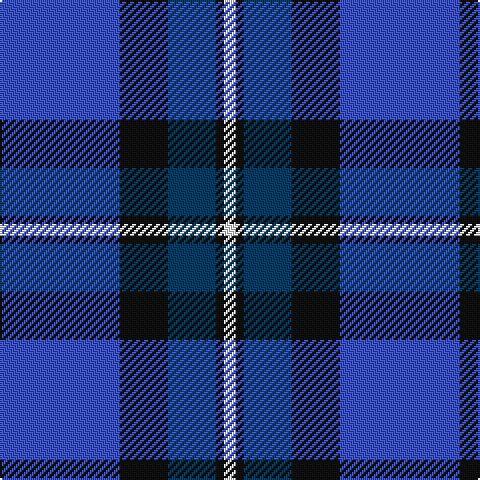

In pattern [BKBKW](/stripes/bkbkw/).

This was sourced from tartans-authority.  It is a [5 stripe tartan](/stripes/stripes5/).

Original link http://www.tartansauthority.com/tartan-ferret/display/3500/

## Thread count
B/60 K24 DB24 K4 W/6

## Palette
Each colour and the base-6 reference it is a variant of.

| Colour | Shade | Base |
|---|---|---|
| B | <code style="background-color:#3850C8;">#3850C8</code> `oklch(48.8% 0.188 269.4)` <small>#3850C8</small> | B <code style="background-color:#2A418A;">#2A418A</code> |
| DB | <code style="background-color:#003C64;">#003C64</code> `oklch(34.5% 0.089 246.0)` <small>#003C64</small> | B <code style="background-color:#2A418A;">#2A418A</code> |
| K | <code style="background-color:#101010;">#101010</code> `oklch(17.3% 0.000 89.9)` <small>#101010</small> | K <code style="background-color:#000000;">#000000</code> |
| W | <code style="background-color:#FCFCFC;">#FCFCFC</code> `oklch(99.1% 0.000 89.9)` <small>#FCFCFC</small> | W <code style="background-color:#F7F7F7;">#F7F7F7</code> |

# Sample pattern

## Nearest tartans

The nearest existing variants by ΔTartan distance.

1. [Joker, The](/setts/s6/b18k2b4k6dp12lo1~x2/) — ΔT 1.09
1. [Federal Bureau of Investigation](/setts/s7/db6lb2db2lb3db16b26r2~x2/) — ΔT 1.17
1. [Gilt Edge (Corporate)](/setts/s5/db3db2t31db34w2~x2/) — ΔT 1.21
1. [Aberdeen Academy of Performing Arts](/setts/s6/db4p2dp3db24b24w3~x2/) — ΔT 1.24
1. [Joker Fancy Tartan Tartan Number: 6769. Earliest known date: 2005 I have a photo of a fabric swatch that I am trying to match as close as possible. I have been commissioned to make a life size mannequin of Jack Nicholson as the Joker and he wore plaid/tartan pants. I could send you some photos through email and possibly you could help me. Thanks, Andy Garringer USA, January 2008. (96 threads @ 40 epi heavyweight = 2.5 inch repeat) See products available Copyright © Blair Urquhart, Comrie, 2015](/setts/s6/b11k1b3k5dp9lo1~x2/) — ΔT 1.26
1. [Brazell (Personal)](/setts/s5/db7ly1db7t11r2~x6/) — ΔT 1.31
1. [Int. Police Association (Official)](/setts/s7/db7r3db26t2db2t26ly4~x2/) — ΔT 1.31
1. [McKerrell of Hillhouse](/setts/s4/w4t28db49ly3~x2/) — ΔT 1.32
1. [Gorman Family (Canada) (Personal)](/setts/s6/g6n16db49n14db2w6~x2/) — ΔT 1.37
1. [Brazell (Personal)](/setts/s5/db7ly1db7b11r2~x6/) — ΔT 1.42

## Neighbour map

Every grey dot is one of 14299 variants placed by the first two principal components of the ΔTartan feature space (44% of its variance). Red is this tartan; blue dots are its nearest — click one to open its page.

<svg viewBox="0 0 640 380" role="img" style="max-width:100%;height:auto;border:1px solid #e0e0e0;border-radius:4px;display:block" xmlns="http://www.w3.org/2000/svg"><image href="/nn/cloud.v1.png" width="640" height="380"/><a href="/setts/s6/b18k2b4k6dp12lo1~x2/"><circle cx="306.7" cy="199.2" r="4" fill="#3465a4"><title>Joker, The</title></circle></a><a href="/setts/s7/db6lb2db2lb3db16b26r2~x2/"><circle cx="288.5" cy="190.6" r="4" fill="#3465a4"><title>Federal Bureau of Investigation</title></circle></a><a href="/setts/s5/db3db2t31db34w2~x2/"><circle cx="345.8" cy="201.8" r="4" fill="#3465a4"><title>Gilt Edge (Corporate)</title></circle></a><a href="/setts/s6/db4p2dp3db24b24w3~x2/"><circle cx="264.6" cy="188.0" r="4" fill="#3465a4"><title>Aberdeen Academy of Performing Arts</title></circle></a><a href="/setts/s6/b11k1b3k5dp9lo1~x2/"><circle cx="263.8" cy="228.3" r="4" fill="#3465a4"><title>Joker Fancy Tartan Tartan Number: 6769. Earliest known date: 2005 I have a photo of a fabric swatch that I am trying to match as close as possible. I have been commissioned to make a life size mannequin of Jack Nicholson as the Joker and he wore plaid/tartan pants. I could send you some photos through email and possibly you could help me. Thanks, Andy Garringer USA, January 2008. (96 threads @ 40 epi heavyweight = 2.5 inch repeat) See products available Copyright © Blair Urquhart, Comrie, 2015</title></circle></a><a href="/setts/s5/db7ly1db7t11r2~x6/"><circle cx="265.5" cy="235.7" r="4" fill="#3465a4"><title>Brazell (Personal)</title></circle></a><a href="/setts/s7/db7r3db26t2db2t26ly4~x2/"><circle cx="288.6" cy="179.7" r="4" fill="#3465a4"><title>Int. Police Association (Official)</title></circle></a><a href="/setts/s4/w4t28db49ly3~x2/"><circle cx="346.0" cy="210.7" r="4" fill="#3465a4"><title>McKerrell of Hillhouse</title></circle></a><a href="/setts/s6/g6n16db49n14db2w6~x2/"><circle cx="306.0" cy="159.2" r="4" fill="#3465a4"><title>Gorman Family (Canada) (Personal)</title></circle></a><a href="/setts/s5/db7ly1db7b11r2~x6/"><circle cx="242.0" cy="229.3" r="4" fill="#3465a4"><title>Brazell (Personal)</title></circle></a><circle cx="280.4" cy="211.0" r="5" fill="#c00000"/></svg>

ID: /setts/s5/b30k12dt12k2w3~x2/
