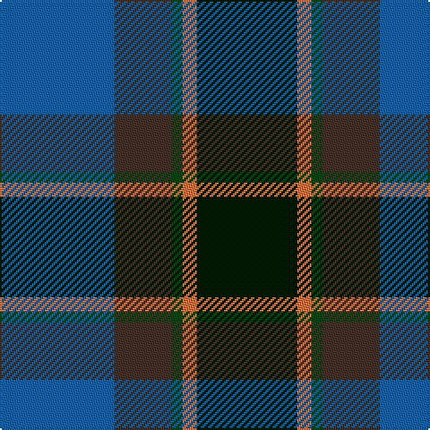

**Bands:** [BBGRK](/stripes/bbgrk/) · **Stripes:** [B DO DG O K](/stripes/stripes5/) B DO DG O K

This was sourced from register-of-tartans.  It is a [5 band tartan](/bands/bands5/).

Original link https://www.tartanregister.gov.uk/tartanDetails.aspx?ref=10824

## Register references

External register numbers recorded for this tartan.

- Scottish Register of Tartans: [10824](https://www.tartanregister.gov.uk/tartanDetails.aspx?ref=10824)

## Thread count
B/64 T32 DGa6 O8 DG/56

## Palette
Each colour and its ΔE from the base-6 reference it is a variant of.

| Colour | Shade | Base | ΔE (OKLab) |
|---|---|---|---|
| B | <code style="background-color:#0163AC;">#0163AC</code> `#0163AC` | B <code style="background-color:#2A418A;">#2A418A</code> | 0.10 |
| DG | <code style="background-color:#001A00;">#001A00</code> `#001A00` | K <code style="background-color:#000000;">#000000</code> | 0.20 |
| DGa | <code style="background-color:#004710;">#004710</code> `#004710` | G <code style="background-color:#006100;">#006100</code> | 0.09 |
| O | <code style="background-color:#E9713C;">#E9713C</code> `#E9713C` | R <code style="background-color:#CC0000;">#CC0000</code> | 0.17 |
| T | <code style="background-color:#453128;">#453128</code> `#453128` | B <code style="background-color:#2A418A;">#2A418A</code> | 0.17 |

# Sample pattern

## Nearest tartans

The nearest existing variants by ΔTartan distance.

1. [Landels (Personal)](/setts/s5/db31g2k20ly2g24~x2/) — ΔT 0.61
1. [MacPhail Hunting](/setts/s6/r2db23k14dg16k2w2~x2/) — ΔT 0.66
1. [Russell or Mitchell or Hunter or Galbraith](/setts/s6/k2dg12k12r1db12w2~x2/) — ΔT 0.68
1. [Paterson Blue (Personal)](/setts/s6/db22w2k10g11r3g4~x2/) — ΔT 0.77
1. [Rose Hunting Clan Tartan Tartan Number: 1226. Earliest known date: 1831 First recorded in James Logan's, 'The Scottish Gael' in 1831. See products available Copyright © Blair Urquhart, Comrie, 2015](/setts/s6/k4w1g10k10db10r2~x2/) — ΔT 0.82
1. [Lyle and Scott](/setts/s6/dg5db2dg9db19dr9ly2~x2/) — ΔT 0.86
1. [MacPhail Hunting #2](/setts/s6/r4db24k12g14k4lb3~x2/) — ΔT 0.86
1. [Loudoun's Highlanders - 1747 #1 (Mil](/setts/s6/r4k2db24k20g20lo3~x2/) — ΔT 0.87
1. [Deloughery, Paul](/setts/s7/db20k6o4db3k16g20w2~x2/) — ΔT 0.89
1. [Rose Hunting](/setts/s6/k4w1g10k10db10r2~x4/) — ΔT 0.89

## Neighbour map

Every grey dot is one of 14313 variants placed by the first two principal components of the ΔTartan feature space (44% of its variance). Red is this tartan; blue dots are its nearest — click one to open its page.

<svg viewBox="0 0 640 380" role="img" style="max-width:100%;height:auto;border:1px solid #e0e0e0;border-radius:4px;display:block" xmlns="http://www.w3.org/2000/svg"><image href="/nn/cloud.v1.png" width="640" height="380"/><a href="/setts/s5/db31g2k20ly2g24~x2/"><circle cx="218.5" cy="213.6" r="4" fill="#3465a4"><title>Landels (Personal)</title></circle></a><a href="/setts/s6/r2db23k14dg16k2w2~x2/"><circle cx="214.8" cy="209.7" r="4" fill="#3465a4"><title>MacPhail Hunting</title></circle></a><a href="/setts/s6/k2dg12k12r1db12w2~x2/"><circle cx="180.3" cy="211.0" r="4" fill="#3465a4"><title>Russell or Mitchell or Hunter or Galbraith</title></circle></a><a href="/setts/s6/db22w2k10g11r3g4~x2/"><circle cx="203.9" cy="204.8" r="4" fill="#3465a4"><title>Paterson Blue (Personal)</title></circle></a><a href="/setts/s6/k4w1g10k10db10r2~x2/"><circle cx="170.4" cy="225.3" r="4" fill="#3465a4"><title>Rose Hunting Clan Tartan Tartan Number: 1226. Earliest known date: 1831 First recorded in James Logan's, 'The Scottish Gael' in 1831. See products available Copyright © Blair Urquhart, Comrie, 2015</title></circle></a><a href="/setts/s6/dg5db2dg9db19dr9ly2~x2/"><circle cx="202.7" cy="221.6" r="4" fill="#3465a4"><title>Lyle and Scott</title></circle></a><a href="/setts/s6/r4db24k12g14k4lb3~x2/"><circle cx="172.3" cy="220.7" r="4" fill="#3465a4"><title>MacPhail Hunting #2</title></circle></a><a href="/setts/s6/r4k2db24k20g20lo3~x2/"><circle cx="173.2" cy="210.5" r="4" fill="#3465a4"><title>Loudoun's Highlanders - 1747 #1 (Mil</title></circle></a><a href="/setts/s7/db20k6o4db3k16g20w2~x2/"><circle cx="167.0" cy="215.8" r="4" fill="#3465a4"><title>Deloughery, Paul</title></circle></a><a href="/setts/s6/k4w1g10k10db10r2~x4/"><circle cx="166.2" cy="223.1" r="4" fill="#3465a4"><title>Rose Hunting</title></circle></a><circle cx="199.2" cy="229.4" r="5" fill="#c00000"/></svg>

ID: /setts/s5/b32do16dg3o4k28~x2/
