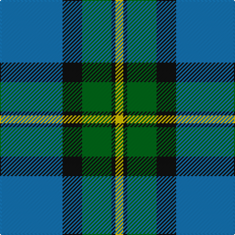

In pattern [BKGKY](/stripes/bkgky/).

This was sourced from tartans-authority.  It is a [5 stripe tartan](/stripes/stripes5/).

Original link http://www.tartansauthority.com/tartan-ferret/display/8857/

## Thread count
B/64 K20 G30 K4 Y/8

## Palette
Each colour and the base-6 reference it is a variant of.

| Colour | Shade | Base |
|---|---|---|
| B | <code style="background-color:#1474B4;">#1474B4</code> `oklch(54.0% 0.129 245.1)` <small>#1474B4</small> | B <code style="background-color:#2A418A;">#2A418A</code> |
| G | <code style="background-color:#006818;">#006818</code> `oklch(45.0% 0.142 145.0)` <small>#006818</small> | G <code style="background-color:#006100;">#006100</code> |
| K | <code style="background-color:#101010;">#101010</code> `oklch(17.3% 0.000 89.9)` <small>#101010</small> | K <code style="background-color:#000000;">#000000</code> |
| Y | <code style="background-color:#E8C000;">#E8C000</code> `oklch(81.9% 0.168 93.7)` <small>#E8C000</small> | Y <code style="background-color:#F2BF00;">#F2BF00</code> |

# Sample pattern

## Nearest tartans

The nearest existing variants by ΔTartan distance, with this tartan at the top so the swatches line up against it.

ΔTartan

Tartan

Sett

—

<a href="/ttd/edit/#slug=b32k10g15k2ly4~x2">Rothesay &amp; Caithness Fencibles (Mil)</a> <a class="nn-out" href="/setts/s5/b32k10g15k2ly4~x2/" title="open its dictionary page">↗</a>

0.90

<a href="/ttd/edit/#slug=g40k15b10k10ly3~x2">U.S. Border Patrol (Corporate)</a> <a class="nn-out" href="/setts/s5/g40k15b10k10ly3~x2/" title="open its dictionary page">↗</a>

0.93

<a href="/ttd/edit/#slug=b12k4g6ly1~x8">Sinclair of Ulbster (Portrait)</a> <a class="nn-out" href="/setts/s4/b12k4g6ly1~x8/" title="open its dictionary page">↗</a>

1.07

<a href="/ttd/edit/#slug=db5w3db36g38ly5g5~x2">St. Andrew Society, Sao Paulo (Corp)</a> <a class="nn-out" href="/setts/s6/db5w3db36g38ly5g5~x2/" title="open its dictionary page">↗</a>

1.14

<a href="/ttd/edit/#slug=t2db29t12g29w2~x2">Wallace Blue (Fashion)</a> <a class="nn-out" href="/setts/s5/t2db29t12g29w2~x2/" title="open its dictionary page">↗</a>

1.14

<a href="/ttd/edit/#slug=r2w7b30dg36ly2~x2">Centennial-King George Lodge No.171</a> <a class="nn-out" href="/setts/s5/r2w7b30dg36ly2~x2/" title="open its dictionary page">↗</a>

1.19

<a href="/ttd/edit/#slug=db10k3t65dg56ly6">Phoenix Police Honor Guard</a> <a class="nn-out" href="/setts/s5/db10k3t65dg56ly6/" title="open its dictionary page">↗</a>

1.20

<a href="/ttd/edit/#slug=r2db32g14db5g16w2~x2">Connacht Irish District Tartan Tartan Number: 4485. Earliest known date: 1994 Phil Smith obtained in Perthshire from a swatch dated 1994 shown to him by Keith Lumsden of the Scottish Tartans Society. However www.uniq-orn.com shows this as Connaught Green. See products available Copyright © Blair Urquhart, Comrie, 2015</a> <a class="nn-out" href="/setts/s6/r2db32g14db5g16w2~x2/" title="open its dictionary page">↗</a>

1.25

<a href="/ttd/edit/#slug=dg35t40w11lo3dg7~x2">Fife Ethylene Plant</a> <a class="nn-out" href="/setts/s5/dg35t40w11lo3dg7~x2/" title="open its dictionary page">↗</a>

1.30

<a href="/ttd/edit/#slug=dt36t21ly4lb12dp2~x2">Emond, Kenneth (Personal)</a> <a class="nn-out" href="/setts/s5/dt36t21ly4lb12dp2~x2/" title="open its dictionary page">↗</a>

1.33

<a href="/ttd/edit/#slug=k4t24k2g13t2k3~x4">Vance (Family Association) Corporate Family Tartan Tartan Number: 2208. Earliest known date: December 1994 Designed and Copyrighted in the US by Mark W. Vance. Details from Vance Family Association website. See products available Copyright © Blair Urquhart, Comrie, 2015</a> <a class="nn-out" href="/setts/s6/k4t24k2g13t2k3~x4/" title="open its dictionary page">↗</a>

## Neighbour map

Every grey dot is one of 14299 variants placed by the first two principal components of the ΔTartan feature space (44% of its variance). Red is this tartan; blue dots are its nearest — click one to open its page.

<svg viewBox="0 0 640 380" role="img" style="max-width:100%;height:auto;border:1px solid #e0e0e0;border-radius:4px;display:block" xmlns="http://www.w3.org/2000/svg"><image href="/nn/cloud.v1.png" width="640" height="380"/><a href="/setts/s5/g40k15b10k10ly3~x2/"><circle cx="280.0" cy="216.3" r="4" fill="#3465a4"><title>U.S. Border Patrol (Corporate)</title></circle></a><a href="/setts/s4/b12k4g6ly1~x8/"><circle cx="278.3" cy="247.8" r="4" fill="#3465a4"><title>Sinclair of Ulbster (Portrait)</title></circle></a><a href="/setts/s6/db5w3db36g38ly5g5~x2/"><circle cx="294.0" cy="201.7" r="4" fill="#3465a4"><title>St. Andrew Society, Sao Paulo (Corp)</title></circle></a><a href="/setts/s5/t2db29t12g29w2~x2/"><circle cx="249.0" cy="223.1" r="4" fill="#3465a4"><title>Wallace Blue (Fashion)</title></circle></a><a href="/setts/s5/r2w7b30dg36ly2~x2/"><circle cx="255.8" cy="173.5" r="4" fill="#3465a4"><title>Centennial-King George Lodge No.171</title></circle></a><a href="/setts/s5/db10k3t65dg56ly6/"><circle cx="285.2" cy="181.3" r="4" fill="#3465a4"><title>Phoenix Police Honor Guard</title></circle></a><a href="/setts/s6/r2db32g14db5g16w2~x2/"><circle cx="323.6" cy="202.1" r="4" fill="#3465a4"><title>Connacht Irish District Tartan Tartan Number: 4485. Earliest known date: 1994 Phil Smith obtained in Perthshire from a swatch dated 1994 shown to him by Keith Lumsden of the Scottish Tartans Society. However www.uniq-orn.com shows this as Connaught Green. See products available Copyright © Blair Urquhart, Comrie, 2015</title></circle></a><a href="/setts/s5/dg35t40w11lo3dg7~x2/"><circle cx="225.5" cy="203.2" r="4" fill="#3465a4"><title>Fife Ethylene Plant</title></circle></a><a href="/setts/s5/dt36t21ly4lb12dp2~x2/"><circle cx="240.4" cy="179.8" r="4" fill="#3465a4"><title>Emond, Kenneth (Personal)</title></circle></a><a href="/setts/s6/k4t24k2g13t2k3~x4/"><circle cx="261.1" cy="178.2" r="4" fill="#3465a4"><title>Vance (Family Association) Corporate Family Tartan Tartan Number: 2208. Earliest known date: December 1994 Designed and Copyrighted in the US by Mark W. Vance. Details from Vance Family Association website. See products available Copyright © Blair Urquhart, Comrie, 2015</title></circle></a><circle cx="277.0" cy="208.5" r="5" fill="#c00000"/></svg>

ID: /setts/s5/b32k10g15k2ly4~x2/
