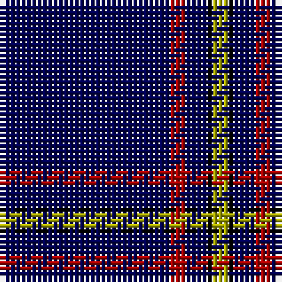

In pattern [BRBKY](/patterns/brbky/).

This was sourced from weddslist.  It is a [5 stripes tartan](/stripes/stripes5/).

Original link http://www.weddslist.com/cgi-bin/tartans/pg.pl?source=x

## Thread count
DB/32 DR3 DB4 K1 LG/3

## Palette
Each colour and its ΔE from the base-6 reference it is a variant of.

| Colour | Shade | Base | ΔE (OKLab) |
|---|---|---|---|
| DB | <code style="background-color:#000052;">#000052</code> `#000052` | B <code style="background-color:#2A418A;">#2A418A</code> | 0.20 |
| DR | <code style="background-color:#AA0000;">#AA0000</code> `#AA0000` | R <code style="background-color:#CC0000;">#CC0000</code> | 0.07 |
| K | <code style="background-color:#000000;">#000000</code> `#000000` | K <code style="background-color:#000000;">#000000</code> | 0.00 |
| LG | <code style="background-color:#AAAA00;">#AAAA00</code> `#AAAA00` | Y <code style="background-color:#F2BF00;">#F2BF00</code> | 0.13 |

# Sample pattern

## Nearest tartans

The nearest existing variants by ΔTartan distance.

1. [MacLaine of Lochbuie Hunting](/setts/s5/b32r3b4k1y3~b000052-k000000-raa0000-yaaaa00~x2/) — ΔT 0.00
1. [MacLaine of Lochbuie Hunting](/setts/s5/b32r3b4k1y3~b00006b-k000000-rc80000-yc8c800/) — ΔT 0.71
1. [MacLaine of Lochbuie Hunting Clan Tartan Tartan Number: 491. Earliest known date: 1906 The Sett is also recorded by Adam in 1908. The hunting version first appeared in this century, in the work of H. Whyte published by W. and A.K. Johnston. His book introduced many new hunting and dress forms of both clan and family tartans. D.W. Stewart (1893) pointed out that the use of so much blue, was unique among old tartan setts. See products available Copyright © Blair Urquhart, Comrie, 2015](/setts/s5/b32r3b4k1y3~b2c2c80-k101010-rc80000-ye8c000~x2/) — ΔT 1.40
1. [Auchairne](/setts/s6/b10ba6b3ba62w4ba5~b8080d0-ba000050-we0e0e0~x2/) — ΔT 1.45
1. [Inverness Htg (Royal)](/setts/s8/b61r6w2r8y2b3y2b15~b1c0070-r880000-wfcfcfc-yd09800~x2/) — ΔT 1.60
1. [MacLaine of Lochbuie, hunting](/setts/s5/b32r3b4k1y3~b304080-k000000-rc00000-yf0c000~x2/) — ΔT 1.65
1. [Auchairne (Corporate)](/setts/s6/b11ba7b3ba70w4ba6~b1474b4-ba1c1c50-w98c8e8~x2/) — ΔT 1.66
1. [Duke of York (Royal)](/setts/s8/b61r6w2r8y2b3y2b15~b00008c-r8c0000-wfcfcfc-yc88c00~x2/) — ΔT 1.67
1. [Scotch Whisky, Heritage](/setts/s8/b73g16b10r8b10k4b10w2~b000050-g008000-k000000-rc00000-we0e0e0/) — ΔT 1.69
1. [Weir Minerals (Corporate)](/setts/s4/b80w1y8w3~b1c0070-we0e0e0-yd87c00~x2/) — ΔT 1.72

## Neighbour map

Every grey dot is one of 15726 variants placed by the first two principal components of the ΔTartan feature space (44% of its variance). Red is this tartan; blue dots are its nearest — click one to open its page.

<svg viewBox="0 0 640 380" role="img" style="max-width:100%;height:auto;border:1px solid #e0e0e0;border-radius:4px;display:block" xmlns="http://www.w3.org/2000/svg"><image href="/nn/cloud.v1.png" width="640" height="380"/><a href="/setts/s5/b32r3b4k1y3~b000052-k000000-raa0000-yaaaa00~x2/"><circle cx="587.4" cy="176.9" r="4" fill="#3465a4"><title>MacLaine of Lochbuie Hunting</title></circle></a><a href="/setts/s5/b32r3b4k1y3~b00006b-k000000-rc80000-yc8c800/"><circle cx="572.9" cy="170.7" r="4" fill="#3465a4"><title>MacLaine of Lochbuie Hunting</title></circle></a><a href="/setts/s5/b32r3b4k1y3~b2c2c80-k101010-rc80000-ye8c000~x2/"><circle cx="595.2" cy="168.7" r="4" fill="#3465a4"><title>MacLaine of Lochbuie Hunting Clan Tartan Tartan Number: 491. Earliest known date: 1906 The Sett is also recorded by Adam in 1908. The hunting version first appeared in this century, in the work of H. Whyte published by W. and A.K. Johnston. His book introduced many new hunting and dress forms of both clan and family tartans. D.W. Stewart (1893) pointed out that the use of so much blue, was unique among old tartan setts. See products available Copyright © Blair Urquhart, Comrie, 2015</title></circle></a><a href="/setts/s6/b10ba6b3ba62w4ba5~b8080d0-ba000050-we0e0e0~x2/"><circle cx="550.0" cy="190.2" r="4" fill="#3465a4"><title>Auchairne</title></circle></a><a href="/setts/s8/b61r6w2r8y2b3y2b15~b1c0070-r880000-wfcfcfc-yd09800~x2/"><circle cx="559.1" cy="142.9" r="4" fill="#3465a4"><title>Inverness Htg (Royal)</title></circle></a><a href="/setts/s5/b32r3b4k1y3~b304080-k000000-rc00000-yf0c000~x2/"><circle cx="595.8" cy="168.5" r="4" fill="#3465a4"><title>MacLaine of Lochbuie, hunting</title></circle></a><a href="/setts/s6/b11ba7b3ba70w4ba6~b1474b4-ba1c1c50-w98c8e8~x2/"><circle cx="611.4" cy="199.7" r="4" fill="#3465a4"><title>Auchairne (Corporate)</title></circle></a><a href="/setts/s8/b61r6w2r8y2b3y2b15~b00008c-r8c0000-wfcfcfc-yc88c00~x2/"><circle cx="548.3" cy="144.0" r="4" fill="#3465a4"><title>Duke of York (Royal)</title></circle></a><a href="/setts/s8/b73g16b10r8b10k4b10w2~b000050-g008000-k000000-rc00000-we0e0e0/"><circle cx="501.0" cy="133.7" r="4" fill="#3465a4"><title>Scotch Whisky, Heritage</title></circle></a><a href="/setts/s4/b80w1y8w3~b1c0070-we0e0e0-yd87c00~x2/"><circle cx="626.0" cy="176.4" r="4" fill="#3465a4"><title>Weir Minerals (Corporate)</title></circle></a><circle cx="587.4" cy="176.9" r="5" fill="#c00000"/></svg>

ID: /setts/s5/b32r3b4k1y3~b000052-k000000-raa0000-yaaaa00/
