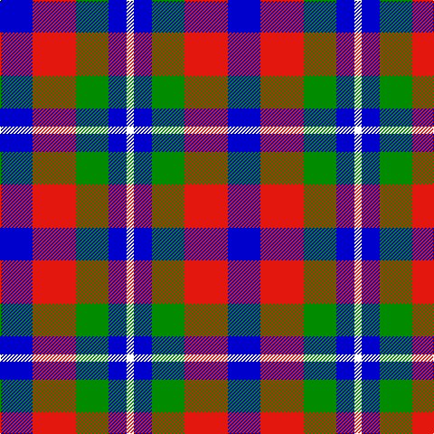

In pattern [BRGBW](/patterns/brgbw/).

This was sourced from register-of-tartans.  It is a [5 stripes tartan](/stripes/stripes5/).

Original link https://www.tartanregister.gov.uk/tartanDetails.aspx?ref=10841

## Thread count
B/36 R48 G36 B20 W/8

## Palette
Each colour and its ΔE from the base-6 reference it is a variant of.

| Colour | Shade | Base | ΔE (OKLab) |
|---|---|---|---|
| B | <code style="background-color:#0000CD;">#0000CD</code> `#0000CD` | B <code style="background-color:#2C4084;">#2C4084</code> | 0.15 |
| G | <code style="background-color:#008B00;">#008B00</code> `#008B00` | G <code style="background-color:#006400;">#006400</code> | 0.12 |
| R | <code style="background-color:#E3170D;">#E3170D</code> `#E3170D` | R <code style="background-color:#C80000;">#C80000</code> | 0.06 |
| W | <code style="background-color:#FFFFFF;">#FFFFFF</code> `#FFFFFF` | W <code style="background-color:#F4F4F0;">#F4F4F0</code> | 0.03 |

# Sample pattern

ID: /setts/s5/b36r48g36b20w8-b0000cd-g008b00-re3170d-wffffff/
