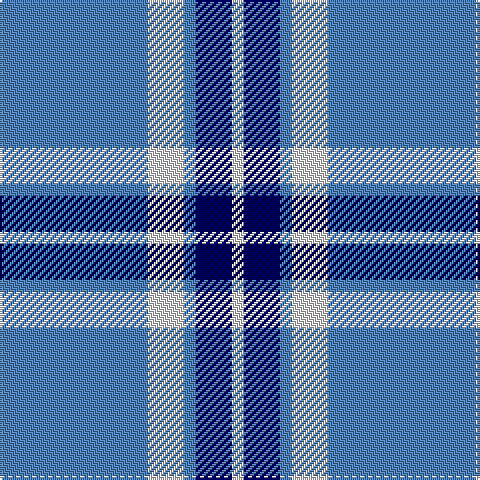

In pattern [BWBBW](/patterns/bwbbw/).

This was sourced from weddslist.  It is a [5 stripes tartan](/stripes/stripes5/).

Original link http://www.weddslist.com/cgi-bin/tartans/pg.pl?source=sts

## Thread count
B/74 LN18 B6 DB18 LN/6

## Palette
Each colour and its ΔE from the base-6 reference it is a variant of.

| Colour | Shade | Base | ΔE (OKLab) |
|---|---|---|---|
| B | <code style="background-color:#5480B0;">#5480B0</code> `#5480B0` | B <code style="background-color:#2A418A;">#2A418A</code> | 0.19 |
| DB | <code style="background-color:#000050;">#000050</code> `#000050` | B <code style="background-color:#2A418A;">#2A418A</code> | 0.21 |
| LN | <code style="background-color:#E0E0E0;">#E0E0E0</code> `#E0E0E0` | W <code style="background-color:#F7F7F7;">#F7F7F7</code> | 0.07 |

# Sample pattern

## Nearest tartans

The nearest existing variants by ΔTartan distance.

1. [Carlisle Ancient](/setts/s5/b11y2r1y2r1~b2474e8-r880000-yd09800~x4/) — ΔT 0.68
1. [Whitley (Personal)](/setts/s6/b1w5b1w5b15y1~b3850c8-we0e0e0-ye8c000~x4/) — ΔT 1.14
1. [Rea](/setts/s6/b12y2b1k5b4k2~b2888c4-k101010-ye8c000~x4/) — ΔT 1.19
1. [Legary (Name)](/setts/s6/y5b15w5b5w40y3~b1c1c50-w98c8e8-ye8c000~x2/) — ΔT 1.20
1. [Loch Lomond #2](/setts/s5/b13w3b1k3w1~b2474e8-k101010-wfcfcfc~x6/) — ΔT 1.20
1. [Angle, Blue (Fashion)](/setts/s7/w1y11k6y3w1y1w1~k101010-we8ccb8-y48a4c0~x4/) — ΔT 1.32
1. [Carlisle Family (Name)](/setts/s7/b33y6r3y6k3y15b32~b3474fc-k000000-r8c0000-yc88c00~x4/) — ΔT 1.38
1. [Legary](/setts/s6/y5b15w5b5w40y3~b00006b-wabcdd9-yeff265~x2/) — ΔT 1.40
1. [MacLintock #2](/setts/s7/b3ba2w10ba2b6ba26k2~b5c5c5c-ba1474b4-k101010-wfcfcfc~x2/) — ΔT 1.45
1. [Sligo](/setts/s6/b50ba4b12ba23y4ba4~b5480b0-ba401000-yf0c000~x2/) — ΔT 1.46

## Neighbour map

Every grey dot is one of 15726 variants placed by the first two principal components of the ΔTartan feature space (44% of its variance). Red is this tartan; blue dots are its nearest — click one to open its page.

<svg viewBox="0 0 640 380" role="img" style="max-width:100%;height:auto;border:1px solid #e0e0e0;border-radius:4px;display:block" xmlns="http://www.w3.org/2000/svg"><image href="/nn/cloud.v1.png" width="640" height="380"/><a href="/setts/s5/b11y2r1y2r1~b2474e8-r880000-yd09800~x4/"><circle cx="394.3" cy="212.3" r="4" fill="#3465a4"><title>Carlisle Ancient</title></circle></a><a href="/setts/s6/b1w5b1w5b15y1~b3850c8-we0e0e0-ye8c000~x4/"><circle cx="364.0" cy="186.7" r="4" fill="#3465a4"><title>Whitley (Personal)</title></circle></a><a href="/setts/s6/b12y2b1k5b4k2~b2888c4-k101010-ye8c000~x4/"><circle cx="361.1" cy="222.3" r="4" fill="#3465a4"><title>Rea</title></circle></a><a href="/setts/s6/y5b15w5b5w40y3~b1c1c50-w98c8e8-ye8c000~x2/"><circle cx="340.9" cy="184.6" r="4" fill="#3465a4"><title>Legary (Name)</title></circle></a><a href="/setts/s5/b13w3b1k3w1~b2474e8-k101010-wfcfcfc~x6/"><circle cx="372.2" cy="202.0" r="4" fill="#3465a4"><title>Loch Lomond #2</title></circle></a><a href="/setts/s7/w1y11k6y3w1y1w1~k101010-we8ccb8-y48a4c0~x4/"><circle cx="335.9" cy="196.3" r="4" fill="#3465a4"><title>Angle, Blue (Fashion)</title></circle></a><a href="/setts/s7/b33y6r3y6k3y15b32~b3474fc-k000000-r8c0000-yc88c00~x4/"><circle cx="358.4" cy="197.4" r="4" fill="#3465a4"><title>Carlisle Family (Name)</title></circle></a><a href="/setts/s6/y5b15w5b5w40y3~b00006b-wabcdd9-yeff265~x2/"><circle cx="331.4" cy="181.9" r="4" fill="#3465a4"><title>Legary</title></circle></a><a href="/setts/s7/b3ba2w10ba2b6ba26k2~b5c5c5c-ba1474b4-k101010-wfcfcfc~x2/"><circle cx="312.9" cy="170.7" r="4" fill="#3465a4"><title>MacLintock #2</title></circle></a><a href="/setts/s6/b50ba4b12ba23y4ba4~b5480b0-ba401000-yf0c000~x2/"><circle cx="398.5" cy="210.2" r="4" fill="#3465a4"><title>Sligo</title></circle></a><circle cx="380.0" cy="210.1" r="5" fill="#c00000"/></svg>

ID: /setts/s5/b37w9b3ba9w3~b5480b0-ba000050-we0e0e0~x2/
