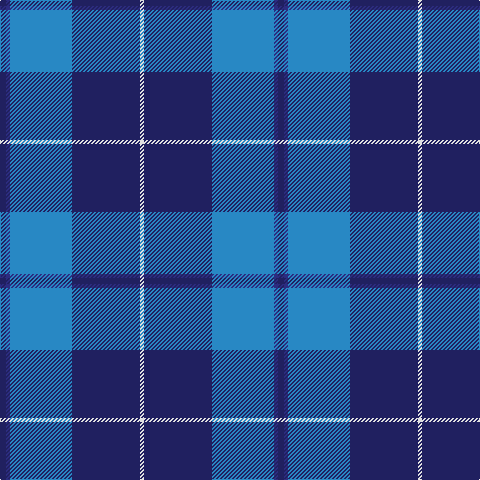

In pattern [BBBBW](/patterns/bbbbw/).

This was sourced from tartans-authority.  It is a [5 stripes tartan](/stripes/stripes5/).

Original link http://www.tartansauthority.com/tartan-ferret/display/4986/

## Attestations

This cloth appears in 2 source records; the oldest owns this page.

- 1998 — Gilt Edge (Corporate) (tartans-authority, [record](http://www.tartansauthority.com/tartan-ferret/display/4986/))
- 01/02/2001 — Gilt Edge (register-of-tartans, [record](https://www.tartanregister.gov.uk/tartanDetails.aspx?ref=1346))

## Thread count
DB/6 DBa4 B62 DB68 LN/4

## Palette
Each colour and its ΔE from the base-6 reference it is a variant of.

| Colour | Shade | Base | ΔE (OKLab) |
|---|---|---|---|
| B | <code style="background-color:#2888C4;">#2888C4</code> `#2888C4` | B <code style="background-color:#2A418A;">#2A418A</code> | 0.21 |
| DB | <code style="background-color:#202060;">#202060</code> `#202060` | B <code style="background-color:#2A418A;">#2A418A</code> | 0.11 |
| DBa | <code style="background-color:#2C2C80;">#2C2C80</code> `#2C2C80` | B <code style="background-color:#2A418A;">#2A418A</code> | 0.06 |
| LN | <code style="background-color:#E0E0E0;">#E0E0E0</code> `#E0E0E0` | W <code style="background-color:#F7F7F7;">#F7F7F7</code> | 0.07 |

# Sample pattern

## Nearest tartans

The nearest existing variants by ΔTartan distance.

1. [Ewell Castle School](/setts/s6/b4w1b18ba18r1ba4~b1474b4-ba202060-rc80000-wfcfcfc~x4/) — ΔT 0.70
1. [MacKerral Family Tartan Tartan Number: 1757. Earliest known date: 1975 A sample was presented to the Scottish Tartans Society by John Drummond Bowman. This version of the tartan has the unusual feature of exchanging red for yellow in the weft. It is larger than the sett recorded in the Lyon Court Books in 1982. The name, MacKerral or MacKerrell, is recorded in Ayrshire in the 12th century. See products available Copyright © Blair Urquhart, Comrie, 2015](/setts/s4/w4b34ba60y3~b5c8ca8-ba2c2c80-we0e0e0-ye8c000~x2/) — ΔT 1.01
1. [McKerrell of Hillhouse](/setts/s4/w4b28ba49y3~b2888c4-ba202060-we0e0e0-ye8c000~x2/) — ΔT 1.07
1. [Federal Bureau of Investigation](/setts/s7/b6w2b2w3b16ba26r2~b1c0070-ba1870a4-r880000-wc0c0c0~x2/) — ΔT 1.09
1. [MacNeil - 1994 (Personal)](/setts/s5/b30k12ba12k2w3~b3850c8-ba003c64-k101010-wfcfcfc~x2/) — ΔT 1.21
1. [St. Andrews, Earl of (District)](/setts/s6/b52ba28w5ba3w2ba10~b1870a4-ba1c0070-wf8f8f8~x2/) — ΔT 1.26
1. [World Fed. of Bldg Contractors (Corp](/setts/s5/r2b19ba6bb44w2~b000064-ba346488-bb6478b0-rc82800-wc8c8c8~x2/) — ΔT 1.30
1. [Joker, The](/setts/s6/b18k2b4k6ba12y1~b1474b4-ba780078-k101010-yd87c00~x2/) — ΔT 1.36
1. [Int. Police Association (Official)](/setts/s7/b7r3b26ba2b2ba26y4~b1c0070-ba5c8ca8-rc80000-ye8c000~x2/) — ΔT 1.36
1. [Aberdeen Academy of Performing Arts](/setts/s6/b4ba2bb3b24bc24w3~b1c1c50-ba9058d8-bb440044-bc1870a4-wffffff~x2/) — ΔT 1.42

## Neighbour map

Every grey dot is one of 15726 variants placed by the first two principal components of the ΔTartan feature space (44% of its variance). Red is this tartan; blue dots are its nearest — click one to open its page.

<svg viewBox="0 0 640 380" role="img" style="max-width:100%;height:auto;border:1px solid #e0e0e0;border-radius:4px;display:block" xmlns="http://www.w3.org/2000/svg"><image href="/nn/cloud.v1.png" width="640" height="380"/><a href="/setts/s6/b4w1b18ba18r1ba4~b1474b4-ba202060-rc80000-wfcfcfc~x4/"><circle cx="342.5" cy="200.9" r="4" fill="#3465a4"><title>Ewell Castle School</title></circle></a><a href="/setts/s4/w4b34ba60y3~b5c8ca8-ba2c2c80-we0e0e0-ye8c000~x2/"><circle cx="378.2" cy="207.4" r="4" fill="#3465a4"><title>MacKerral Family Tartan Tartan Number: 1757. Earliest known date: 1975 A sample was presented to the Scottish Tartans Society by John Drummond Bowman. This version of the tartan has the unusual feature of exchanging red for yellow in the weft. It is larger than the sett recorded in the Lyon Court Books in 1982. The name, MacKerral or MacKerrell, is recorded in Ayrshire in the 12th century. See products available Copyright © Blair Urquhart, Comrie, 2015</title></circle></a><a href="/setts/s4/w4b28ba49y3~b2888c4-ba202060-we0e0e0-ye8c000~x2/"><circle cx="342.9" cy="212.3" r="4" fill="#3465a4"><title>McKerrell of Hillhouse</title></circle></a><a href="/setts/s7/b6w2b2w3b16ba26r2~b1c0070-ba1870a4-r880000-wc0c0c0~x2/"><circle cx="284.9" cy="188.2" r="4" fill="#3465a4"><title>Federal Bureau of Investigation</title></circle></a><a href="/setts/s5/b30k12ba12k2w3~b3850c8-ba003c64-k101010-wfcfcfc~x2/"><circle cx="276.8" cy="209.8" r="4" fill="#3465a4"><title>MacNeil - 1994 (Personal)</title></circle></a><a href="/setts/s6/b52ba28w5ba3w2ba10~b1870a4-ba1c0070-wf8f8f8~x2/"><circle cx="358.2" cy="183.7" r="4" fill="#3465a4"><title>St. Andrews, Earl of (District)</title></circle></a><a href="/setts/s5/r2b19ba6bb44w2~b000064-ba346488-bb6478b0-rc82800-wc8c8c8~x2/"><circle cx="368.2" cy="168.5" r="4" fill="#3465a4"><title>World Fed. of Bldg Contractors (Corp</title></circle></a><a href="/setts/s6/b18k2b4k6ba12y1~b1474b4-ba780078-k101010-yd87c00~x2/"><circle cx="304.1" cy="197.6" r="4" fill="#3465a4"><title>Joker, The</title></circle></a><a href="/setts/s7/b7r3b26ba2b2ba26y4~b1c0070-ba5c8ca8-rc80000-ye8c000~x2/"><circle cx="285.3" cy="180.8" r="4" fill="#3465a4"><title>Int. Police Association (Official)</title></circle></a><a href="/setts/s6/b4ba2bb3b24bc24w3~b1c1c50-ba9058d8-bb440044-bc1870a4-wffffff~x2/"><circle cx="261.2" cy="185.5" r="4" fill="#3465a4"><title>Aberdeen Academy of Performing Arts</title></circle></a><circle cx="342.5" cy="200.2" r="5" fill="#c00000"/></svg>

ID: /setts/s5/b3ba2bb31b34w2~b202060-ba2c2c80-bb2888c4-we0e0e0~x2/
