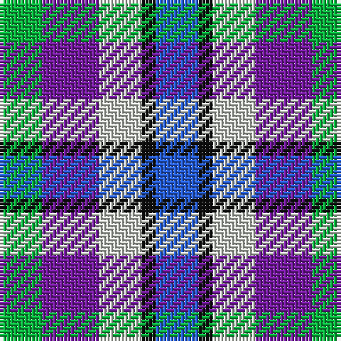

In pattern [BKWBY](/stripes/bkwby/).

This was sourced from register-of-tartans.  It is a [5 stripe tartan](/stripes/stripes5/).

Original link https://www.tartanregister.gov.uk/tartanDetails.aspx?ref=10789

## Register references

External register numbers recorded for this tartan.

- Scottish Register of Tartans: [10789](https://www.tartanregister.gov.uk/tartanDetails.aspx?ref=10789)

## Thread count
G/12 P16 N12 K4 B/12

## Palette
Each colour and the base-6 reference it is a variant of.

| Colour | Shade | Base |
|---|---|---|
| B | <code style="background-color:#275EDC;">#275EDC</code> `oklch(52.5% 0.202 263.3)` <small>#275EDC</small> | B <code style="background-color:#2A418A;">#2A418A</code> |
| G | <code style="background-color:#0BB43F;">#0BB43F</code> `oklch(67.1% 0.200 146.4)` <small>#0BB43F</small> | Y <code style="background-color:#F2BF00;">#F2BF00</code> |
| K | <code style="background-color:#101010;">#101010</code> `oklch(17.3% 0.000 89.9)` <small>#101010</small> | K <code style="background-color:#000000;">#000000</code> |
| N | <code style="background-color:#D1D5CD;">#D1D5CD</code> `oklch(86.8% 0.012 128.6)` <small>#D1D5CD</small> | W <code style="background-color:#F7F7F7;">#F7F7F7</code> |
| P | <code style="background-color:#761CA0;">#761CA0</code> `oklch(44.2% 0.198 311.6)` <small>#761CA0</small> | B <code style="background-color:#2A418A;">#2A418A</code> |

# Sample pattern

## Nearest tartans

The nearest existing variants by ΔTartan distance.

1. [MacTeddy](/setts/s5/t3w10db10g10r2~x4/) — ΔT 1.54
1. [MacTeddy](/setts/s5/lt3w10db10g10k2~x4/) — ΔT 1.64
1. [Clan Haggis World (Corporate)](/setts/s5/r13ly13g13b22w4~x2/) — ΔT 1.71
1. [Becker (Name)](/setts/s6/lb3lb2db3r3k3ly1~x8/) — ΔT 1.87
1. [Battle of Prestonpans (1745) Heritage Trust, The](/setts/s5/db9r12g9db5w2~x4/) — ΔT 1.89
1. [Pride of the Glen](/setts/s4/g3db3dp4w1~x4/) — ΔT 1.89
1. [Clan Haggis World (Corporate)](/setts/s5/r13lo13g13db22w4~x2/) — ΔT 1.92
1. [MacBlain (2016)](/setts/s6/db5dp3w2dg3k1ly1~x10/) — ΔT 1.97
1. [Edinburgh Military Tattoo Dress](/setts/s8/k6w11b11r13db17w10k2w4~x2/) — ΔT 2.00
1. [Dunoon Burgh Hall Trust](/setts/s5/db2m3g3o6ly2~x2/) — ΔT 2.02

## Neighbour map

Every grey dot is one of 14299 variants placed by the first two principal components of the ΔTartan feature space (44% of its variance). Red is this tartan; blue dots are its nearest — click one to open its page.

<svg viewBox="0 0 640 380" role="img" style="max-width:100%;height:auto;border:1px solid #e0e0e0;border-radius:4px;display:block" xmlns="http://www.w3.org/2000/svg"><image href="/nn/cloud.v1.png" width="640" height="380"/><a href="/setts/s5/t3w10db10g10r2~x4/"><circle cx="52.7" cy="237.8" r="4" fill="#3465a4"><title>MacTeddy</title></circle></a><a href="/setts/s5/lt3w10db10g10k2~x4/"><circle cx="32.9" cy="235.5" r="4" fill="#3465a4"><title>MacTeddy</title></circle></a><a href="/setts/s5/r13ly13g13b22w4~x2/"><circle cx="51.7" cy="236.6" r="4" fill="#3465a4"><title>Clan Haggis World (Corporate)</title></circle></a><a href="/setts/s6/lb3lb2db3r3k3ly1~x8/"><circle cx="14.0" cy="254.5" r="4" fill="#3465a4"><title>Becker (Name)</title></circle></a><a href="/setts/s5/db9r12g9db5w2~x4/"><circle cx="120.8" cy="251.7" r="4" fill="#3465a4"><title>Battle of Prestonpans (1745) Heritage Trust, The</title></circle></a><a href="/setts/s4/g3db3dp4w1~x4/"><circle cx="99.8" cy="296.3" r="4" fill="#3465a4"><title>Pride of the Glen</title></circle></a><a href="/setts/s5/r13lo13g13db22w4~x2/"><circle cx="72.6" cy="245.5" r="4" fill="#3465a4"><title>Clan Haggis World (Corporate)</title></circle></a><a href="/setts/s6/db5dp3w2dg3k1ly1~x10/"><circle cx="35.4" cy="210.6" r="4" fill="#3465a4"><title>MacBlain (2016)</title></circle></a><a href="/setts/s8/k6w11b11r13db17w10k2w4~x2/"><circle cx="63.2" cy="191.0" r="4" fill="#3465a4"><title>Edinburgh Military Tattoo Dress</title></circle></a><a href="/setts/s5/db2m3g3o6ly2~x2/"><circle cx="63.7" cy="266.7" r="4" fill="#3465a4"><title>Dunoon Burgh Hall Trust</title></circle></a><circle cx="14.0" cy="268.9" r="5" fill="#c00000"/></svg>

ID: /setts/s5/b3k1lb3p4lg3~x4/
