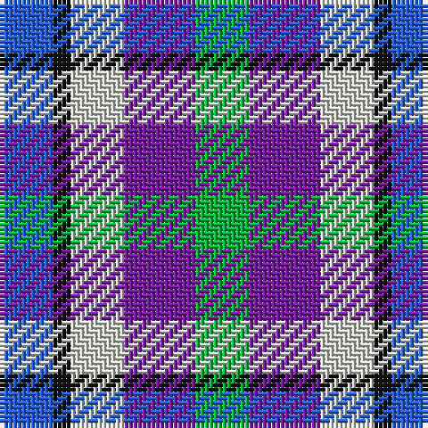

In pattern [BKWBY](/patterns/bkwby/).

This was sourced from register-of-tartans.  It is a [5 stripes tartan](/stripes/stripes5/).

Original link https://www.tartanregister.gov.uk/tartanDetails.aspx?ref=10789

## Thread count
B/12 K4 N12 P16 G/12

## Palette
Each colour and its ΔE from the base-6 reference it is a variant of.

| Colour | Shade | Base | ΔE (OKLab) |
|---|---|---|---|
| B | <code style="background-color:#275EDC;">#275EDC</code> `#275EDC` | B <code style="background-color:#2A418A;">#2A418A</code> | 0.15 |
| G | <code style="background-color:#0BB43F;">#0BB43F</code> `#0BB43F` | Y <code style="background-color:#F2BF00;">#F2BF00</code> | 0.24 |
| K | <code style="background-color:#101010;">#101010</code> `#101010` | K <code style="background-color:#000000;">#000000</code> | 0.17 |
| N | <code style="background-color:#D1D5CD;">#D1D5CD</code> `#D1D5CD` | W <code style="background-color:#F7F7F7;">#F7F7F7</code> | 0.11 |
| P | <code style="background-color:#761CA0;">#761CA0</code> `#761CA0` | B <code style="background-color:#2A418A;">#2A418A</code> | 0.15 |

# Sample pattern

## Nearest tartans

The nearest existing variants by ΔTartan distance.

1. [MacTeddy](/setts/s5/b3w10ba10g10r2~b5c8ca8-ba2c2c80-g207810-rc80000-we0e0e0~x4/) — ΔT 1.54
1. [MacTeddy](/setts/s5/w3wa10b10g10k2~b0000cd-g008b00-k000000-w82cffd-wae0e0e0~x4/) — ΔT 1.63
1. [Clan Haggis World (Corporate)](/setts/s5/r13y13g13b22w4~b1044ad-g649848-rca2625-wf9f5ef-yf8f85d~x2/) — ΔT 1.71
1. [Becker (Name)](/setts/s6/w3wa2b3r3k3y1~b2c2c80-k101010-rc80000-w98c8e8-waa8ace8-yfccc00~x8/) — ΔT 1.86
1. [Pride of the Glen](/setts/s4/g3b3ba4w1~b000080-ba780078-g006818-wffffff~x4/) — ΔT 1.89
1. [Battle of Prestonpans (1745) Heritage Trust, The](/setts/s5/b9r12g9b5w2~b0000cd-g008b00-re3170d-wffffff~x4/) — ΔT 1.89
1. [Pride of the Glen](/setts/s4/g3b3ba4w1~b2c2c80-ba780078-g006818-wfcfcfc~x4/) — ΔT 1.91
1. [Clan Haggis World (Corporate)](/setts/s5/r13y13g13b22w4~b2c2c80-g006818-rc8002c-wfcfcfc-ydc943c~x2/) — ΔT 1.92
1. [MacBlain (2016)](/setts/s6/b5ba3w2g3k1y1~b2c2c80-ba6c0070-g004c00-k000000-wf8f8f8-yf8e38c~x10/) — ΔT 1.97
1. [Edinburgh Military Tattoo Dress](/setts/s8/k6w11b11r13ba17w10k2w4~b0596fa-ba2c4084-k101010-rdc0000-we0e0e0~x2/) — ΔT 2.00

## Neighbour map

Every grey dot is one of 15726 variants placed by the first two principal components of the ΔTartan feature space (44% of its variance). Red is this tartan; blue dots are its nearest — click one to open its page.

<svg viewBox="0 0 640 380" role="img" style="max-width:100%;height:auto;border:1px solid #e0e0e0;border-radius:4px;display:block" xmlns="http://www.w3.org/2000/svg"><image href="/nn/cloud.v1.png" width="640" height="380"/><a href="/setts/s5/b3w10ba10g10r2~b5c8ca8-ba2c2c80-g207810-rc80000-we0e0e0~x4/"><circle cx="49.4" cy="238.0" r="4" fill="#3465a4"><title>MacTeddy</title></circle></a><a href="/setts/s5/w3wa10b10g10k2~b0000cd-g008b00-k000000-w82cffd-wae0e0e0~x4/"><circle cx="28.6" cy="236.2" r="4" fill="#3465a4"><title>MacTeddy</title></circle></a><a href="/setts/s5/r13y13g13b22w4~b1044ad-g649848-rca2625-wf9f5ef-yf8f85d~x2/"><circle cx="49.2" cy="238.4" r="4" fill="#3465a4"><title>Clan Haggis World (Corporate)</title></circle></a><a href="/setts/s6/w3wa2b3r3k3y1~b2c2c80-k101010-rc80000-w98c8e8-waa8ace8-yfccc00~x8/"><circle cx="14.0" cy="254.4" r="4" fill="#3465a4"><title>Becker (Name)</title></circle></a><a href="/setts/s4/g3b3ba4w1~b000080-ba780078-g006818-wffffff~x4/"><circle cx="96.7" cy="297.6" r="4" fill="#3465a4"><title>Pride of the Glen</title></circle></a><a href="/setts/s5/b9r12g9b5w2~b0000cd-g008b00-re3170d-wffffff~x4/"><circle cx="118.0" cy="254.8" r="4" fill="#3465a4"><title>Battle of Prestonpans (1745) Heritage Trust, The</title></circle></a><a href="/setts/s4/g3b3ba4w1~b2c2c80-ba780078-g006818-wfcfcfc~x4/"><circle cx="108.3" cy="299.5" r="4" fill="#3465a4"><title>Pride of the Glen</title></circle></a><a href="/setts/s5/r13y13g13b22w4~b2c2c80-g006818-rc8002c-wfcfcfc-ydc943c~x2/"><circle cx="70.4" cy="246.2" r="4" fill="#3465a4"><title>Clan Haggis World (Corporate)</title></circle></a><a href="/setts/s6/b5ba3w2g3k1y1~b2c2c80-ba6c0070-g004c00-k000000-wf8f8f8-yf8e38c~x10/"><circle cx="31.9" cy="210.6" r="4" fill="#3465a4"><title>MacBlain (2016)</title></circle></a><a href="/setts/s8/k6w11b11r13ba17w10k2w4~b0596fa-ba2c4084-k101010-rdc0000-we0e0e0~x2/"><circle cx="60.5" cy="192.4" r="4" fill="#3465a4"><title>Edinburgh Military Tattoo Dress</title></circle></a><circle cx="14.0" cy="268.6" r="5" fill="#c00000"/></svg>

ID: /setts/s5/b3k1w3ba4y3~b275edc-ba761ca0-k101010-wd1d5cd-y0bb43f~x4/
