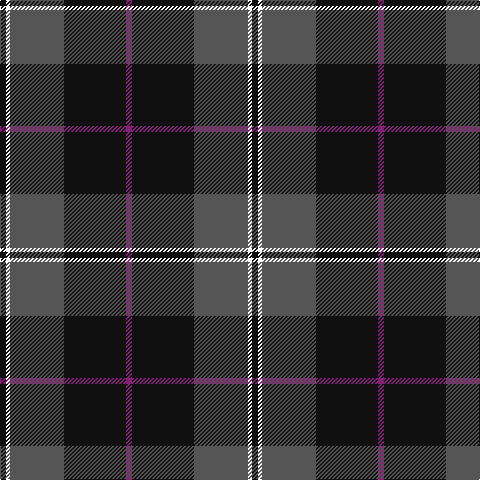

In pattern [BKBWK](/patterns/bkbwk/).

This was sourced from register-of-tartans.  It is a [5 stripes tartan](/stripes/stripes5/).

Original link https://www.tartanregister.gov.uk/tartanDetails.aspx?ref=10184

## Register references

External register numbers recorded for this tartan.

- Scottish Register of Tartans: [10184](https://www.tartanregister.gov.uk/tartanDetails.aspx?ref=10184)

## Thread count
K/6 W4 N54 K62 P/6

## Palette
Each colour and its ΔE from the base-6 reference it is a variant of.

| Colour | Shade | Base | ΔE (OKLab) |
|---|---|---|---|
| K | <code style="background-color:#101010;">#101010</code> `#101010` | K <code style="background-color:#000000;">#000000</code> | 0.17 |
| N | <code style="background-color:#555555;">#555555</code> `#555555` | B <code style="background-color:#2A418A;">#2A418A</code> | 0.13 |
| P | <code style="background-color:#871F78;">#871F78</code> `#871F78` | B <code style="background-color:#2A418A;">#2A418A</code> | 0.17 |
| W | <code style="background-color:#FFFFFF;">#FFFFFF</code> `#FFFFFF` | W <code style="background-color:#F7F7F7;">#F7F7F7</code> | 0.02 |

# Sample pattern

## Nearest tartans

The nearest existing variants by ΔTartan distance.

1. [Kelley Oliphint (Commemorative)](/setts/s5/k3w2b27k31y3~b5c5c5c-k101010-we0e0e0-ydc94c4~x2/) — ΔT 0.45
1. [Calgary Firefighters](/setts/s5/g4k48g16r12b3~b4876ff-g696969-k101010-rdb2929~x2/) — ΔT 0.90
1. [Mountain Rescue Assoc. (Corporate)](/setts/s7/k32b2k6b2k13ba30w2~b1474b4-ba5c5c5c-k101010-wfcfcfc~x2/) — ΔT 0.96
1. [Swedish Para Whisky Club (Corporate](/setts/s6/b2g14w3b13y1b2~b680028-g003820-w98c8e8-yc4bc68~x4/) — ΔT 1.02
1. [Connecticut State Police Pipe Band](/setts/s6/k42b2k2b17ba8y4~b5c5c5c-ba00008c-k141414-yc88c00~x2/) — ΔT 1.07
1. [Calgary Firefighters (Corporate)](/setts/s5/r4k48r16ra12b3~b2c2c80-k101010-r888888-rac80000~x2/) — ΔT 1.07
1. [Dege, of Saville Row](/setts/s6/r11b1r3ba1b9ra1~b000050-ba304080-r806050-rac00000~x4/) — ΔT 1.10
1. [Brotherhood of the Kilt](/setts/s5/k10g4k1b2r1~b7884a8-g505420-k101010-rc80000~x10/) — ΔT 1.10
1. [Mountain Rescue Association Honor Guard](/setts/s7/k32b2k6b2k13ba30w2~b0000ff-ba2f4f4f-k101010-wffffff~x2/) — ΔT 1.17
1. [Connaught Green](/setts/s6/r1b12g5b2g4w1~b202060-g5c6428-ra00000-wc0c0c0~x2/) — ΔT 1.19

## Neighbour map

Every grey dot is one of 15726 variants placed by the first two principal components of the ΔTartan feature space (44% of its variance). Red is this tartan; blue dots are its nearest — click one to open its page.

<svg viewBox="0 0 640 380" role="img" style="max-width:100%;height:auto;border:1px solid #e0e0e0;border-radius:4px;display:block" xmlns="http://www.w3.org/2000/svg"><image href="/nn/cloud.v1.png" width="640" height="380"/><a href="/setts/s5/k3w2b27k31y3~b5c5c5c-k101010-we0e0e0-ydc94c4~x2/"><circle cx="326.4" cy="200.7" r="4" fill="#3465a4"><title>Kelley Oliphint (Commemorative)</title></circle></a><a href="/setts/s5/g4k48g16r12b3~b4876ff-g696969-k101010-rdb2929~x2/"><circle cx="340.6" cy="195.1" r="4" fill="#3465a4"><title>Calgary Firefighters</title></circle></a><a href="/setts/s7/k32b2k6b2k13ba30w2~b1474b4-ba5c5c5c-k101010-wfcfcfc~x2/"><circle cx="364.2" cy="192.6" r="4" fill="#3465a4"><title>Mountain Rescue Assoc. (Corporate)</title></circle></a><a href="/setts/s6/b2g14w3b13y1b2~b680028-g003820-w98c8e8-yc4bc68~x4/"><circle cx="311.1" cy="198.8" r="4" fill="#3465a4"><title>Swedish Para Whisky Club (Corporate</title></circle></a><a href="/setts/s6/k42b2k2b17ba8y4~b5c5c5c-ba00008c-k141414-yc88c00~x2/"><circle cx="386.0" cy="185.0" r="4" fill="#3465a4"><title>Connecticut State Police Pipe Band</title></circle></a><a href="/setts/s5/r4k48r16ra12b3~b2c2c80-k101010-r888888-rac80000~x2/"><circle cx="334.1" cy="191.9" r="4" fill="#3465a4"><title>Calgary Firefighters (Corporate)</title></circle></a><a href="/setts/s6/r11b1r3ba1b9ra1~b000050-ba304080-r806050-rac00000~x4/"><circle cx="327.0" cy="208.5" r="4" fill="#3465a4"><title>Dege, of Saville Row</title></circle></a><a href="/setts/s5/k10g4k1b2r1~b7884a8-g505420-k101010-rc80000~x10/"><circle cx="355.1" cy="227.6" r="4" fill="#3465a4"><title>Brotherhood of the Kilt</title></circle></a><a href="/setts/s7/k32b2k6b2k13ba30w2~b0000ff-ba2f4f4f-k101010-wffffff~x2/"><circle cx="374.6" cy="200.7" r="4" fill="#3465a4"><title>Mountain Rescue Association Honor Guard</title></circle></a><a href="/setts/s6/r1b12g5b2g4w1~b202060-g5c6428-ra00000-wc0c0c0~x2/"><circle cx="351.5" cy="217.6" r="4" fill="#3465a4"><title>Connaught Green</title></circle></a><circle cx="338.8" cy="206.5" r="5" fill="#c00000"/></svg>

ID: /setts/s5/b3k31ba27w2k3~b871f78-ba555555-k101010-wffffff~x2/
