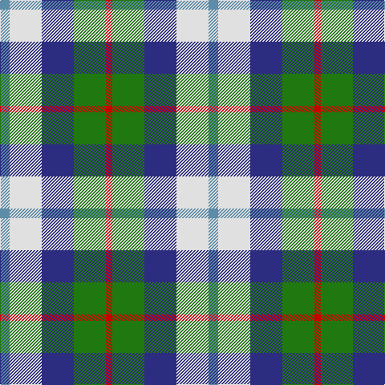

In pattern [BWBGR](/patterns/bwbgr/).

This was sourced from tartans-authority.  It is a [5 stripes tartan](/stripes/stripes5/).

Original link http://www.tartansauthority.com/tartan-ferret/display/3985/

## Thread count
B/12 LN40 DB40 G40 R/8

## Palette
Each colour and its ΔE from the base-6 reference it is a variant of.

| Colour | Shade | Base | ΔE (OKLab) |
|---|---|---|---|
| B | <code style="background-color:#5C8CA8;">#5C8CA8</code> `#5C8CA8` | B <code style="background-color:#2A418A;">#2A418A</code> | 0.23 |
| DB | <code style="background-color:#2C2C80;">#2C2C80</code> `#2C2C80` | B <code style="background-color:#2A418A;">#2A418A</code> | 0.06 |
| G | <code style="background-color:#207810;">#207810</code> `#207810` | G <code style="background-color:#006100;">#006100</code> | 0.08 |
| LN | <code style="background-color:#E0E0E0;">#E0E0E0</code> `#E0E0E0` | W <code style="background-color:#F7F7F7;">#F7F7F7</code> | 0.07 |
| R | <code style="background-color:#C80000;">#C80000</code> `#C80000` | R <code style="background-color:#CC0000;">#CC0000</code> | 0.01 |

# Sample pattern

## Nearest tartans

The nearest existing variants by ΔTartan distance.

1. [Clan Haggis World (Corporate)](/setts/s5/r13y13g13b22w4x2~b1044ad-g649848-rca2625-wf9f5ef-yf8f85d/) — ΔT 0.98
1. [MacTeddy](/setts/s5/w3wa10b10g10k2x4~b0000cd-g008b00-k000000-w82cffd-wae0e0e0/) — ΔT 1.19
1. [Unidentified (Winterbottom)](/setts/s6/b13w13b4y2g8r3x2~b2c2c80-g006818-rc80000-we0e0e0-yd4c028/) — ΔT 1.30
1. [Inspiration](/setts/s5/r5b12y11ba21ya5x2~b5f749c-ba14283c-rc8002c-yc4bc68-yae0a126/) — ΔT 1.36
1. [Dunoon Burgh Hall Trust](/setts/s5/b2r3g3ra6y2x2~b1c1c50-g008b00-rb458ac-ra888888-yffff00/) — ΔT 1.40
1. [Fraser, Red dress](/setts/s7/r4b18ra4g19w25r10w4x2~b304080-g008000-rc00000-ra800000-we0e0e0/) — ΔT 1.43
1. [Fraser Red Dress](/setts/s7/r4b18ra4g19w25r10w4x2~b2c4084-g005020-rdc0000-ra960000-we0e0e0/) — ΔT 1.50
1. [Loch Leven Check Trade Tartan Tartan Number: 108. Earliest known date: 1976 Sample presented by Clan Crest Textiles Ltd in 1976. See products available Copyright © Blair Urquhart, Comrie, 2015](/setts/s6/b2g13b11ba4w9b2x2~b2c2c80-ba5c8ca8-g006818-we0e0e0/) — ΔT 1.50
1. [Thompson's Fancy (Fashion)](/setts/s6/r1g6b2w4k4w1x6~b1c0070-g604000-k101010-r880000-w98c8e8/) — ΔT 1.51
1. [MacNeil of Barra (Clan)](/setts/s6/w3b14k12g12k2y3x4~b1474b4-g006818-k101010-wfcfcfc-ye8c000/) — ΔT 1.52

## Neighbour map

Every grey dot is one of 15726 variants placed by the first two principal components of the ΔTartan feature space (44% of its variance). Red is this tartan; blue dots are its nearest — click one to open its page.

<svg viewBox="0 0 640 380" role="img" style="max-width:100%;height:auto;border:1px solid #e0e0e0;border-radius:4px;display:block" xmlns="http://www.w3.org/2000/svg"><image href="/nn/cloud.v1.png" width="640" height="380"/><a href="/setts/s5/r13y13g13b22w4x2~b1044ad-g649848-rca2625-wf9f5ef-yf8f85d/"><circle cx="49.2" cy="238.4" r="4" fill="#3465a4"><title>Clan Haggis World (Corporate)</title></circle></a><a href="/setts/s5/w3wa10b10g10k2x4~b0000cd-g008b00-k000000-w82cffd-wae0e0e0/"><circle cx="28.6" cy="236.2" r="4" fill="#3465a4"><title>MacTeddy</title></circle></a><a href="/setts/s6/b13w13b4y2g8r3x2~b2c2c80-g006818-rc80000-we0e0e0-yd4c028/"><circle cx="110.6" cy="207.8" r="4" fill="#3465a4"><title>Unidentified (Winterbottom)</title></circle></a><a href="/setts/s5/r5b12y11ba21ya5x2~b5f749c-ba14283c-rc8002c-yc4bc68-yae0a126/"><circle cx="95.6" cy="246.9" r="4" fill="#3465a4"><title>Inspiration</title></circle></a><a href="/setts/s5/b2r3g3ra6y2x2~b1c1c50-g008b00-rb458ac-ra888888-yffff00/"><circle cx="61.3" cy="266.5" r="4" fill="#3465a4"><title>Dunoon Burgh Hall Trust</title></circle></a><a href="/setts/s7/r4b18ra4g19w25r10w4x2~b304080-g008000-rc00000-ra800000-we0e0e0/"><circle cx="84.2" cy="193.8" r="4" fill="#3465a4"><title>Fraser, Red dress</title></circle></a><a href="/setts/s7/r4b18ra4g19w25r10w4x2~b2c4084-g005020-rdc0000-ra960000-we0e0e0/"><circle cx="83.6" cy="192.7" r="4" fill="#3465a4"><title>Fraser Red Dress</title></circle></a><a href="/setts/s6/b2g13b11ba4w9b2x2~b2c2c80-ba5c8ca8-g006818-we0e0e0/"><circle cx="127.7" cy="232.7" r="4" fill="#3465a4"><title>Loch Leven Check Trade Tartan Tartan Number: 108. Earliest known date: 1976 Sample presented by Clan Crest Textiles Ltd in 1976. See products available Copyright © Blair Urquhart, Comrie, 2015</title></circle></a><a href="/setts/s6/r1g6b2w4k4w1x6~b1c0070-g604000-k101010-r880000-w98c8e8/"><circle cx="84.6" cy="219.2" r="4" fill="#3465a4"><title>Thompson's Fancy (Fashion)</title></circle></a><a href="/setts/s6/w3b14k12g12k2y3x4~b1474b4-g006818-k101010-wfcfcfc-ye8c000/"><circle cx="82.5" cy="214.3" r="4" fill="#3465a4"><title>MacNeil of Barra (Clan)</title></circle></a><circle cx="49.4" cy="238.0" r="5" fill="#c00000"/></svg>

ID: /setts/s5/b3w10ba10g10r2x4~b5c8ca8-ba2c2c80-g207810-rc80000-we0e0e0/
