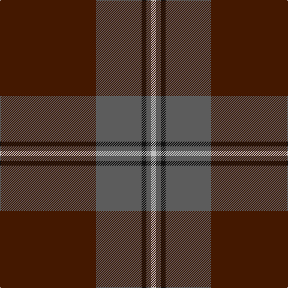

In pattern [BBKBW](/patterns/bbkbw/).

This was sourced from register-of-tartans.  It is a [5 stripes tartan](/stripes/stripes5/).

Original link https://www.tartanregister.gov.uk/tartanDetails.aspx?ref=3096

## Attestations

This cloth appears in 2 source records; the oldest owns this page.

- 01/01/1994 — National Ballet of Canada (register-of-tartans, [record](https://www.tartanregister.gov.uk/tartanDetails.aspx?ref=3096))
- 1994 — National Ballet of Canada (Corporate (tartans-authority, [record](http://www.tartansauthority.com/tartan-ferret/display/5631/))

## Register references

External register numbers recorded for this tartan.

- Scottish Register of Tartans: [3096](https://www.tartanregister.gov.uk/tartanDetails.aspx?ref=3096)
- Scottish Tartans Authority (ITI): 5631

## Thread count
DR/160 N76 K8 N8 Na/8

## Palette
Each colour and its ΔE from the base-6 reference it is a variant of.

| Colour | Shade | Base | ΔE (OKLab) |
|---|---|---|---|
| DR | <code style="background-color:#441800;">#441800</code> `#441800` | B <code style="background-color:#2A418A;">#2A418A</code> | 0.23 |
| K | <code style="background-color:#101010;">#101010</code> `#101010` | K <code style="background-color:#000000;">#000000</code> | 0.17 |
| N | <code style="background-color:#5C5C5C;">#5C5C5C</code> `#5C5C5C` | B <code style="background-color:#2A418A;">#2A418A</code> | 0.15 |
| Na | <code style="background-color:#C0C0C0;">#C0C0C0</code> `#C0C0C0` | W <code style="background-color:#F7F7F7;">#F7F7F7</code> | 0.17 |

# Sample pattern

## Nearest tartans

The nearest existing variants by ΔTartan distance.

1. [Keepers of the Quaich](/setts/s6/y3g33b24g2b2g2~b2c2c80-g604000-yd09800~x2/) — ΔT 1.38
1. [Dunning Primary (School)](/setts/s5/b30ba9w1r5y1~b405064-ba441800-r880000-we0e0e0-ye8c000~x4/) — ΔT 1.44
1. [Meaux (Personal)](/setts/s4/b62r24y5g3~b003c64-g003820-r880000-ybc8c00~x2/) — ΔT 1.53
1. [Glen Trool District Tartan Tartan Number: 914. Earliest known date: pre 1945 Glen Trool is in the Galloway Uplands in the Southwest of Scotland. The tartan began life as a trade sett - a colourful fashion fabric - and was given a name merely to identify it. It proved very popular and is now recognised as a District Tartan. See products available Copyright © Blair Urquhart, Comrie, 2015](/setts/s5/g37ga9g3r9ga3~g003820-ga604000-rc80000~x2/) — ΔT 1.61
1. [Keeper of the Quaich](/setts/s6/g3b3g3b27g40ga3~b304080-g402000-ga908000/) — ΔT 1.65
1. [MacWilliam Htg](/setts/s7/g2ga32ga12k10r1b16r2~b2c2c80-g285800-ga604000-k101010-rc80000~x2/) — ΔT 1.66
1. [Dege of Saville Row](/setts/s6/g11b1g3ba1b9r1~b202060-ba2c2c80-g604000-rc80000~x4/) — ΔT 1.67
1. [Unidentified #44](/setts/s7/b13k3b20g70b20g30w3~b2c4084-g503c14-k101010-we0e0e0~x2/) — ΔT 1.69
1. [Wcwm 9275 5471-1](/setts/s6/r4k2g28r38k1y4~g004c00-k000000-r780028-yc89800~x2/) — ΔT 1.70
1. [Lion Brand Sportswear](/setts/s7/y4b1r15b42r6b4ya1~b142836-r800028-ya0a0a0-yac88c00~x2/) — ΔT 1.71

## Neighbour map

Every grey dot is one of 15726 variants placed by the first two principal components of the ΔTartan feature space (44% of its variance). Red is this tartan; blue dots are its nearest — click one to open its page.

<svg viewBox="0 0 640 380" role="img" style="max-width:100%;height:auto;border:1px solid #e0e0e0;border-radius:4px;display:block" xmlns="http://www.w3.org/2000/svg"><image href="/nn/cloud.v1.png" width="640" height="380"/><a href="/setts/s6/y3g33b24g2b2g2~b2c2c80-g604000-yd09800~x2/"><circle cx="439.7" cy="216.7" r="4" fill="#3465a4"><title>Keepers of the Quaich</title></circle></a><a href="/setts/s5/b30ba9w1r5y1~b405064-ba441800-r880000-we0e0e0-ye8c000~x4/"><circle cx="465.1" cy="171.3" r="4" fill="#3465a4"><title>Dunning Primary (School)</title></circle></a><a href="/setts/s4/b62r24y5g3~b003c64-g003820-r880000-ybc8c00~x2/"><circle cx="470.3" cy="222.8" r="4" fill="#3465a4"><title>Meaux (Personal)</title></circle></a><a href="/setts/s5/g37ga9g3r9ga3~g003820-ga604000-rc80000~x2/"><circle cx="476.1" cy="253.3" r="4" fill="#3465a4"><title>Glen Trool District Tartan Tartan Number: 914. Earliest known date: pre 1945 Glen Trool is in the Galloway Uplands in the Southwest of Scotland. The tartan began life as a trade sett - a colourful fashion fabric - and was given a name merely to identify it. It proved very popular and is now recognised as a District Tartan. See products available Copyright © Blair Urquhart, Comrie, 2015</title></circle></a><a href="/setts/s6/g3b3g3b27g40ga3~b304080-g402000-ga908000/"><circle cx="471.2" cy="240.5" r="4" fill="#3465a4"><title>Keeper of the Quaich</title></circle></a><a href="/setts/s7/g2ga32ga12k10r1b16r2~b2c2c80-g285800-ga604000-k101010-rc80000~x2/"><circle cx="411.9" cy="171.4" r="4" fill="#3465a4"><title>MacWilliam Htg</title></circle></a><a href="/setts/s6/g11b1g3ba1b9r1~b202060-ba2c2c80-g604000-rc80000~x4/"><circle cx="398.6" cy="237.4" r="4" fill="#3465a4"><title>Dege of Saville Row</title></circle></a><a href="/setts/s7/b13k3b20g70b20g30w3~b2c4084-g503c14-k101010-we0e0e0~x2/"><circle cx="481.1" cy="212.9" r="4" fill="#3465a4"><title>Unidentified #44</title></circle></a><a href="/setts/s6/r4k2g28r38k1y4~g004c00-k000000-r780028-yc89800~x2/"><circle cx="412.8" cy="157.2" r="4" fill="#3465a4"><title>Wcwm 9275 5471-1</title></circle></a><a href="/setts/s7/y4b1r15b42r6b4ya1~b142836-r800028-ya0a0a0-yac88c00~x2/"><circle cx="494.6" cy="153.0" r="4" fill="#3465a4"><title>Lion Brand Sportswear</title></circle></a><circle cx="463.6" cy="203.7" r="5" fill="#c00000"/></svg>

ID: /setts/s5/b40ba19k2ba2w2~b441800-ba5c5c5c-k101010-wc0c0c0~x4/
