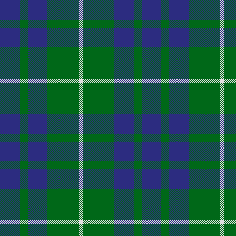

In pattern [BGBGW](/patterns/bgbgw/).

This was sourced from house-of-tartan.  It is a [5 stripes tartan](/stripes/stripes5/).

Original link http://www.house-of-tartan.scotland.net/house/TartanViewjs.asp?colr=Def&tnam=139

## Thread count
DB/40 G16 DB40 G64 LN/8

## Palette
Each colour and its ΔE from the base-6 reference it is a variant of.

| Colour | Shade | Base | ΔE (OKLab) |
|---|---|---|---|
| DB | <code style="background-color:#2C2C80;">#2C2C80</code> `#2C2C80` | B <code style="background-color:#2C4084;">#2C4084</code> | 0.05 |
| G | <code style="background-color:#006818;">#006818</code> `#006818` | G <code style="background-color:#006400;">#006400</code> | 0.02 |
| LN | <code style="background-color:#E0E0E0;">#E0E0E0</code> `#E0E0E0` | W <code style="background-color:#F4F4F0;">#F4F4F0</code> | 0.06 |

# Sample pattern

## Nearest tartans

The nearest existing variants by ΔTartan distance.

1. [Hamilton Green Hunting](/setts/s5/b32g8b32g60w8-b1c0070-g006818-wc0c0c0/) — ΔT 0.79
1. [Hamilton, hunting](/setts/s5/b40g16b40g64w8-b304080-g008000-we0e0e0/) — ΔT 0.81
1. [Hamilton, hunting](/setts/s5/b22g4b30g36w4-b304080-g008000-we0e0e0/) — ΔT 0.86
1. [Unnamed No 78](/setts/s4/b4g14b14w2-b304080-g008000-we0e0e0/) — ΔT 0.90
1. [Unidentified No 78](/setts/s4/b4g14b14w2-b2c4084-g005020-we0e0e0/) — ΔT 1.13
1. [Ferguson - 1930 (Old)](/setts/s3/g34r4b30-b2c2c80-g006818-rc80000/) — ΔT 1.29
1. [Outdoorsmen (Fashion)](/setts/s7/b12k4g16k4b16g36k8-b2474e8-g408060-k101010/) — ΔT 1.35
1. [Campbell of Glenlyon](/setts/s5/g14k12b14k2b4-b1474b4-g006818-k101010/) — ΔT 1.36
1. [Campbell of Glenlyon Check (Clan)](/setts/s5/g28k24b28k4b8-b1474b4-g006818-k101010/) — ΔT 1.36
1. [Wilson's No.062](/setts/s4/g26r4b26r4-b202060-g006818-rc80000/) — ΔT 1.38

## Neighbour map

Every grey dot is one of 15726 variants placed by the first two principal components of the ΔTartan feature space (44% of its variance). Red is this tartan; blue dots are its nearest — click one to open its page.

<svg viewBox="0 0 640 380" role="img" style="max-width:100%;height:auto;border:1px solid #e0e0e0;border-radius:4px;display:block" xmlns="http://www.w3.org/2000/svg"><image href="/nn/cloud.v1.png" width="640" height="380"/><a href="/setts/s5/b32g8b32g60w8-b1c0070-g006818-wc0c0c0/"><circle cx="280.7" cy="268.9" r="4" fill="#3465a4"><title>Hamilton Green Hunting</title></circle></a><a href="/setts/s5/b40g16b40g64w8-b304080-g008000-we0e0e0/"><circle cx="284.1" cy="280.1" r="4" fill="#3465a4"><title>Hamilton, hunting</title></circle></a><a href="/setts/s5/b22g4b30g36w4-b304080-g008000-we0e0e0/"><circle cx="327.2" cy="267.3" r="4" fill="#3465a4"><title>Hamilton, hunting</title></circle></a><a href="/setts/s4/b4g14b14w2-b304080-g008000-we0e0e0/"><circle cx="303.4" cy="285.2" r="4" fill="#3465a4"><title>Unnamed No 78</title></circle></a><a href="/setts/s4/b4g14b14w2-b2c4084-g005020-we0e0e0/"><circle cx="331.8" cy="299.2" r="4" fill="#3465a4"><title>Unidentified No 78</title></circle></a><a href="/setts/s3/g34r4b30-b2c2c80-g006818-rc80000/"><circle cx="326.2" cy="309.2" r="4" fill="#3465a4"><title>Ferguson - 1930 (Old)</title></circle></a><a href="/setts/s7/b12k4g16k4b16g36k8-b2474e8-g408060-k101010/"><circle cx="296.0" cy="242.2" r="4" fill="#3465a4"><title>Outdoorsmen (Fashion)</title></circle></a><a href="/setts/s5/g14k12b14k2b4-b1474b4-g006818-k101010/"><circle cx="202.0" cy="285.7" r="4" fill="#3465a4"><title>Campbell of Glenlyon</title></circle></a><a href="/setts/s5/g28k24b28k4b8-b1474b4-g006818-k101010/"><circle cx="202.0" cy="285.7" r="4" fill="#3465a4"><title>Campbell of Glenlyon Check (Clan)</title></circle></a><a href="/setts/s4/g26r4b26r4-b202060-g006818-rc80000/"><circle cx="271.8" cy="281.5" r="4" fill="#3465a4"><title>Wilson's No.062</title></circle></a><circle cx="287.7" cy="281.9" r="5" fill="#c00000"/></svg>

ID: /setts/s5/b40g16b40g64w8-b2c2c80-g006818-we0e0e0/
