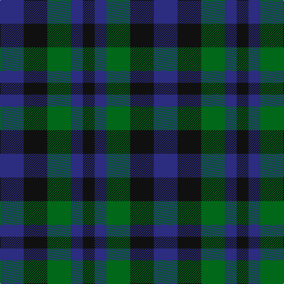

In pattern [BKGBK](/patterns/bkgbk/).

This was sourced from tartans-authority.  It is a [5 stripes tartan](/stripes/stripes5/).

Original link http://www.tartansauthority.com/tartan-ferret/display/10169/

## Thread count
DB/40 K40 G40 DB20 K/20

## Palette
Each colour and its ΔE from the base-6 reference it is a variant of.

| Colour | Shade | Base | ΔE (OKLab) |
|---|---|---|---|
| DB | <code style="background-color:#2C2C80;">#2C2C80</code> `#2C2C80` | B <code style="background-color:#2C4084;">#2C4084</code> | 0.05 |
| G | <code style="background-color:#006818;">#006818</code> `#006818` | G <code style="background-color:#006400;">#006400</code> | 0.02 |
| K | <code style="background-color:#101010;">#101010</code> `#101010` | K <code style="background-color:#000000;">#000000</code> | 0.17 |

# Sample pattern

## Nearest tartans

The nearest existing variants by ΔTartan distance.

1. [Sutherland 42nd](/setts/s6/b4k4b12k12g12k4-b2c4084-g005020-k101010/) — ΔT 1.65
1. [Durham District Tartan Tartan Number: 1089. Earliest known date: 1819 It was Wilson's practice to give the names of towns to many of his new designs. Maybe because the order came from there or because it was the name of the purchaser. There was a family of Durhams associated with the Royal Court in Edinburgh prior to the Union of the Crowns. Wilson was also a collector of tartans, receiving samples from his agents in the Highlands and from purchase orders from around the world. See 'Denholme' and 'Urquhart'. See products available Copyright © Blair Urquhart, Comrie, 2015](/setts/s5/k4g12k12b12r4-b2c2c80-g006818-k101010-rc80000/) — ΔT 1.70
1. [Austin Clan](/setts/s5/b8k8b8g18k4-b2c2c80-g006818-k101010/) — ΔT 1.79
1. [Austin WI](/setts/s5/b6k6b6g12k4-b6e5058-g11450d-k000000/) — ΔT 1.90
1. [Austin WI](/setts/s5/b3k3b3g6k2-b6e5058-g11450d-k000000/) — ΔT 1.90
1. [MacKay Coat](/setts/s7/k8g8y2g8k8b8k2-b2c4084-g005020-k101010-ye8c000/) — ΔT 1.93
1. [Unidentified No 39](/setts/s7/k8g8k2g8k8b8y2-b2c4084-g005020-k101010-ye8c000/) — ΔT 1.93
1. [Unidentified No 63](/setts/s7/k6g8k2g8k6b8k2-b2c4084-g005020-k101010/) — ΔT 1.94
1. [Unidentified pattern #3](/setts/s4/b16k20g16r4-b2c4084-g005020-k101010-rdc0000/) — ΔT 1.97
1. [Macintosh, Charles Rennie (Commem)](/setts/s6/b10k10b10k18ba10k10-b2c2c80-ba5c5c5c-k101010/) — ΔT 1.97

## Neighbour map

Every grey dot is one of 15726 variants placed by the first two principal components of the ΔTartan feature space (44% of its variance). Red is this tartan; blue dots are its nearest — click one to open its page.

<svg viewBox="0 0 640 380" role="img" style="max-width:100%;height:auto;border:1px solid #e0e0e0;border-radius:4px;display:block" xmlns="http://www.w3.org/2000/svg"><image href="/nn/cloud.v1.png" width="640" height="380"/><a href="/setts/s6/b4k4b12k12g12k4-b2c4084-g005020-k101010/"><circle cx="231.9" cy="341.5" r="4" fill="#3465a4"><title>Sutherland 42nd</title></circle></a><a href="/setts/s5/k4g12k12b12r4-b2c2c80-g006818-k101010-rc80000/"><circle cx="128.6" cy="314.3" r="4" fill="#3465a4"><title>Durham District Tartan Tartan Number: 1089. Earliest known date: 1819 It was Wilson's practice to give the names of towns to many of his new designs. Maybe because the order came from there or because it was the name of the purchaser. There was a family of Durhams associated with the Royal Court in Edinburgh prior to the Union of the Crowns. Wilson was also a collector of tartans, receiving samples from his agents in the Highlands and from purchase orders from around the world. See 'Denholme' and 'Urquhart'. See products available Copyright © Blair Urquhart, Comrie, 2015</title></circle></a><a href="/setts/s5/b8k8b8g18k4-b2c2c80-g006818-k101010/"><circle cx="207.3" cy="318.6" r="4" fill="#3465a4"><title>Austin Clan</title></circle></a><a href="/setts/s5/b6k6b6g12k4-b6e5058-g11450d-k000000/"><circle cx="140.0" cy="332.9" r="4" fill="#3465a4"><title>Austin WI</title></circle></a><a href="/setts/s5/b3k3b3g6k2-b6e5058-g11450d-k000000/"><circle cx="140.0" cy="332.9" r="4" fill="#3465a4"><title>Austin WI</title></circle></a><a href="/setts/s7/k8g8y2g8k8b8k2-b2c4084-g005020-k101010-ye8c000/"><circle cx="166.9" cy="300.6" r="4" fill="#3465a4"><title>MacKay Coat</title></circle></a><a href="/setts/s7/k8g8k2g8k8b8y2-b2c4084-g005020-k101010-ye8c000/"><circle cx="166.9" cy="300.6" r="4" fill="#3465a4"><title>Unidentified No 39</title></circle></a><a href="/setts/s7/k6g8k2g8k6b8k2-b2c4084-g005020-k101010/"><circle cx="233.6" cy="336.4" r="4" fill="#3465a4"><title>Unidentified No 63</title></circle></a><a href="/setts/s4/b16k20g16r4-b2c4084-g005020-k101010-rdc0000/"><circle cx="167.5" cy="317.3" r="4" fill="#3465a4"><title>Unidentified pattern #3</title></circle></a><a href="/setts/s6/b10k10b10k18ba10k10-b2c2c80-ba5c5c5c-k101010/"><circle cx="255.1" cy="366.0" r="4" fill="#3465a4"><title>Macintosh, Charles Rennie (Commem)</title></circle></a><circle cx="154.3" cy="366.0" r="5" fill="#c00000"/></svg>

ID: /setts/s5/b40k40g40b20k20-b2c2c80-g006818-k101010/
