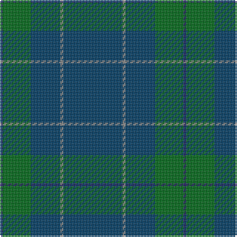

In pattern [BGBRB](/patterns/bgbrb/).

This was sourced from tartans-authority.  It is a [5 stripes tartan](/stripes/stripes5/).

Original link http://www.tartansauthority.com/tartan-ferret/display/5765/

## Thread count
DB/2 G19 DBa20 N2 DBa/40

## Palette
Each colour and its ΔE from the base-6 reference it is a variant of.

| Colour | Shade | Base | ΔE (OKLab) |
|---|---|---|---|
| DB | <code style="background-color:#202060;">#202060</code> `#202060` | B <code style="background-color:#2A418A;">#2A418A</code> | 0.11 |
| DBa | <code style="background-color:#003C64;">#003C64</code> `#003C64` | B <code style="background-color:#2A418A;">#2A418A</code> | 0.08 |
| G | <code style="background-color:#006818;">#006818</code> `#006818` | G <code style="background-color:#006100;">#006100</code> | 0.02 |
| N | <code style="background-color:#888888;">#888888</code> `#888888` | R <code style="background-color:#CC0000;">#CC0000</code> | 0.24 |
| Na | <code style="background-color:#888888;">#888888</code> `#888888` | R <code style="background-color:#CC0000;">#CC0000</code> | 0.24 |
| R | <code style="background-color:#C80000;">#C80000</code> `#C80000` | R <code style="background-color:#CC0000;">#CC0000</code> | 0.01 |

# Sample pattern

## Nearest tartans

The nearest existing variants by ΔTartan distance.

1. [Miramichi](/setts/s5/g31y1g18b18r1~b1c0070-g003820-r880000-yd09800~x2/) — ΔT 1.31
1. [Burnett's & Struth (Corporate)](/setts/s5/b68ba7b16k16y4~b24486c-ba1870a4-k101010-ybc8c00~x2/) — ΔT 1.42
1. [Burnetts & Struth](/setts/s5/b68ba7b16k16y4~b14283c-ba5c8ca8-k101010-ya08858~x2/) — ΔT 1.66
1. [Elliot](/setts/s6/b9g12b44g12b9r3~b2c2c80-g604000-r901c38~x2/) — ΔT 2.05
1. [Unidentified #44](/setts/s7/b13k3b20g70b20g30w3~b2c4084-g503c14-k101010-we0e0e0~x2/) — ΔT 2.07
1. [Williams (New York) (Personal)](/setts/s5/k30b6k6b41ba2~b003c64-ba5c8ca8-k101010~x2/) — ΔT 2.13
1. [Kalkofen (Name)](/setts/s6/k40g15k10r2k10y2~g003820-k101010-rb03000-yd09800~x2/) — ΔT 2.22
1. [Aberdeen Mither Kirk (St Nicholas)](/setts/s9/b58r3g16ra3y2g7b29ra3r2~b003c64-g5c6428-r888888-ra880000-ybc8c00~x2/) — ΔT 2.30
1. [Heslop, William D (Name)](/setts/s4/b44g12ba1r6~b5c5c5c-ba003c64-g003820-ra00000~x2/) — ΔT 2.33
1. [McGovern (2016)](/setts/s5/b62r4g10ga3gb21~b061d37-g452700-ga2a230c-gb004f15-r9e411f~x2/) — ΔT 2.34

## Neighbour map

Every grey dot is one of 15726 variants placed by the first two principal components of the ΔTartan feature space (44% of its variance). Red is this tartan; blue dots are its nearest — click one to open its page.

<svg viewBox="0 0 640 380" role="img" style="max-width:100%;height:auto;border:1px solid #e0e0e0;border-radius:4px;display:block" xmlns="http://www.w3.org/2000/svg"><image href="/nn/cloud.v1.png" width="640" height="380"/><a href="/setts/s5/g31y1g18b18r1~b1c0070-g003820-r880000-yd09800~x2/"><circle cx="535.9" cy="237.4" r="4" fill="#3465a4"><title>Miramichi</title></circle></a><a href="/setts/s5/b68ba7b16k16y4~b24486c-ba1870a4-k101010-ybc8c00~x2/"><circle cx="546.6" cy="235.0" r="4" fill="#3465a4"><title>Burnett's &amp; Struth (Corporate)</title></circle></a><a href="/setts/s5/b68ba7b16k16y4~b14283c-ba5c8ca8-k101010-ya08858~x2/"><circle cx="549.9" cy="238.9" r="4" fill="#3465a4"><title>Burnetts &amp; Struth</title></circle></a><a href="/setts/s6/b9g12b44g12b9r3~b2c2c80-g604000-r901c38~x2/"><circle cx="531.4" cy="260.3" r="4" fill="#3465a4"><title>Elliot</title></circle></a><a href="/setts/s7/b13k3b20g70b20g30w3~b2c4084-g503c14-k101010-we0e0e0~x2/"><circle cx="481.1" cy="212.9" r="4" fill="#3465a4"><title>Unidentified #44</title></circle></a><a href="/setts/s5/k30b6k6b41ba2~b003c64-ba5c8ca8-k101010~x2/"><circle cx="472.0" cy="260.7" r="4" fill="#3465a4"><title>Williams (New York) (Personal)</title></circle></a><a href="/setts/s6/k40g15k10r2k10y2~g003820-k101010-rb03000-yd09800~x2/"><circle cx="565.5" cy="236.7" r="4" fill="#3465a4"><title>Kalkofen (Name)</title></circle></a><a href="/setts/s9/b58r3g16ra3y2g7b29ra3r2~b003c64-g5c6428-r888888-ra880000-ybc8c00~x2/"><circle cx="514.1" cy="157.0" r="4" fill="#3465a4"><title>Aberdeen Mither Kirk (St Nicholas)</title></circle></a><a href="/setts/s4/b44g12ba1r6~b5c5c5c-ba003c64-g003820-ra00000~x2/"><circle cx="586.1" cy="216.5" r="4" fill="#3465a4"><title>Heslop, William D (Name)</title></circle></a><a href="/setts/s5/b62r4g10ga3gb21~b061d37-g452700-ga2a230c-gb004f15-r9e411f~x2/"><circle cx="470.5" cy="220.2" r="4" fill="#3465a4"><title>McGovern (2016)</title></circle></a><circle cx="541.1" cy="257.6" r="5" fill="#c00000"/></svg>

ID: /setts/s5/b40r2b20g19ba2~b003c64-ba202060-g006818-r888888/
