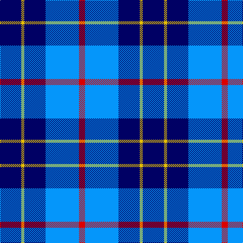

In pattern [BYBBR](/patterns/bybbr/).

This was sourced from register-of-tartans.  It is a [5 stripes tartan](/stripes/stripes5/).

Original link https://www.tartanregister.gov.uk/tartanDetails.aspx?ref=344

## Thread count
DB/42 Y6 DB42 B66 R/12

## Palette
Each colour and its ΔE from the base-6 reference it is a variant of.

| Colour | Shade | Base | ΔE (OKLab) |
|---|---|---|---|
| B | <code style="background-color:#0596FA;">#0596FA</code> `#0596FA` | B <code style="background-color:#2A418A;">#2A418A</code> | 0.27 |
| DB | <code style="background-color:#000064;">#000064</code> `#000064` | B <code style="background-color:#2A418A;">#2A418A</code> | 0.18 |
| R | <code style="background-color:#DC0000;">#DC0000</code> `#DC0000` | R <code style="background-color:#CC0000;">#CC0000</code> | 0.03 |
| Y | <code style="background-color:#E8C000;">#E8C000</code> `#E8C000` | Y <code style="background-color:#F2BF00;">#F2BF00</code> | 0.02 |

# Sample pattern

## Nearest tartans

The nearest existing variants by ΔTartan distance.

1. [Brazell (Personal)](/setts/s5/b42y6b42ba66r12-b1c1c50-ba2888c4-rc80000-ye8c000/) — ΔT 1.35
1. [MacNeil - 1994 (Personal)](/setts/s5/b60k24ba24k4w6-b3850c8-ba003c64-k101010-wfcfcfc/) — ΔT 1.41
1. [Lytley alias Parsons Hunting (Personal)](/setts/s5/b50r5y5ba15y10-b0000cd-ba000080-rff0000-yffe600/) — ΔT 1.49
1. [Douglas Variation](/setts/s6/w8b50ba50b4ba10w4-b080848-ba0596fa-we0e0e0/) — ΔT 1.56
1. [Fong Wedding (Personal)](/setts/s4/r21b43ba86w10-b0000cd-ba26264f-rff0000-wffffff/) — ΔT 1.56
1. [Immanuel Presbyterian Church (Milwaukee)](/setts/s8/k6r4k28w4b12w4b32w6-b0000cd-k101010-rff0000-w82cffd/) — ΔT 1.59
1. [Douglas, Variation](/setts/s6/w8b50ba50b4ba10w4-b000050-ba8080d0-we0e0e0/) — ΔT 1.65
1. [Lauder Primary School](/setts/s6/y8b36r8ba24y4r4-b003beb-ba000080-rff0000-yffe600/) — ΔT 1.68
1. [Sugiyama Corporate Tartan Tartan Number: 10639. Earliest known date: 01/04/2012 The tartan design has long been used on the school bags used by middle and high school students at Sugiyama Jogakuen University. The tartan design has been used as the motif on various other items that are used at the school, such as our carrier bag, in order to promote a sense of attachment and affinity when using the items. See products available Copyright © Blair Urquhart, Comrie, 2015](/setts/s6/b14ba4b50ba20g42ba4-b0000cd-ba000080-g008b00/) — ΔT 1.69
1. [Swan, Brian E](/setts/s6/k12b34k12b34k54w6-b0000cd-k101010-wffffff/) — ΔT 1.69

## Neighbour map

Every grey dot is one of 15726 variants placed by the first two principal components of the ΔTartan feature space (44% of its variance). Red is this tartan; blue dots are its nearest — click one to open its page.

<svg viewBox="0 0 640 380" role="img" style="max-width:100%;height:auto;border:1px solid #e0e0e0;border-radius:4px;display:block" xmlns="http://www.w3.org/2000/svg"><image href="/nn/cloud.v1.png" width="640" height="380"/><a href="/setts/s5/b42y6b42ba66r12-b1c1c50-ba2888c4-rc80000-ye8c000/"><circle cx="263.3" cy="234.1" r="4" fill="#3465a4"><title>Brazell (Personal)</title></circle></a><a href="/setts/s5/b60k24ba24k4w6-b3850c8-ba003c64-k101010-wfcfcfc/"><circle cx="276.5" cy="207.9" r="4" fill="#3465a4"><title>MacNeil - 1994 (Personal)</title></circle></a><a href="/setts/s5/b50r5y5ba15y10-b0000cd-ba000080-rff0000-yffe600/"><circle cx="280.3" cy="196.5" r="4" fill="#3465a4"><title>Lytley alias Parsons Hunting (Personal)</title></circle></a><a href="/setts/s6/w8b50ba50b4ba10w4-b080848-ba0596fa-we0e0e0/"><circle cx="270.8" cy="199.9" r="4" fill="#3465a4"><title>Douglas Variation</title></circle></a><a href="/setts/s4/r21b43ba86w10-b0000cd-ba26264f-rff0000-wffffff/"><circle cx="257.7" cy="236.5" r="4" fill="#3465a4"><title>Fong Wedding (Personal)</title></circle></a><a href="/setts/s8/k6r4k28w4b12w4b32w6-b0000cd-k101010-rff0000-w82cffd/"><circle cx="205.0" cy="197.4" r="4" fill="#3465a4"><title>Immanuel Presbyterian Church (Milwaukee)</title></circle></a><a href="/setts/s6/w8b50ba50b4ba10w4-b000050-ba8080d0-we0e0e0/"><circle cx="280.0" cy="197.5" r="4" fill="#3465a4"><title>Douglas, Variation</title></circle></a><a href="/setts/s6/y8b36r8ba24y4r4-b003beb-ba000080-rff0000-yffe600/"><circle cx="174.6" cy="194.7" r="4" fill="#3465a4"><title>Lauder Primary School</title></circle></a><a href="/setts/s6/b14ba4b50ba20g42ba4-b0000cd-ba000080-g008b00/"><circle cx="261.7" cy="231.8" r="4" fill="#3465a4"><title>Sugiyama Corporate Tartan Tartan Number: 10639. Earliest known date: 01/04/2012 The tartan design has long been used on the school bags used by middle and high school students at Sugiyama Jogakuen University. The tartan design has been used as the motif on various other items that are used at the school, such as our carrier bag, in order to promote a sense of attachment and affinity when using the items. See products available Copyright © Blair Urquhart, Comrie, 2015</title></circle></a><a href="/setts/s6/k12b34k12b34k54w6-b0000cd-k101010-wffffff/"><circle cx="289.0" cy="256.0" r="4" fill="#3465a4"><title>Swan, Brian E</title></circle></a><circle cx="238.9" cy="228.3" r="5" fill="#c00000"/></svg>

ID: /setts/s5/b42y6b42ba66r12-b000064-ba0596fa-rdc0000-ye8c000/
