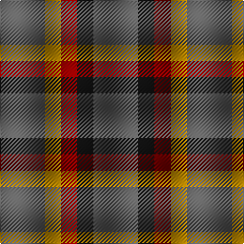

In pattern [BKRYB](/patterns/bkryb/).

This was sourced from tartans-authority.  It is a [5 stripes tartan](/stripes/stripes5/).

Original link http://www.tartansauthority.com/tartan-ferret/display/2212/

## Thread count
N/44 DY16 DR16 K16 N/44

## Palette
Each colour and its ΔE from the base-6 reference it is a variant of.

| Colour | Shade | Base | ΔE (OKLab) |
|---|---|---|---|
| DR | <code style="background-color:#880000;">#880000</code> `#880000` | R <code style="background-color:#C80000;">#C80000</code> | 0.14 |
| DY | <code style="background-color:#D09800;">#D09800</code> `#D09800` | Y <code style="background-color:#E8C000;">#E8C000</code> | 0.11 |
| K | <code style="background-color:#101010;">#101010</code> `#101010` | K <code style="background-color:#000000;">#000000</code> | 0.17 |
| N | <code style="background-color:#5C5C5C;">#5C5C5C</code> `#5C5C5C` | B <code style="background-color:#2C4084;">#2C4084</code> | 0.14 |

# Sample pattern

## Nearest tartans

The nearest existing variants by ΔTartan distance.

1. [Menzies](/setts/s5/r10g10y2b4r10-b4367ae-g11450d-raa0000-yaaaaaa/) — ΔT 1.79
1. [Menzies](/setts/s5/r5g5y1b2r5-b4367ae-g11450d-raa0000-yaaaaaa/) — ΔT 1.79
1. [Tokharian](/setts/s6/b4r20b4r20b8w4-b304080-r906030-we0e0e0/) — ΔT 1.79
1. [Cub Scouts of America](/setts/s5/g40b8r32y8g20-b00008c-g146400-r8c0000-yc88c00/) — ΔT 1.82
1. [Ikelman No 3](/setts/s5/g50k20r20y20g50-g808080-k000000-rc00000-yf0c000/) — ΔT 2.05
1. [Bean of Freeport Htg (Corporate)](/setts/s7/b6r15g41r15b20g41ba6-b003c64-ba1c0070-g006438-rc8002c/) — ΔT 2.09
1. [Unidentified #59](/setts/s7/r4g16r4y4r16g4r4-g004c00-r8c0000-yb0b0b0/) — ΔT 2.11
1. [MacDona Family Tartan Tartan Number: 1104. Earliest known date: 1892 This sett appears in Paton's collection which is housed at the Scottish Tartans Museum, Comrie in Perthshire, Scotland. The samples are undated but the collection is known to have been put together around the 1830's, with some additions during the Victorian period. See products available Copyright © Blair Urquhart, Comrie, 2015](/setts/s7/r35g52b18g17r12g17k18-b202060-g006818-k101010-rc80000/) — ΔT 2.13
1. [Justus Hunting (Personal)](/setts/s7/b12g48r12g12y12g48b12-b1c0070-g285800-r880000-yd09800/) — ΔT 2.14
1. [Bean of Freeport (Personal)](/setts/s7/b6r15g41r15b20g41ba6-b003c64-ba1c0070-g003820-rc8002c/) — ΔT 2.18

## Neighbour map

Every grey dot is one of 15726 variants placed by the first two principal components of the ΔTartan feature space (44% of its variance). Red is this tartan; blue dots are its nearest — click one to open its page.

<svg viewBox="0 0 640 380" role="img" style="max-width:100%;height:auto;border:1px solid #e0e0e0;border-radius:4px;display:block" xmlns="http://www.w3.org/2000/svg"><image href="/nn/cloud.v1.png" width="640" height="380"/><a href="/setts/s5/r10g10y2b4r10-b4367ae-g11450d-raa0000-yaaaaaa/"><circle cx="277.4" cy="283.0" r="4" fill="#3465a4"><title>Menzies</title></circle></a><a href="/setts/s5/r5g5y1b2r5-b4367ae-g11450d-raa0000-yaaaaaa/"><circle cx="277.4" cy="283.0" r="4" fill="#3465a4"><title>Menzies</title></circle></a><a href="/setts/s6/b4r20b4r20b8w4-b304080-r906030-we0e0e0/"><circle cx="395.9" cy="274.1" r="4" fill="#3465a4"><title>Tokharian</title></circle></a><a href="/setts/s5/g40b8r32y8g20-b00008c-g146400-r8c0000-yc88c00/"><circle cx="279.8" cy="280.0" r="4" fill="#3465a4"><title>Cub Scouts of America</title></circle></a><a href="/setts/s5/g50k20r20y20g50-g808080-k000000-rc00000-yf0c000/"><circle cx="227.0" cy="292.0" r="4" fill="#3465a4"><title>Ikelman No 3</title></circle></a><a href="/setts/s7/b6r15g41r15b20g41ba6-b003c64-ba1c0070-g006438-rc8002c/"><circle cx="303.7" cy="253.9" r="4" fill="#3465a4"><title>Bean of Freeport Htg (Corporate)</title></circle></a><a href="/setts/s7/r4g16r4y4r16g4r4-g004c00-r8c0000-yb0b0b0/"><circle cx="317.3" cy="272.9" r="4" fill="#3465a4"><title>Unidentified #59</title></circle></a><a href="/setts/s7/r35g52b18g17r12g17k18-b202060-g006818-k101010-rc80000/"><circle cx="214.2" cy="266.5" r="4" fill="#3465a4"><title>MacDona Family Tartan Tartan Number: 1104. Earliest known date: 1892 This sett appears in Paton's collection which is housed at the Scottish Tartans Museum, Comrie in Perthshire, Scotland. The samples are undated but the collection is known to have been put together around the 1830's, with some additions during the Victorian period. See products available Copyright © Blair Urquhart, Comrie, 2015</title></circle></a><a href="/setts/s7/b12g48r12g12y12g48b12-b1c0070-g285800-r880000-yd09800/"><circle cx="360.1" cy="268.2" r="4" fill="#3465a4"><title>Justus Hunting (Personal)</title></circle></a><a href="/setts/s7/b6r15g41r15b20g41ba6-b003c64-ba1c0070-g003820-rc8002c/"><circle cx="309.8" cy="257.6" r="4" fill="#3465a4"><title>Bean of Freeport (Personal)</title></circle></a><circle cx="309.5" cy="313.2" r="5" fill="#c00000"/></svg>

ID: /setts/s5/b44k16r16y16b44-b5c5c5c-k101010-r880000-yd09800/
