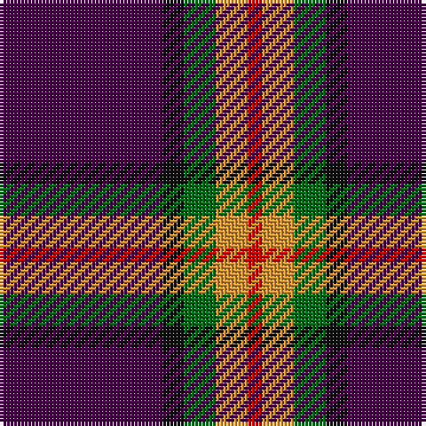

In pattern [BKGYR](/patterns/bkgyr/).

This was sourced from tartans-authority.  It is a [5 stripes tartan](/stripes/stripes5/).

Original link http://www.tartansauthority.com/tartan-ferret/display/10626/

## Thread count
DP/46 K6 G9 O9 R/4

## Palette
Each colour and its ΔE from the base-6 reference it is a variant of.

| Colour | Shade | Base | ΔE (OKLab) |
|---|---|---|---|
| DP | <code style="background-color:#440044;">#440044</code> `#440044` | B <code style="background-color:#2C4084;">#2C4084</code> | 0.17 |
| G | <code style="background-color:#006818;">#006818</code> `#006818` | G <code style="background-color:#006400;">#006400</code> | 0.02 |
| K | <code style="background-color:#101010;">#101010</code> `#101010` | K <code style="background-color:#000000;">#000000</code> | 0.17 |
| O | <code style="background-color:#DC943C;">#DC943C</code> `#DC943C` | Y <code style="background-color:#E8C000;">#E8C000</code> | 0.12 |
| R | <code style="background-color:#C80000;">#C80000</code> `#C80000` | R <code style="background-color:#C80000;">#C80000</code> | 0.00 |

# Sample pattern

## Nearest tartans

The nearest existing variants by ΔTartan distance.

1. [Doten (2013)](/setts/s5/r28y12b76k6g4-b202060-g006818-k101010-rc80000-yb8b8b8/) — ΔT 1.15
1. [Sreijsener (Name)](/setts/s8/r8ra12k6ra33k72rb6k8w6-k101010-rc8002c-ra980044-rb888888-we0e0e0/) — ΔT 1.21
1. [MacShimsi](/setts/s5/r22ra10g10k80y6-g006818-k101010-rb43448-ra901c38-ye8c000/) — ΔT 1.22
1. [MacGregor, Modern](/setts/s6/b72r36b8r12k4ra4-b1c1c50-k101010-rc80000-ra888888/) — ΔT 1.28
1. [MacShimsi Personal Tartan Tartan Number: 7318. Earliest known date: 2007 Designed for the MacShimsi Clan in Dundee See products available Copyright © Blair Urquhart, Comrie, 2015](/setts/s5/r22b10g10k80y6-b601830-g285828-k101010-r882c4c-ydcd00c/) — ΔT 1.34
1. [Widows Sons Scotland (MRA)](/setts/s6/r9k16g10k22b67y4-b780078-g003820-k101010-r888888-ye8c000/) — ΔT 1.38
1. [Calgary Firefighters](/setts/s5/g8k96g32r24b6-b4876ff-g696969-k101010-rdb2929/) — ΔT 1.45
1. [Widows Sons Scotland Dress](/setts/s6/w12g12k12g24b75y4-b780078-g006818-k101010-wc0c0c0-yfccc00/) — ΔT 1.47
1. [Calgary Firefighters (Corporate)](/setts/s5/r8k96r32ra24b6-b2c2c80-k101010-r888888-rac80000/) — ΔT 1.50
1. [Perry (2014)](/setts/s5/k124r48y8b20k8-b5c5c5c-k101010-rc80000-ye8c000/) — ΔT 1.53

## Neighbour map

Every grey dot is one of 15726 variants placed by the first two principal components of the ΔTartan feature space (44% of its variance). Red is this tartan; blue dots are its nearest — click one to open its page.

<svg viewBox="0 0 640 380" role="img" style="max-width:100%;height:auto;border:1px solid #e0e0e0;border-radius:4px;display:block" xmlns="http://www.w3.org/2000/svg"><image href="/nn/cloud.v1.png" width="640" height="380"/><a href="/setts/s5/r28y12b76k6g4-b202060-g006818-k101010-rc80000-yb8b8b8/"><circle cx="346.0" cy="162.2" r="4" fill="#3465a4"><title>Doten (2013)</title></circle></a><a href="/setts/s8/r8ra12k6ra33k72rb6k8w6-k101010-rc8002c-ra980044-rb888888-we0e0e0/"><circle cx="317.3" cy="152.9" r="4" fill="#3465a4"><title>Sreijsener (Name)</title></circle></a><a href="/setts/s5/r22ra10g10k80y6-g006818-k101010-rb43448-ra901c38-ye8c000/"><circle cx="347.9" cy="178.5" r="4" fill="#3465a4"><title>MacShimsi</title></circle></a><a href="/setts/s6/b72r36b8r12k4ra4-b1c1c50-k101010-rc80000-ra888888/"><circle cx="389.2" cy="174.4" r="4" fill="#3465a4"><title>MacGregor, Modern</title></circle></a><a href="/setts/s5/r22b10g10k80y6-b601830-g285828-k101010-r882c4c-ydcd00c/"><circle cx="364.2" cy="188.7" r="4" fill="#3465a4"><title>MacShimsi Personal Tartan Tartan Number: 7318. Earliest known date: 2007 Designed for the MacShimsi Clan in Dundee See products available Copyright © Blair Urquhart, Comrie, 2015</title></circle></a><a href="/setts/s6/r9k16g10k22b67y4-b780078-g003820-k101010-r888888-ye8c000/"><circle cx="306.9" cy="166.5" r="4" fill="#3465a4"><title>Widows Sons Scotland (MRA)</title></circle></a><a href="/setts/s5/g8k96g32r24b6-b4876ff-g696969-k101010-rdb2929/"><circle cx="340.8" cy="191.8" r="4" fill="#3465a4"><title>Calgary Firefighters</title></circle></a><a href="/setts/s6/w12g12k12g24b75y4-b780078-g006818-k101010-wc0c0c0-yfccc00/"><circle cx="296.1" cy="149.3" r="4" fill="#3465a4"><title>Widows Sons Scotland Dress</title></circle></a><a href="/setts/s5/r8k96r32ra24b6-b2c2c80-k101010-r888888-rac80000/"><circle cx="334.5" cy="188.5" r="4" fill="#3465a4"><title>Calgary Firefighters (Corporate)</title></circle></a><a href="/setts/s5/k124r48y8b20k8-b5c5c5c-k101010-rc80000-ye8c000/"><circle cx="383.1" cy="188.5" r="4" fill="#3465a4"><title>Perry (2014)</title></circle></a><circle cx="345.3" cy="181.4" r="5" fill="#c00000"/></svg>

ID: /setts/s5/b46k6g9y9r4-b440044-g006818-k101010-rc80000-ydc943c/
