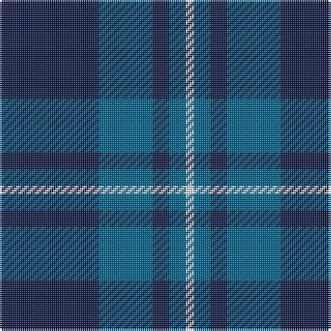

In pattern [BBBBW](/patterns/bbbbw/).

This was sourced from register-of-tartans.  It is a [5 stripes tartan](/stripes/stripes5/).

Original link https://www.tartanregister.gov.uk/tartanDetails.aspx?ref=5975

## Thread count
DB/48 B26 DB8 B8 LN/4

## Palette
Each colour and its ΔE from the base-6 reference it is a variant of.

| Colour | Shade | Base | ΔE (OKLab) |
|---|---|---|---|
| B | <code style="background-color:#07648C;">#07648C</code> `#07648C` | B <code style="background-color:#2A418A;">#2A418A</code> | 0.10 |
| DB | <code style="background-color:#141E46;">#141E46</code> `#141E46` | B <code style="background-color:#2A418A;">#2A418A</code> | 0.16 |
| LN | <code style="background-color:#E0E0E0;">#E0E0E0</code> `#E0E0E0` | W <code style="background-color:#F7F7F7;">#F7F7F7</code> | 0.07 |

# Sample pattern

## Nearest tartans

The nearest existing variants by ΔTartan distance.

1. [City of Kincardine](/setts/s6/g8b72y12g32b32g6-b202060-g006818-y48a4c0/) — ΔT 0.78
1. [Gallaecia (Unofficial) (District)](/setts/s5/b48ba26b8ba8w4-b1c1c50-ba2888c4-we0e0e0/) — ΔT 1.22
1. [Royal Scotsman Train (Corporate)](/setts/s6/b10k4b28k28b4y4-b2c2c80-k101010-yb8b4b8/) — ΔT 1.33
1. [Press & Journal](/setts/s5/k18b6k56b50w4-b4c5484-k101010-we0e0e0/) — ΔT 1.33
1. [Pringle, James (Fashion)](/setts/s7/b40ba4b6ba4b28g36b8-b2c2c80-ba64008c-g146400/) — ΔT 1.35
1. [Open Championship, The](/setts/s5/g4b8ba20b44y4-b141e46-ba2c4084-g005020-ye8c000/) — ΔT 1.38
1. [North Sea Commission](/setts/s5/b36ba12b4ba48y4-b5c8ca8-ba344054-ye8c000/) — ΔT 1.38
1. [Pride of Kinross](/setts/s8/k40b4k12b4k8b54w4b16-b2c2c80-k101010-wffffff/) — ΔT 1.39
1. [Pride of Kinross](/setts/s8/k40b4k12b4k8b54w4b16-b2c2c80-k101010-wfcfcfc/) — ΔT 1.40
1. [Wcwm 1255-1](/setts/s5/b16ba4g56b56r4-b000064-ba0000e0-g004c00-r8c0000/) — ΔT 1.40

## Neighbour map

Every grey dot is one of 15726 variants placed by the first two principal components of the ΔTartan feature space (44% of its variance). Red is this tartan; blue dots are its nearest — click one to open its page.

<svg viewBox="0 0 640 380" role="img" style="max-width:100%;height:auto;border:1px solid #e0e0e0;border-radius:4px;display:block" xmlns="http://www.w3.org/2000/svg"><image href="/nn/cloud.v1.png" width="640" height="380"/><a href="/setts/s6/g8b72y12g32b32g6-b202060-g006818-y48a4c0/"><circle cx="408.7" cy="245.0" r="4" fill="#3465a4"><title>City of Kincardine</title></circle></a><a href="/setts/s5/b48ba26b8ba8w4-b1c1c50-ba2888c4-we0e0e0/"><circle cx="363.8" cy="232.6" r="4" fill="#3465a4"><title>Gallaecia (Unofficial) (District)</title></circle></a><a href="/setts/s6/b10k4b28k28b4y4-b2c2c80-k101010-yb8b4b8/"><circle cx="351.0" cy="265.8" r="4" fill="#3465a4"><title>Royal Scotsman Train (Corporate)</title></circle></a><a href="/setts/s5/k18b6k56b50w4-b4c5484-k101010-we0e0e0/"><circle cx="369.2" cy="239.1" r="4" fill="#3465a4"><title>Press &amp; Journal</title></circle></a><a href="/setts/s7/b40ba4b6ba4b28g36b8-b2c2c80-ba64008c-g146400/"><circle cx="433.0" cy="257.4" r="4" fill="#3465a4"><title>Pringle, James (Fashion)</title></circle></a><a href="/setts/s5/g4b8ba20b44y4-b141e46-ba2c4084-g005020-ye8c000/"><circle cx="421.9" cy="242.3" r="4" fill="#3465a4"><title>Open Championship, The</title></circle></a><a href="/setts/s5/b36ba12b4ba48y4-b5c8ca8-ba344054-ye8c000/"><circle cx="396.6" cy="247.5" r="4" fill="#3465a4"><title>North Sea Commission</title></circle></a><a href="/setts/s8/k40b4k12b4k8b54w4b16-b2c2c80-k101010-wffffff/"><circle cx="386.8" cy="216.9" r="4" fill="#3465a4"><title>Pride of Kinross</title></circle></a><a href="/setts/s8/k40b4k12b4k8b54w4b16-b2c2c80-k101010-wfcfcfc/"><circle cx="387.7" cy="217.3" r="4" fill="#3465a4"><title>Pride of Kinross</title></circle></a><a href="/setts/s5/b16ba4g56b56r4-b000064-ba0000e0-g004c00-r8c0000/"><circle cx="356.5" cy="236.2" r="4" fill="#3465a4"><title>Wcwm 1255-1</title></circle></a><circle cx="395.2" cy="249.4" r="5" fill="#c00000"/></svg>

ID: /setts/s5/b48ba26b8ba8w4-b141e46-ba07648c-we0e0e0/
