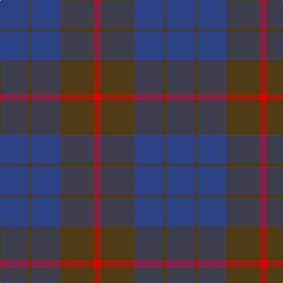

In pattern [BGBGR](/patterns/bgbgr/).

This was sourced from register-of-tartans.  It is a [5 stripes tartan](/stripes/stripes5/).

Original link https://www.tartanregister.gov.uk/tartanDetails.aspx?ref=4225

## Thread count
B/48 T6 B48 T57 R/12

## Palette
Each colour and its ΔE from the base-6 reference it is a variant of.

| Colour | Shade | Base | ΔE (OKLab) |
|---|---|---|---|
| B | <code style="background-color:#2C4084;">#2C4084</code> `#2C4084` | B <code style="background-color:#2A418A;">#2A418A</code> | 0.01 |
| R | <code style="background-color:#DC0000;">#DC0000</code> `#DC0000` | R <code style="background-color:#CC0000;">#CC0000</code> | 0.03 |
| T | <code style="background-color:#503C14;">#503C14</code> `#503C14` | G <code style="background-color:#006100;">#006100</code> | 0.14 |

# Sample pattern

## Nearest tartans

The nearest existing variants by ΔTartan distance.

1. [Unidentified 17](/setts/s5/b48r6b48r57ra12-b304080-r806050-rac00000/) — ΔT 0.59
1. [Unidentified Tartan Tartan Number: 598. Earliest known date: 0 Seen by Alex Lumsden in a Toronto subway 1984. See products available Copyright © Blair Urquhart, Comrie, 2015](/setts/s5/b48g6b48g57r12-b2c2c80-g604000-rc80000/) — ΔT 0.77
1. [Robbins](/setts/s6/b4r12b4r12b24g4-b304080-g008000-r900030/) — ΔT 1.45
1. [Cameron, hunting](/setts/s6/r30ra10r60b64r8y6-b304080-r806050-rac00000-yf0c000/) — ΔT 1.61
1. [Hamilton Hunting](/setts/s5/b22g4b30g36w4-b2c4084-g005020-we0e0e0/) — ΔT 1.62
1. [Mowbray (Personal)](/setts/s5/b32r4b20r28ba10-b5c5c5c-ba5c8ca8-r880000/) — ΔT 1.64
1. [Ferguson (Old)](/setts/s3/g34r4b30-b2c4084-g005020-rdc0000/) — ΔT 1.65
1. [Feniston (Personal)](/setts/s5/b60ba20b6ba60r6-b680028-ba202060-rec34c4/) — ΔT 1.67
1. [MacCallum, High School](/setts/s5/g54b18g6b66g6-b304080-g808080/) — ΔT 1.70
1. [London Regiment](/setts/s6/g68b54r6b54g68w6-b2c2c80-g603800-rc80000-wfcfcfc/) — ΔT 1.74

## Neighbour map

Every grey dot is one of 15726 variants placed by the first two principal components of the ΔTartan feature space (44% of its variance). Red is this tartan; blue dots are its nearest — click one to open its page.

<svg viewBox="0 0 640 380" role="img" style="max-width:100%;height:auto;border:1px solid #e0e0e0;border-radius:4px;display:block" xmlns="http://www.w3.org/2000/svg"><image href="/nn/cloud.v1.png" width="640" height="380"/><a href="/setts/s5/b48r6b48r57ra12-b304080-r806050-rac00000/"><circle cx="407.8" cy="299.2" r="4" fill="#3465a4"><title>Unidentified 17</title></circle></a><a href="/setts/s5/b48g6b48g57r12-b2c2c80-g604000-rc80000/"><circle cx="383.4" cy="289.5" r="4" fill="#3465a4"><title>Unidentified Tartan Tartan Number: 598. Earliest known date: 0 Seen by Alex Lumsden in a Toronto subway 1984. See products available Copyright © Blair Urquhart, Comrie, 2015</title></circle></a><a href="/setts/s6/b4r12b4r12b24g4-b304080-g008000-r900030/"><circle cx="364.6" cy="281.8" r="4" fill="#3465a4"><title>Robbins</title></circle></a><a href="/setts/s6/r30ra10r60b64r8y6-b304080-r806050-rac00000-yf0c000/"><circle cx="377.7" cy="238.9" r="4" fill="#3465a4"><title>Cameron, hunting</title></circle></a><a href="/setts/s5/b22g4b30g36w4-b2c4084-g005020-we0e0e0/"><circle cx="364.1" cy="285.3" r="4" fill="#3465a4"><title>Hamilton Hunting</title></circle></a><a href="/setts/s5/b32r4b20r28ba10-b5c5c5c-ba5c8ca8-r880000/"><circle cx="398.5" cy="310.3" r="4" fill="#3465a4"><title>Mowbray (Personal)</title></circle></a><a href="/setts/s3/g34r4b30-b2c4084-g005020-rdc0000/"><circle cx="364.8" cy="327.5" r="4" fill="#3465a4"><title>Ferguson (Old)</title></circle></a><a href="/setts/s5/b60ba20b6ba60r6-b680028-ba202060-rec34c4/"><circle cx="424.1" cy="277.2" r="4" fill="#3465a4"><title>Feniston (Personal)</title></circle></a><a href="/setts/s5/g54b18g6b66g6-b304080-g808080/"><circle cx="448.9" cy="282.6" r="4" fill="#3465a4"><title>MacCallum, High School</title></circle></a><a href="/setts/s6/g68b54r6b54g68w6-b2c2c80-g603800-rc80000-wfcfcfc/"><circle cx="342.6" cy="249.9" r="4" fill="#3465a4"><title>London Regiment</title></circle></a><circle cx="398.7" cy="298.6" r="5" fill="#c00000"/></svg>

ID: /setts/s5/b48g6b48g57r12-b2c4084-g503c14-rdc0000/
