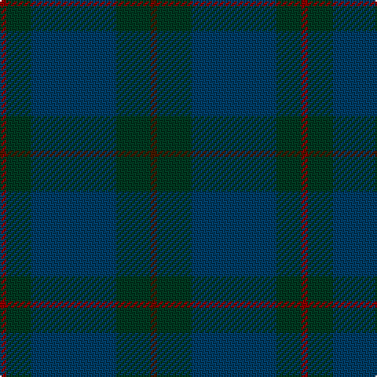

In pattern [BGBGR](/patterns/bgbgr/).

This was sourced from tartans-authority.  It is a [5 stripes tartan](/stripes/stripes5/).

Original link http://www.tartansauthority.com/tartan-ferret/display/2557/

## Thread count
DR/4 DG16 DB54 DG22 DRa/4

## Palette
Each colour and its ΔE from the base-6 reference it is a variant of.

| Colour | Shade | Base | ΔE (OKLab) |
|---|---|---|---|
| DB | <code style="background-color:#003C64;">#003C64</code> `#003C64` | B <code style="background-color:#2C4084;">#2C4084</code> | 0.07 |
| DG | <code style="background-color:#003820;">#003820</code> `#003820` | G <code style="background-color:#006400;">#006400</code> | 0.16 |
| DR | <code style="background-color:#880000;">#880000</code> `#880000` | R <code style="background-color:#C80000;">#C80000</code> | 0.14 |
| DRa | <code style="background-color:#441800;">#441800</code> `#441800` | B <code style="background-color:#2C4084;">#2C4084</code> | 0.22 |

# Sample pattern

## Nearest tartans

The nearest existing variants by ΔTartan distance.

1. [Hector, James](/setts/s8/g16b54g22ba4g22b54g16r4-b003c64-ba441800-g003820-r880000/) — ΔT 1.33
1. [Tern House](/setts/s7/g23b3k8b4g4b56ga8-b141e46-g003820-ga604000-k101010/) — ΔT 1.38
1. [Land's End, Blue (Fashion)](/setts/s8/b4g18r4g18b4g4b52g4-b003054-g004c2c-r901c38/) — ΔT 1.58
1. [Conlon](/setts/s9/g8b4g34ga4r8ga4g6ga22g4-b2c2c80-g005448-ga003820-r880000/) — ΔT 1.74
1. [Cairns, David (Personal)](/setts/s5/b88ba8b32ba64r8-b393939-ba5b5b5b-ra40b00/) — ΔT 1.79
1. [Hueg (Bavaria) Hunting (Personal)](/setts/s10/b34g10b10g34b8g34k4ka4k4g10-b433a5a-g23321b-k1c1714-ka000000/) — ΔT 1.87
1. [Sanix Muted](/setts/s4/g6ga60g80r6-g003820-ga603800-r880000/) — ΔT 1.96
1. [Deighan (Edinburgh)](/setts/s5/b8k86ka40b14g4-b1b1b1b-g696969-k01002c-ka101010/) — ΔT 2.04
1. [Feddinch Club, St Andrews Limited, The](/setts/s4/g86k28ka28r4-g003820-k101010-ka1c0030-r880000/) — ΔT 2.08
1. [St Andrews Old Course Hotel, Golf Course and Spa](/setts/s6/b90ba28k6ba4g4ba10-b002814-ba000048-g604000-k101010/) — ΔT 2.11

## Neighbour map

Every grey dot is one of 15726 variants placed by the first two principal components of the ΔTartan feature space (44% of its variance). Red is this tartan; blue dots are its nearest — click one to open its page.

<svg viewBox="0 0 640 380" role="img" style="max-width:100%;height:auto;border:1px solid #e0e0e0;border-radius:4px;display:block" xmlns="http://www.w3.org/2000/svg"><image href="/nn/cloud.v1.png" width="640" height="380"/><a href="/setts/s8/g16b54g22ba4g22b54g16r4-b003c64-ba441800-g003820-r880000/"><circle cx="504.8" cy="297.0" r="4" fill="#3465a4"><title>Hector, James</title></circle></a><a href="/setts/s7/g23b3k8b4g4b56ga8-b141e46-g003820-ga604000-k101010/"><circle cx="522.5" cy="248.1" r="4" fill="#3465a4"><title>Tern House</title></circle></a><a href="/setts/s8/b4g18r4g18b4g4b52g4-b003054-g004c2c-r901c38/"><circle cx="518.9" cy="270.4" r="4" fill="#3465a4"><title>Land's End, Blue (Fashion)</title></circle></a><a href="/setts/s9/g8b4g34ga4r8ga4g6ga22g4-b2c2c80-g005448-ga003820-r880000/"><circle cx="440.2" cy="273.1" r="4" fill="#3465a4"><title>Conlon</title></circle></a><a href="/setts/s5/b88ba8b32ba64r8-b393939-ba5b5b5b-ra40b00/"><circle cx="544.0" cy="324.2" r="4" fill="#3465a4"><title>Cairns, David (Personal)</title></circle></a><a href="/setts/s10/b34g10b10g34b8g34k4ka4k4g10-b433a5a-g23321b-k1c1714-ka000000/"><circle cx="466.9" cy="283.1" r="4" fill="#3465a4"><title>Hueg (Bavaria) Hunting (Personal)</title></circle></a><a href="/setts/s4/g6ga60g80r6-g003820-ga603800-r880000/"><circle cx="535.3" cy="319.9" r="4" fill="#3465a4"><title>Sanix Muted</title></circle></a><a href="/setts/s5/b8k86ka40b14g4-b1b1b1b-g696969-k01002c-ka101010/"><circle cx="528.2" cy="283.2" r="4" fill="#3465a4"><title>Deighan (Edinburgh)</title></circle></a><a href="/setts/s4/g86k28ka28r4-g003820-k101010-ka1c0030-r880000/"><circle cx="477.3" cy="275.2" r="4" fill="#3465a4"><title>Feddinch Club, St Andrews Limited, The</title></circle></a><a href="/setts/s6/b90ba28k6ba4g4ba10-b002814-ba000048-g604000-k101010/"><circle cx="557.3" cy="238.6" r="4" fill="#3465a4"><title>St Andrews Old Course Hotel, Golf Course and Spa</title></circle></a><circle cx="488.1" cy="293.4" r="5" fill="#c00000"/></svg>

ID: /setts/s5/b4g22ba54g16r4-b441800-ba003c64-g003820-r880000/
