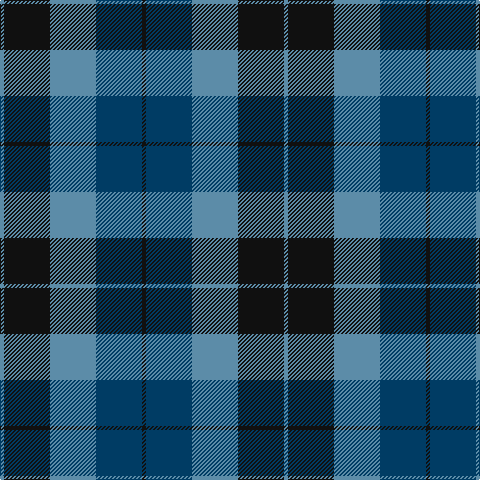

In pattern [BKBBK](/patterns/bkbbk/).

This was sourced from house-of-tartan.  It is a [5 stripes tartan](/stripes/stripes5/).

Original link http://www.house-of-tartan.scotland.net/house/TartanViewjs.asp?colr=Def&tnam=11434

## Thread count
B/4 K46 B46 DB46 K/4

## Palette
Each colour and its ΔE from the base-6 reference it is a variant of.

| Colour | Shade | Base | ΔE (OKLab) |
|---|---|---|---|
| B | <code style="background-color:#5C8CA8;">#5C8CA8</code> `#5C8CA8` | B <code style="background-color:#2C4084;">#2C4084</code> | 0.23 |
| Ba | <code style="background-color:#648498;">#648498</code> `#648498` | B <code style="background-color:#2C4084;">#2C4084</code> | 0.22 |
| DB | <code style="background-color:#003C64;">#003C64</code> `#003C64` | B <code style="background-color:#2C4084;">#2C4084</code> | 0.07 |
| K | <code style="background-color:#101010;">#101010</code> `#101010` | K <code style="background-color:#000000;">#000000</code> | 0.17 |

# Sample pattern

ID: /setts/s5/b4k46b46ba46k4-b5c8ca8-ba003c64-k101010/
