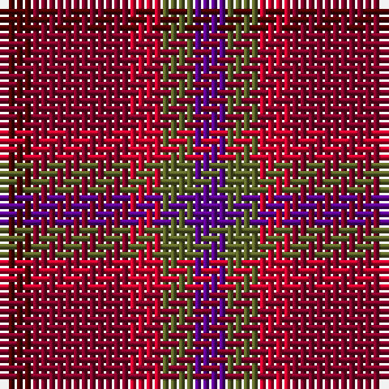

In pattern [BGRRB](/patterns/bgrrb/).

This was sourced from register-of-tartans.  It is a [5 stripes tartan](/stripes/stripes5/).

Original link https://www.tartanregister.gov.uk/tartanDetails.aspx?ref=11150

## Thread count
DRa/4 DR12 R4 G4 P/4

## Palette
Each colour and its ΔE from the base-6 reference it is a variant of.

| Colour | Shade | Base | ΔE (OKLab) |
|---|---|---|---|
| DR | <code style="background-color:#800028;">#800028</code> `#800028` | R <code style="background-color:#C80000;">#C80000</code> | 0.16 |
| DRa | <code style="background-color:#4C0000;">#4C0000</code> `#4C0000` | B <code style="background-color:#2C4084;">#2C4084</code> | 0.24 |
| G | <code style="background-color:#5C6428;">#5C6428</code> `#5C6428` | G <code style="background-color:#006400;">#006400</code> | 0.09 |
| P | <code style="background-color:#5A008C;">#5A008C</code> `#5A008C` | B <code style="background-color:#2C4084;">#2C4084</code> | 0.12 |
| R | <code style="background-color:#C8002C;">#C8002C</code> `#C8002C` | R <code style="background-color:#C80000;">#C80000</code> | 0.03 |

# Sample pattern

ID: /setts/s5/b4r12ra4g4ba4-b4c0000-ba5a008c-g5c6428-r800028-rac8002c/
