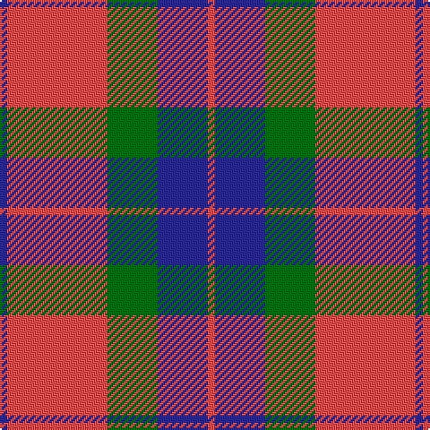

In pattern [BRGBR](/patterns/brgbr/).

This was sourced from register-of-tartans.  It is a [5 stripes tartan](/stripes/stripes5/).

Original link https://www.tartanregister.gov.uk/tartanDetails.aspx?ref=1263

## Thread count
DB/4 DO56 G28 DB28 DO/4

## Palette
Each colour and its ΔE from the base-6 reference it is a variant of.

| Colour | Shade | Base | ΔE (OKLab) |
|---|---|---|---|
| DB | <code style="background-color:#2C2C80;">#2C2C80</code> `#2C2C80` | B <code style="background-color:#2A418A;">#2A418A</code> | 0.06 |
| DO | <code style="background-color:#C85858;">#C85858</code> `#C85858` | R <code style="background-color:#CC0000;">#CC0000</code> | 0.10 |
| G | <code style="background-color:#006818;">#006818</code> `#006818` | G <code style="background-color:#006100;">#006100</code> | 0.02 |

# Sample pattern

## Nearest tartans

The nearest existing variants by ΔTartan distance.

1. [Fraser of Boblainy, Hugh (Personal)](/setts/s5/b4r56g28b28r4-b2c2c80-g006818-rc80000/) — ΔT 0.86
1. [Rob Roy (Film)](/setts/s6/b12g4b40g16r40b8-b708490-g003820-r800028/) — ΔT 0.94
1. [Edinchat](/setts/s6/b8r112g52r8b52r8-b2c2c80-g006818-rc04c08/) — ΔT 0.97
1. [Hugh Fraser of Boblainy](/setts/s5/r4r56g28b28r4-b304080-g008000-rc00000/) — ΔT 1.07
1. [Glasgow, City of](/setts/s7/g56r8b50r44g54r8b4-b780078-g006818-rc80000/) — ΔT 1.16
1. [Wotherspoon](/setts/s5/r12g8r54b45g6-b304080-g008000-rc00000/) — ΔT 1.24
1. [MacFadyan (MacGregor Hastie)](/setts/s7/b6r50b34r10g44r18b6-b2c2c80-g006818-rc80000/) — ΔT 1.34
1. [Sanix Large Muted](/setts/s4/b6y60b80r6-b304080-rc00000-yd08010/) — ΔT 1.34
1. [Logan](/setts/s7/b32r12b4r12g56r12b4-b2c4084-g005020-rdc0000/) — ΔT 1.35
1. [Ikelman #2 (Personal)](/setts/s5/b44k16r16y16b4-b5c5c5c-k101010-r880000-yd09800/) — ΔT 1.36

## Neighbour map

Every grey dot is one of 15726 variants placed by the first two principal components of the ΔTartan feature space (44% of its variance). Red is this tartan; blue dots are its nearest — click one to open its page.

<svg viewBox="0 0 640 380" role="img" style="max-width:100%;height:auto;border:1px solid #e0e0e0;border-radius:4px;display:block" xmlns="http://www.w3.org/2000/svg"><image href="/nn/cloud.v1.png" width="640" height="380"/><a href="/setts/s5/b4r56g28b28r4-b2c2c80-g006818-rc80000/"><circle cx="319.4" cy="220.0" r="4" fill="#3465a4"><title>Fraser of Boblainy, Hugh (Personal)</title></circle></a><a href="/setts/s6/b12g4b40g16r40b8-b708490-g003820-r800028/"><circle cx="313.8" cy="244.2" r="4" fill="#3465a4"><title>Rob Roy (Film)</title></circle></a><a href="/setts/s6/b8r112g52r8b52r8-b2c2c80-g006818-rc04c08/"><circle cx="347.9" cy="206.9" r="4" fill="#3465a4"><title>Edinchat</title></circle></a><a href="/setts/s5/r4r56g28b28r4-b304080-g008000-rc00000/"><circle cx="342.2" cy="222.3" r="4" fill="#3465a4"><title>Hugh Fraser of Boblainy</title></circle></a><a href="/setts/s7/g56r8b50r44g54r8b4-b780078-g006818-rc80000/"><circle cx="298.3" cy="222.3" r="4" fill="#3465a4"><title>Glasgow, City of</title></circle></a><a href="/setts/s5/r12g8r54b45g6-b304080-g008000-rc00000/"><circle cx="342.2" cy="240.0" r="4" fill="#3465a4"><title>Wotherspoon</title></circle></a><a href="/setts/s7/b6r50b34r10g44r18b6-b2c2c80-g006818-rc80000/"><circle cx="266.0" cy="232.8" r="4" fill="#3465a4"><title>MacFadyan (MacGregor Hastie)</title></circle></a><a href="/setts/s4/b6y60b80r6-b304080-rc00000-yd08010/"><circle cx="371.8" cy="229.6" r="4" fill="#3465a4"><title>Sanix Large Muted</title></circle></a><a href="/setts/s7/b32r12b4r12g56r12b4-b2c4084-g005020-rdc0000/"><circle cx="286.7" cy="206.8" r="4" fill="#3465a4"><title>Logan</title></circle></a><a href="/setts/s5/b44k16r16y16b4-b5c5c5c-k101010-r880000-yd09800/"><circle cx="265.7" cy="229.9" r="4" fill="#3465a4"><title>Ikelman #2 (Personal)</title></circle></a><circle cx="317.1" cy="223.2" r="5" fill="#c00000"/></svg>

ID: /setts/s5/b4r56g28b28r4-b2c2c80-g006818-rc85858/
